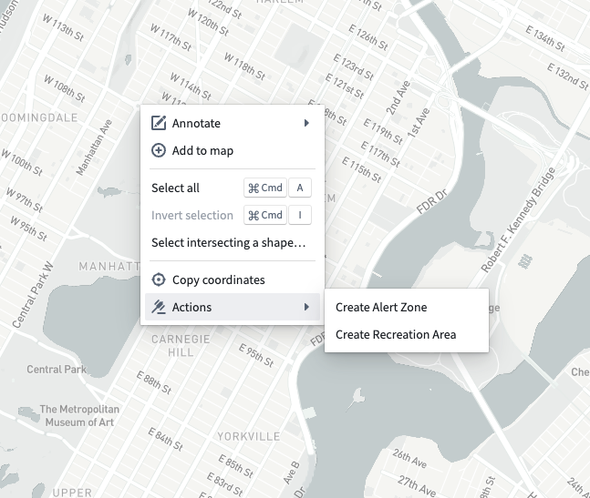
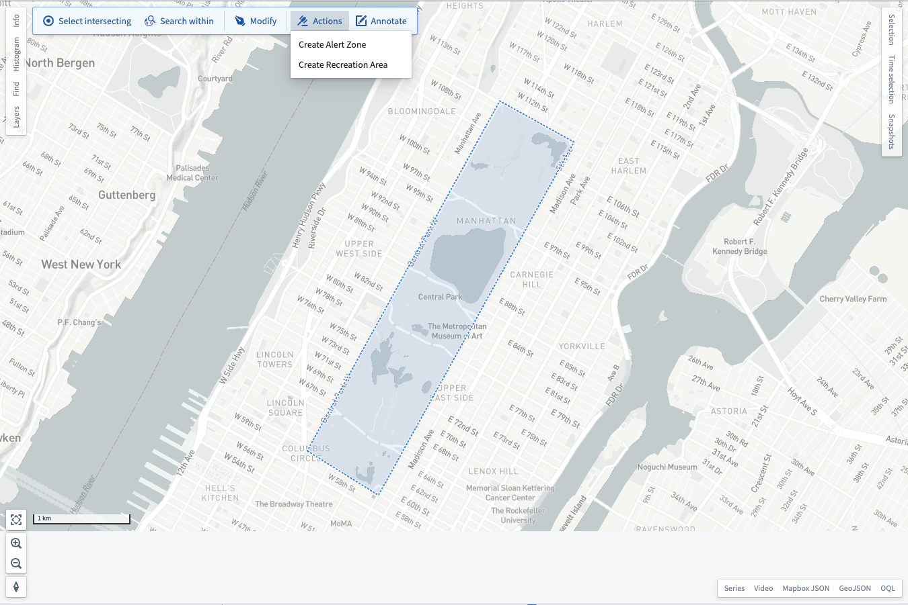
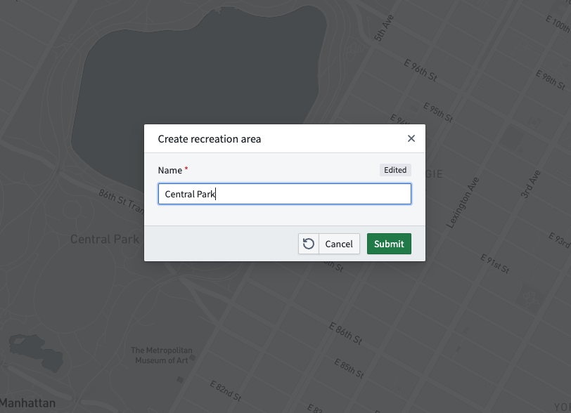
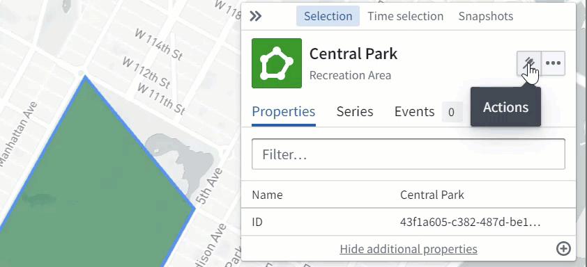

<!-- source: https://palantir.com/docs/foundry/map/actions/ · mirrored 2026-08-22 from Palantir Foundry docs -->

# Actions

Use [Actions](/docs/foundry/map/integrate-actions/) in the Map application to create or edit objects based on points, polygons, or lines drawn on the map.

## Actions on shapes and points

When you right-click on the map, the **Actions** entry in the menu shows all actions that apply to geospatial points, as shown below.

After you [draw a shape](/docs/foundry/map/shapes/), the **Actions** button in the toolbar shows all actions that apply to the polygons, lines, or points you drew:

After selecting an action from one of these menus, there may be additional parameters that you need to provide. When this is the case, the Map shows a dialog for you to input the additional parameters:

If there are no additional parameters, or after you submit the form in the dialog, the Map application executes the action and will add any geospatial objects created by the action to your map.

## Actions on Ontology objects

Use the **Actions** button in the **Selection** panel to execute geospatial actions on your selected object. After selecting an action, you will be prompted to edit or create a shape, depending on the configuration specified in the action.

When you click **Done** on the shape drawing or editing tools, there may be additional parameters that you need to provide. When this is the case, the Map shows a dialog for you to input the additional parameters:

If there are no additional parameters, or after you submit the form in the dialog, the Map application executes the action and will update your map to reflect any objects created or modified by the action.
