<!-- source: https://palantir.com/docs/foundry/map/add-to-map/ · mirrored 2026-08-22 from Palantir Foundry docs -->

# Add data to a map

Begin your geospatial analysis by adding data to your map. There are two kinds of geospatial data you can add to your map from the Foundry platform: Ontology objects and map overlays.

From the **Layers** panel, click **+ Add to map** to add either of these kinds of data to your map using the search dialog.

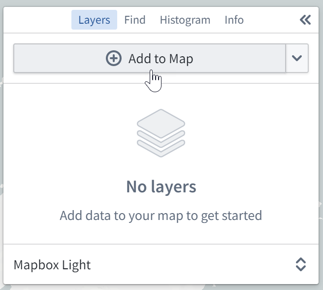

## Add Ontology objects

In the search dialog, the **Objects** tab allows you to add [Ontology objects that have geospatial data](/docs/foundry/map/integrate-objects/) to your map.

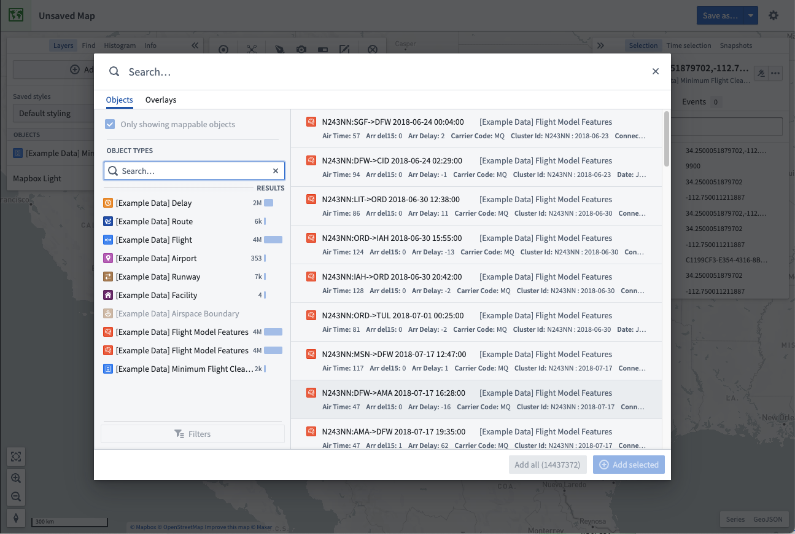

In the dialog, you can search for objects by entering any question into the primary **Search...** field at the top, or filter down the objects being searched using the filters panel on the left.

You can also [configure object search limits in Control Panel](/docs/foundry/map/control-panel/#data-loading).

### Filter objects

Select an object type to filter results to only include objects of that type. After selecting an object type, you can further refine your search using the **Filters** option:

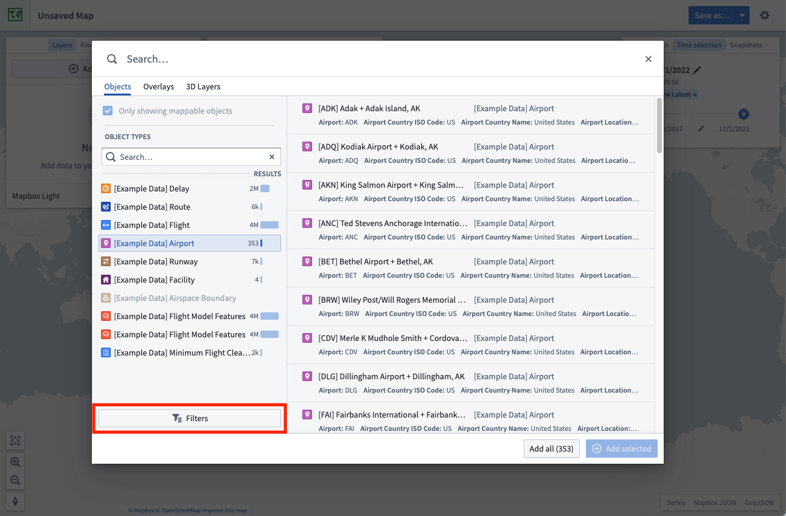

Some of the most commonly-used properties will automatically appear in the filters area, allowing you to narrow down the object results by selecting the values for properties of interest.

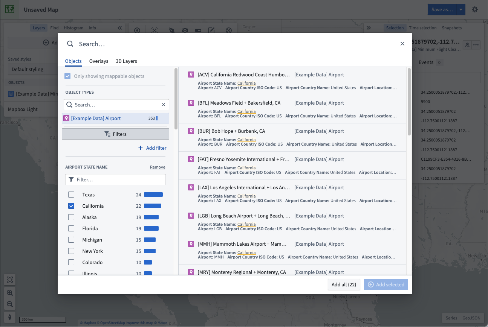

You can filter by any property on the object type by selecting **+ Add filter** and adding the desired properties. Select **Back** to have your chosen properties appear in the filter area.

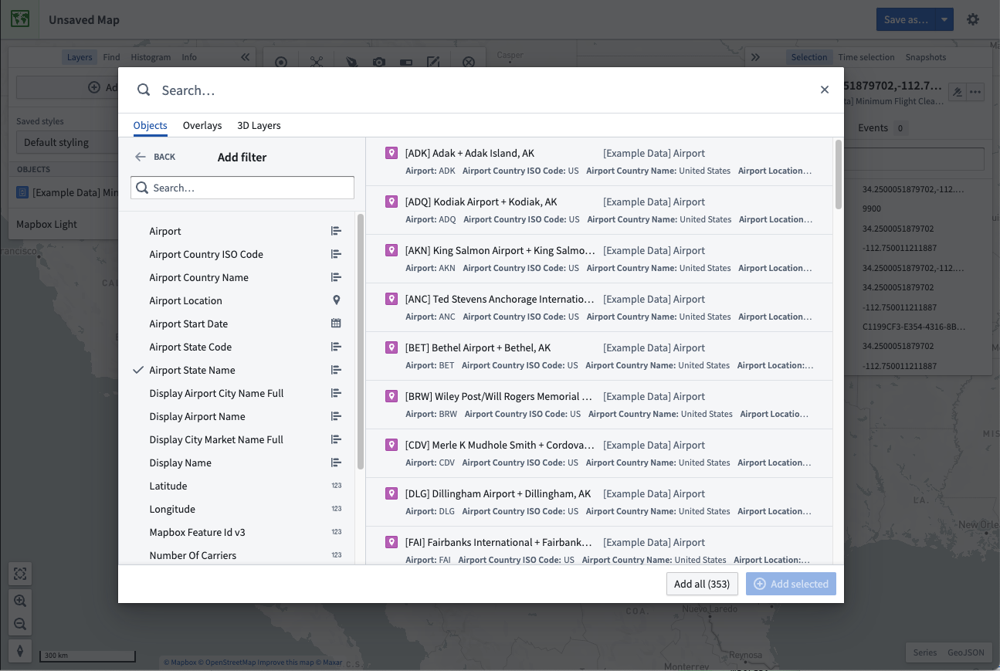

### Select and add results

Select an object in the results table. To toggle selection of any object, hold the `Cmd` (macOS) or `Ctrl` (Windows) key, or additionally use the `Shift` key to select a range of objects. Add your selected objects to the map by using **+ Add selected**, or add all objects that matched your search with **Add all**.

Maps limit how many objects you can add from the search dialog. By default, you can add 1000 objects. When this limit is reached, the **Add all** option is disabled and you will need to [filter your results](#filter-objects) to reduce the number of objects before the option is re-enabled.

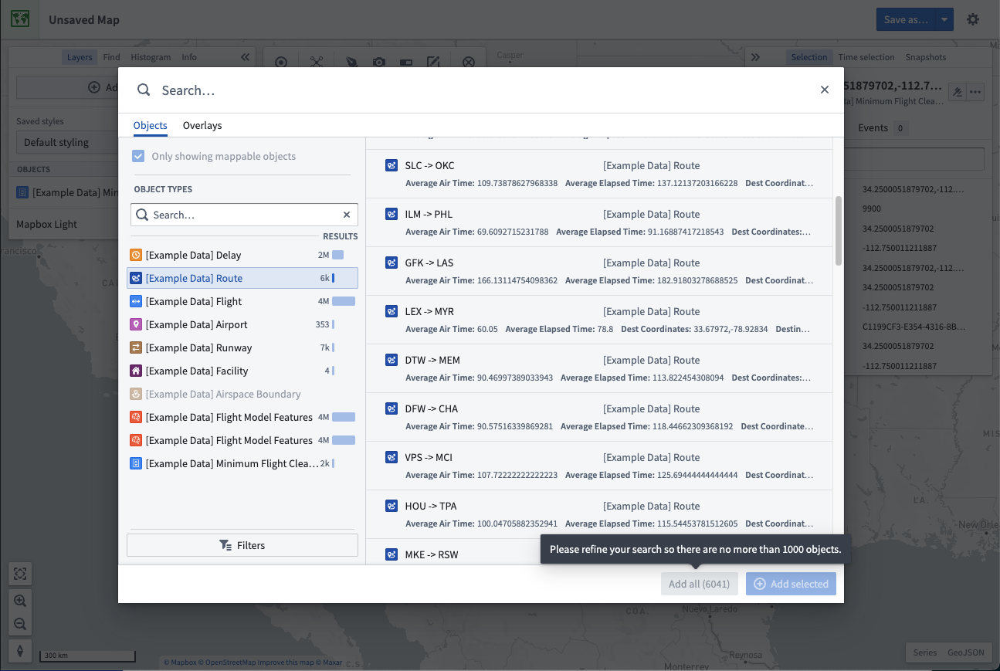

## Search for objects geospatially

You can search for objects in a particular geospatial area of interest. From the **Add to map** dropdown, select **Search for objects that intersect a shape...**:

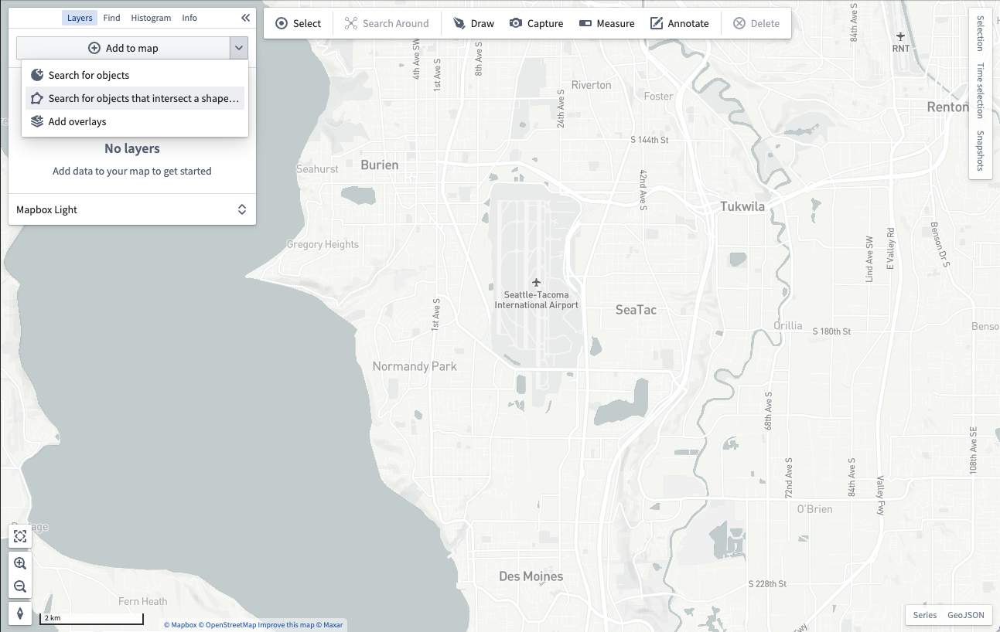

You will then be prompted to draw a [shape](/docs/foundry/map/shapes/) around the geospatial area you want to search within:

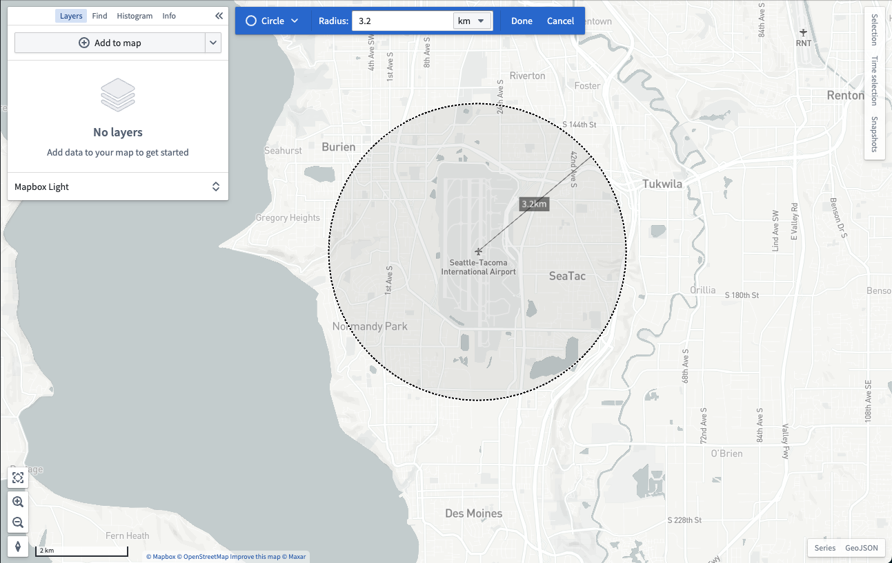

After you finish drawing a shape, the objects search dialog will open and only show objects that contain geospatial data which intersects with the shape you drew:

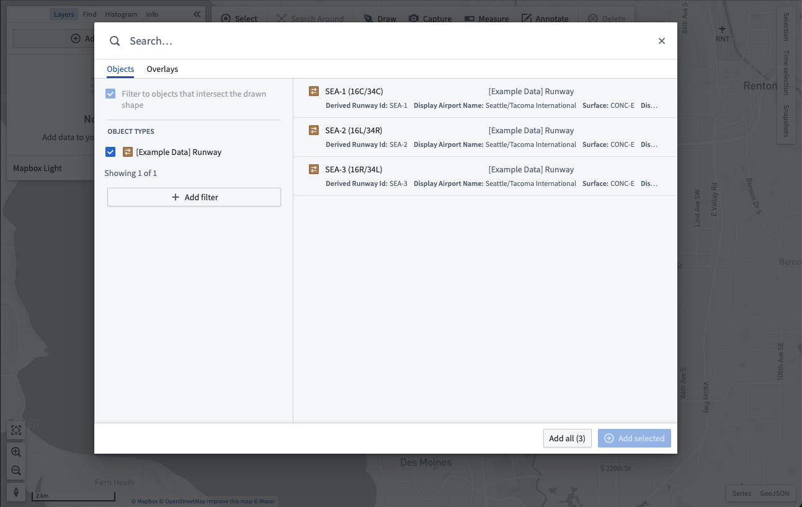

## Add map overlays

The **Overlays** tab of the search dialog allows you to add layers created in the [Map Layer Editor](/docs/foundry/map/layer-editor/). These layers contain pre-configured views of geospatial datasets that can be reused across maps.

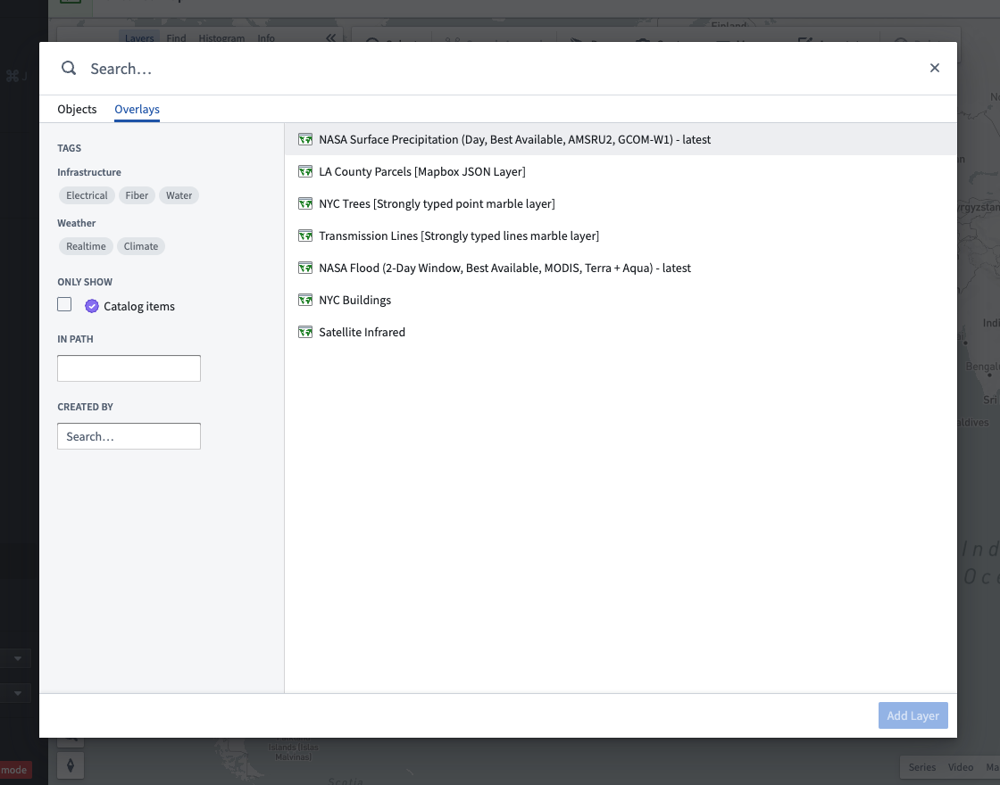

The dialog contains multiple ways for you to find layers:

* Enter text in the **Search...** field at the top to find layers by name.
* Use the **Tags** section of the sidebar to narrow layer results to specific topics.
* Find layers in a specific folder or project by typing the folder's path in the **In path** input.
* Look for layers created by a specific user by selecting the user in **Created by**.

Select a layer. Hold the `Cmd` (macOS) or `Ctrl` (Windows) key to toggle selection of a layer, or use the Shift key to select a range of layers. Add your selected layers to the map with **Add layers**.

## Search Around

Starting from objects already on your map, you can traverse Ontology relationships and add related objects to your map by using a **Search Around**. First, select some objects on the map, and then select **Search Around**:

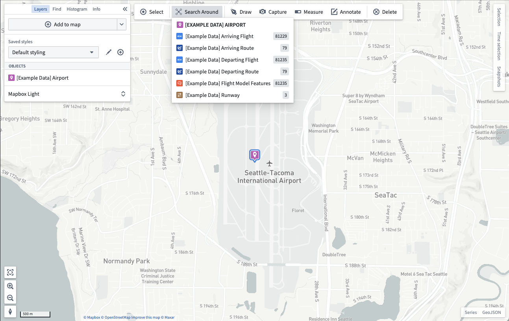

Select from the list of related objects to add them to your map. If the related objects display as points, the map will render a visual link between the related objects:

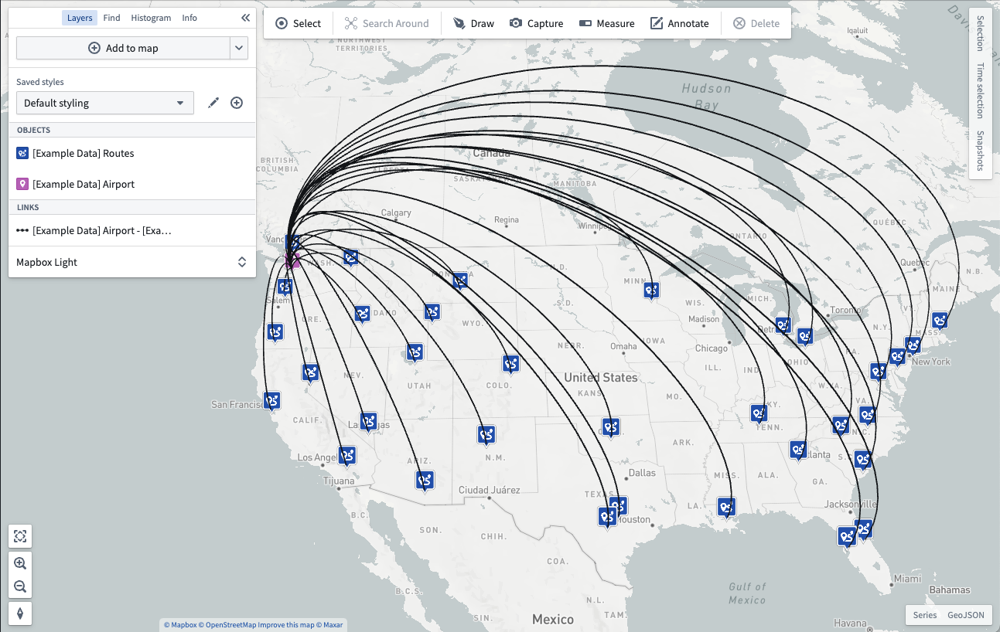
