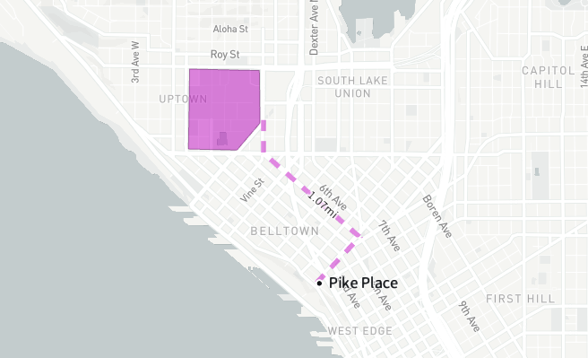
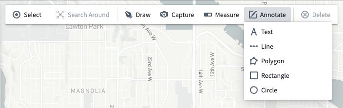
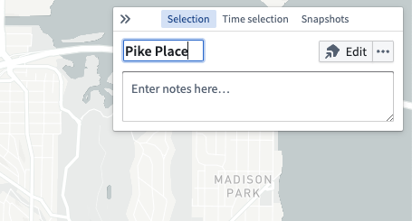
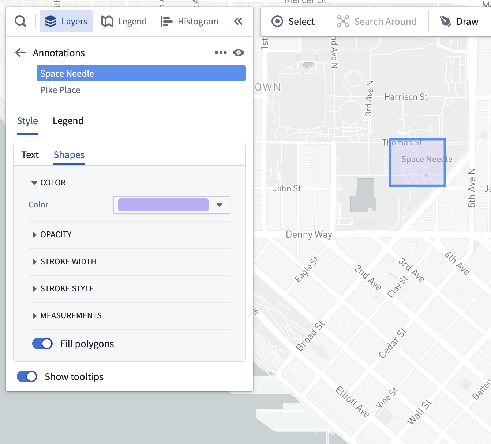

<!-- source: https://palantir.com/docs/foundry/map/annotations/ · mirrored 2026-08-22 from Palantir Foundry docs -->

# Annotations

Use **annotations** to highlight and add contextual information about specific areas on a map.

## Create an annotation

Create an annotation by selecting **Annotate** in the toolbar and choosing one of the following methods:

* **Text:** Add text at a specific location.
* **Line:** Add a line by specifying all points.
* **Polygon:** Add a polygon by specifying all points.
* **Rectangle:** Add a rectangle annotation by specifying two corners.
* **Circle:** Add a circular annotation by specifying the center and a radius.

After selecting the kind of annotation you wish to create, the [drawing tools](/docs/foundry/map/shapes/#draw-a-shape) will open and provide instructions on using that specific drawing mode to create a new annotation. Your map will group annotations into layers according to their types.

## Edit annotations

Select an annotation, then use the **Selection** panel to edit its title and add any notes. For text annotations, the title and notes will appear on both the map and in the tooltip that appears on hover. For polygon and line annotations, the title and notes only appear in the tooltip.

Adjust the annotation's placement by using the **Edit** button.

## Annotation styling

You can modify the appearance of your annotations by editing their styling in the **Layers** panel.

Annotation styling options include:

* **Text**
  * **Text color:** Sets the color of the annotation text.
  * **Text size:** Sets the size of the annotation text in pixels.
  * **Text value:** Configures whether the text value shown on the map includes the annotation's notes in addition to the title.
  * **Text outline color:** Sets the color of an outline shown behind the text.
  * **Show location dot:** When enabled, shows a circular marker indicating the specific location the annotation was added to.
  * **Show tooltips:** When enabled, a tooltip containing the annotation's title and notes will appear when the user hovers over the annotation.
* **Shapes**
  * **Color:** Sets the color of polygons and lines.
  * **Opacity:** Sets the opacity of polygons and lines.
  * **Stroke width:** Sets the width used for lines, and polygon outlines when **Fill polygons** is disabled.
  * **Stroke stroke:** Sets the dash pattern used when rendering lines.
  * **Measurements:** Controls the measurements that appear on the map.
    * **Polygon measurements**
      * **Perimeter:** Configure how measurements are displayed for polygon perimeters. Choose from no display, length displayed for each perimeter segment, or the total length of the entire perimeter.
      * **Area:** Enable the display of the total area for polygons.
    * **Line measurements**
      * **Length:** Configure how measurements are displayed for lines. Choose from no display, length displayed for each line segment, or the total length for the entire line.
  * **Fill polygons:** When enabled, polygons render with a minimal stroke and their interior filled with the specified color. When disabled, only the outline of the polygon is stroked.
  * **Show tooltips:** When enabled, a tooltip containing the annotation's title and notes will appear when the user hovers over the annotation.
