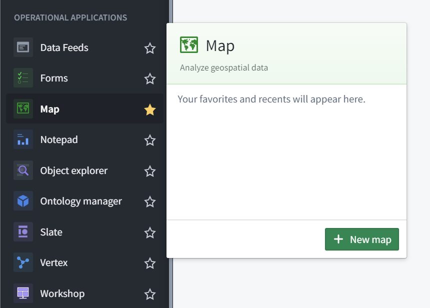
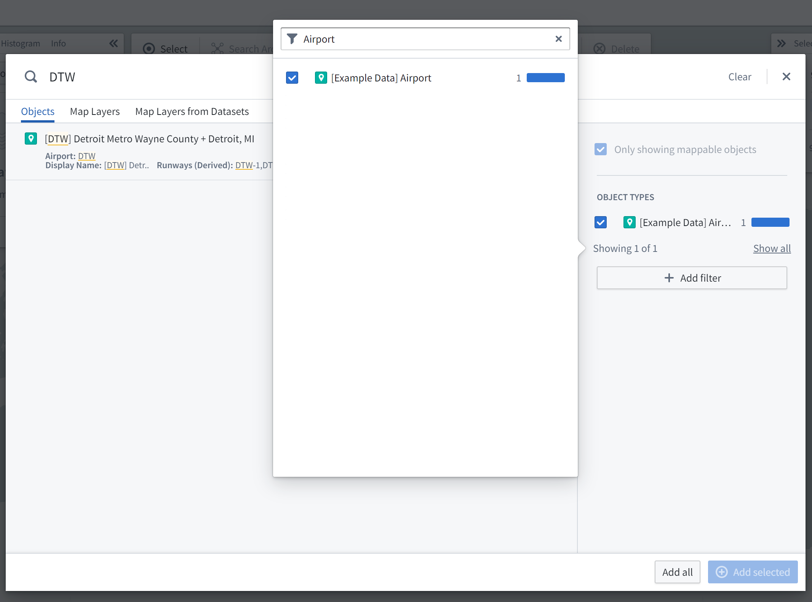
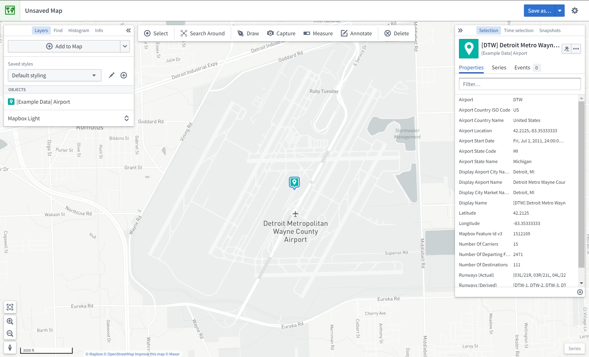
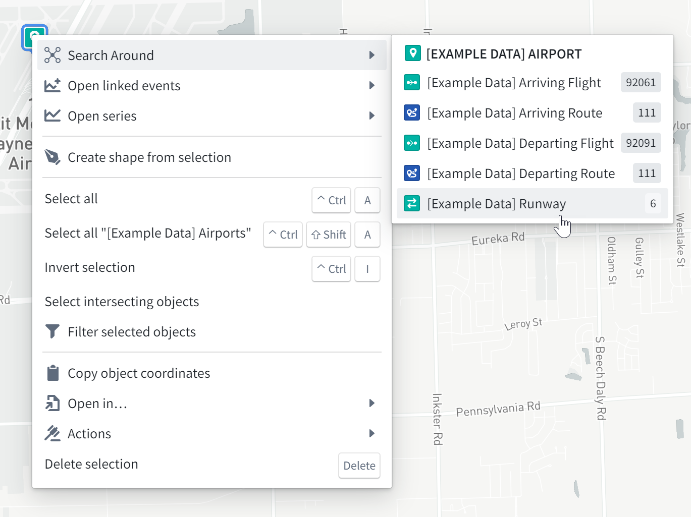
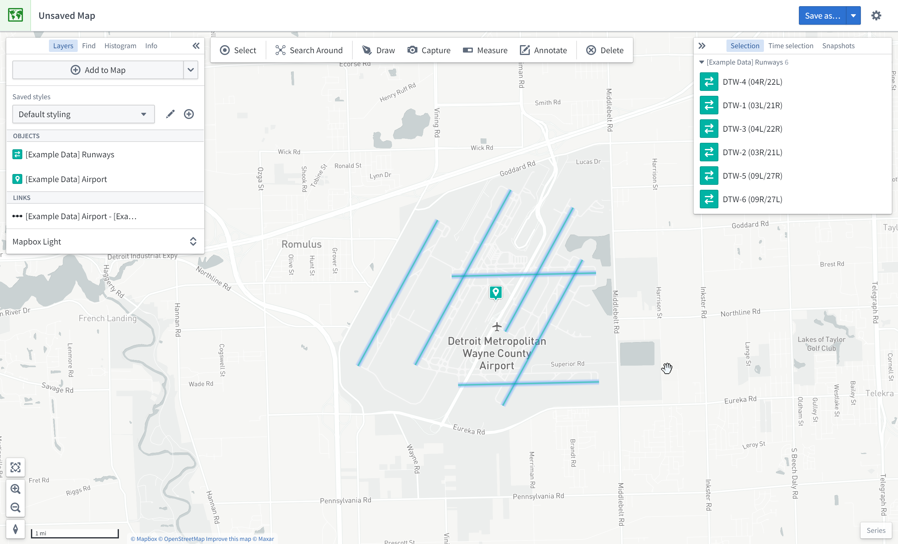
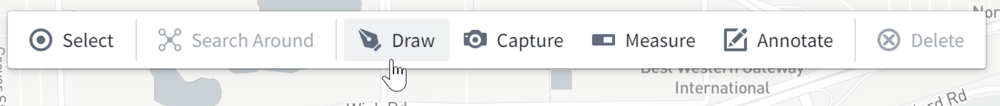
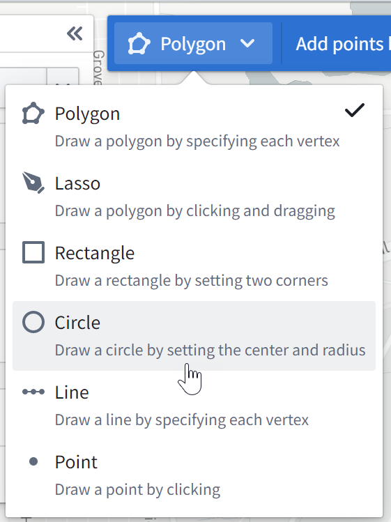
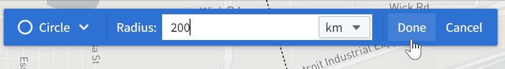

<!-- source: https://palantir.com/docs/foundry/map/getting-started/ · mirrored 2026-08-18 from Palantir Foundry docs -->

# Getting started

This guide demonstrates how to use the Map application with resources from the **Foundry Training and Resources** project. In this example, we will analyze some airline route data geospatially.

## Create a new map

To create a map, expand the left-hand side Foundry navigation bar, then click on **View all** in the Apps section. You will find the **Map** application under the **Operational Applications** section.

## Map application interface overview

When the Map application loads, you are presented with a blank map:

On the left side of the screen are the following panels:

* **Layers:** Add, manage, and style object and overlay layers; set the base layer.
* **Find:** Find objects and locations; navigate to specific geospatial coordinates.
* **Histogram:** Analyze and filter objects based on property and time series values.
* **Info:** Display an overall summary of the map.

At the top of the screen is a toolbar with the following functionality:

* **Select:** Select all items on the map, invert selection, or select items intersecting with a drawn shape.
* **Search Around:** Explore object relations.
* **Draw:** Draw and interact with shapes on the map, including polygons, circles, rectangles, lines, points.
* **Capture:** Capture a screenshot of the current map state.
* **Measure:** Measure physical distances on the map.
* **Annotate:** Add text or polygon annotations to the map.
* **Delete:** Remove items from the map.

On the right side of the screen are the following panels:

* **Selection:** Analyze details and take actions on selected items.
* **Time Selection:** Set the time range and current timestamp to apply to the map and time series views.

At the bottom right of the screen is the **Series** panel for the temporal analysis of time series and event data.

## Add an object to the map

In this example, we will search for the Detroit Metro Airport (DTW) and add it to the map.

First, click **Add to Map** in the **Layers** panel:

Then, search for `DTW` to find Detroit Metro Airport; you may need to select the object type `[Example Data] Airport` in the list on the right. Select the DTW airport object and click **Add selected**.

You should now see the map zoomed in on DTW airport; the object's geospatial data is a point, so the object is represented by a map pin indicating the coordinates. The **Layers** panel on the left now shows that you have an `[Example Data] Airports` layer, and the **Selection** panel on the right displays details about the selected object as shown below.

Try navigating around the map:

* Click and drag to pan the map around
* Zoom in and out by doing any of the following:
  * Scrolling the mouse wheel
  * Clicking the zoom buttons in the bottom-left corner of the interface
  * Pressing the **+** and **-** keys on your keyboard

## Search Around for linked objects

In this example, we will perform exploratory analysis regarding Detroit Metro Airport (DTW). First, add DTW's runways to the map by right-clicking the DTW object icon on the map, selecting **Search Around**, and then choosing `[Example Data] Runway`.

You should then see the runway objects added to the map as well. These runway objects are represented by lines on the map. You can hover the mouse over a runway line to see the runway ID. You can also click on a runway to select it and see more details in the **Selection** panel.

## Geospatial search

In this example, we will find other airports within 200 kilometers of Detroit Metro Airport (DTW).

First, click **Draw** to bring up the shape drawing tool:

Then, select the **Circle** tool:

Finally, from the map, click on DTW airport to choose the center point, enter "200", and select **km**.

This opens the Object Search dialog, filtered to objects that intersect with that circle. Choose **\[Example Data] Airports** from the **Object Type** list, and click **Add all**. This will add six additional airports to the map.
