<!-- source: https://palantir.com/docs/foundry/map/histogram/ · mirrored 2026-08-18 from Palantir Foundry docs -->

# Histogram

The **Histogram** panel allows for the selection and filtering of objects data on your map. The first section of the panel **Object types** shows the counts of objects by object type on your map. Below, there is one section per property type, across all object types present on your map. The filter box at the top of the panel allows you to filter results to properties with matching names.

## Use the histogram

Expand a histogram section to show a row for each distinct value of the given property, limited by default to the top five sorted by the count of values. Click **Show more** to display the next five rows.

Click the **Value** heading to toggle the sort method to **Value** (ascending) or **Value** (descending). Click the **Count** heading to toggle the sort method to **Count** (descending), **Count** (ascending), **Selected Count** (descending) or **Selected Count** (ascending).

| Value                                                                  | Count                                                     | Selected count                                                              |
|------------------------------------------------------------------------|-----------------------------------------------------------|-----------------------------------------------------------------------------|
| 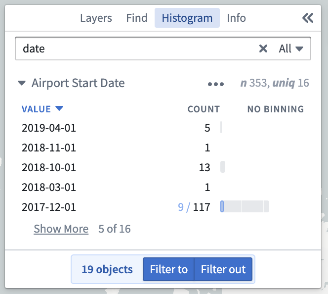 | 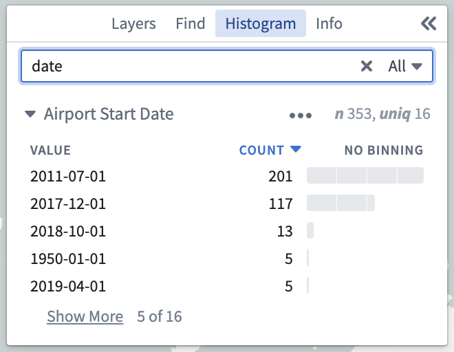 | 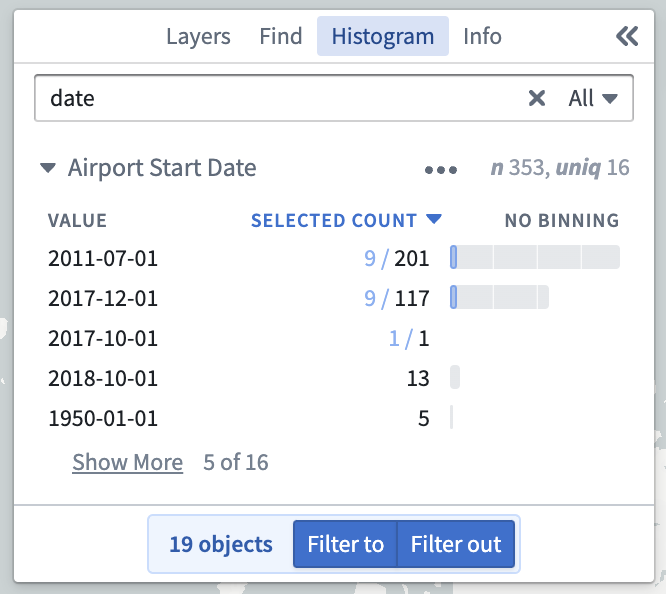 |

For date and numeric properties, an additional option to control the **Binning** is available.

For date properties, by clicking on this heading you can toggle the binning method between **Year**, **Year and month**, **Quarter**, **Month**, and **Day**. Click an example image to expand it.

| Year                                                            | Year and month                                                             | Quarter                                                               | Month                                                                     | Day                                                                   |
|-----------------------------------------------------------------|----------------------------------------------------------------------------|-----------------------------------------------------------------------|---------------------------------------------------------------------------|-----------------------------------------------------------------------|
| 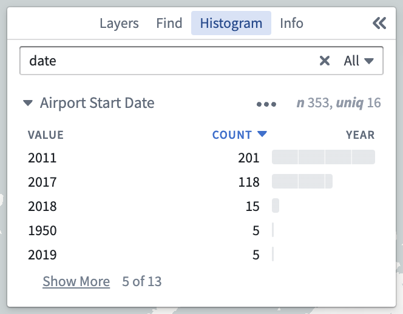 | 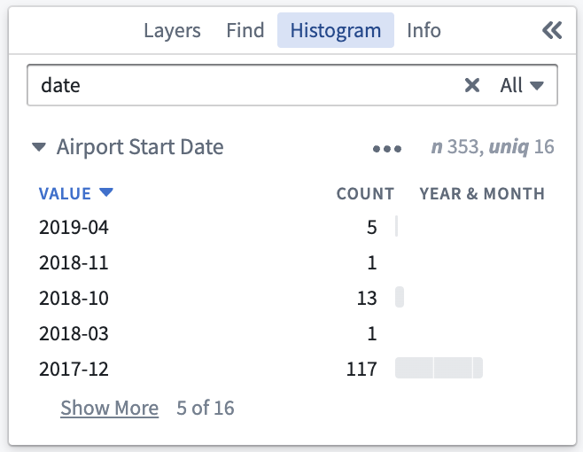 | 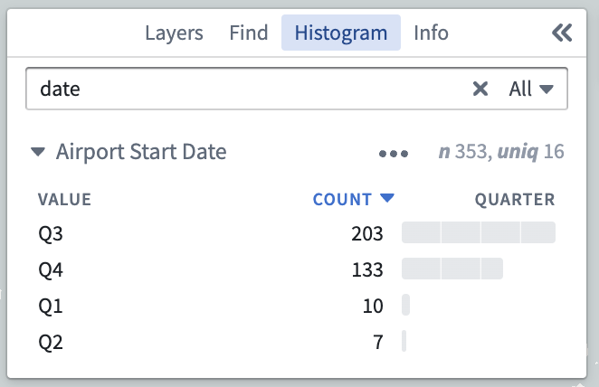 | 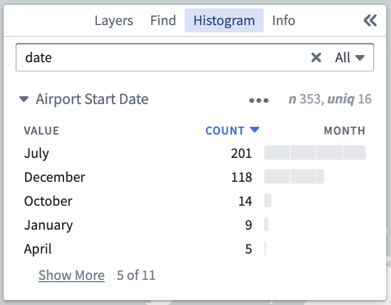 | 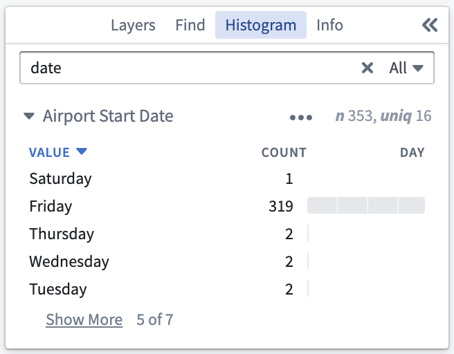 |

For numeric properties, by clicking on this heading you can toggle the binning method between **No binning**, **Equal size** which will automatically group the numeric values into equally sized bins, and **Logarithmic** which will group the numeric values by their order of magnitude.

| No binning                                               | Equal size                                                                        | Logarithmic                                                                           |
|----------------------------------------------------------|-----------------------------------------------------------------------------------|---------------------------------------------------------------------------------------|
| 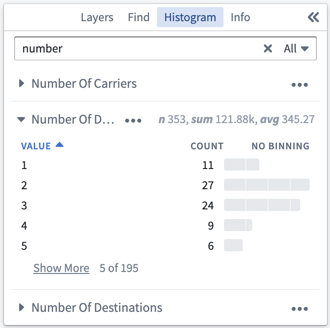 | 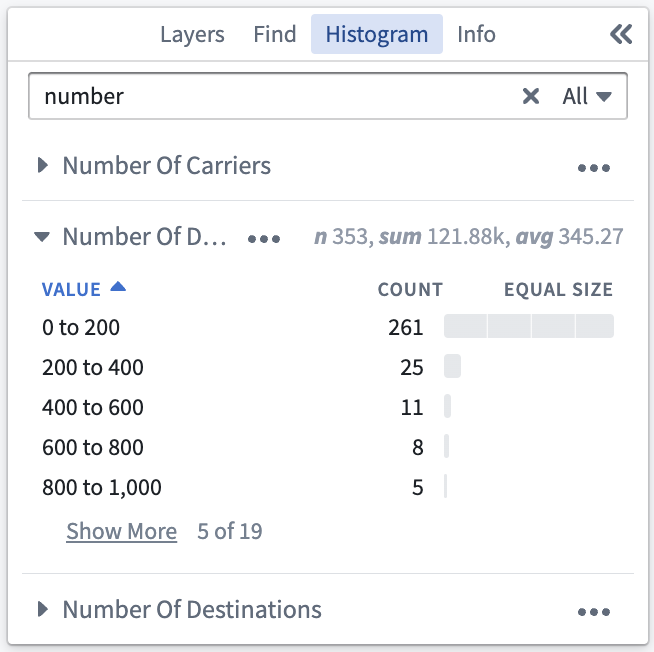 | 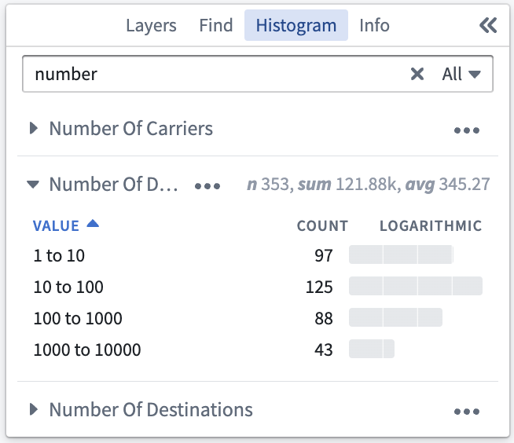 |

## Selection

Clicking on a row within the **Histogram** panel will select all matching objects. Holding Shift while selecting a second row will select a range of rows. Holding Ctrl (Windows) or Cmd (Mac) will add the row to the existing selection. This enables you to select rows across multiple sections of the histogram.

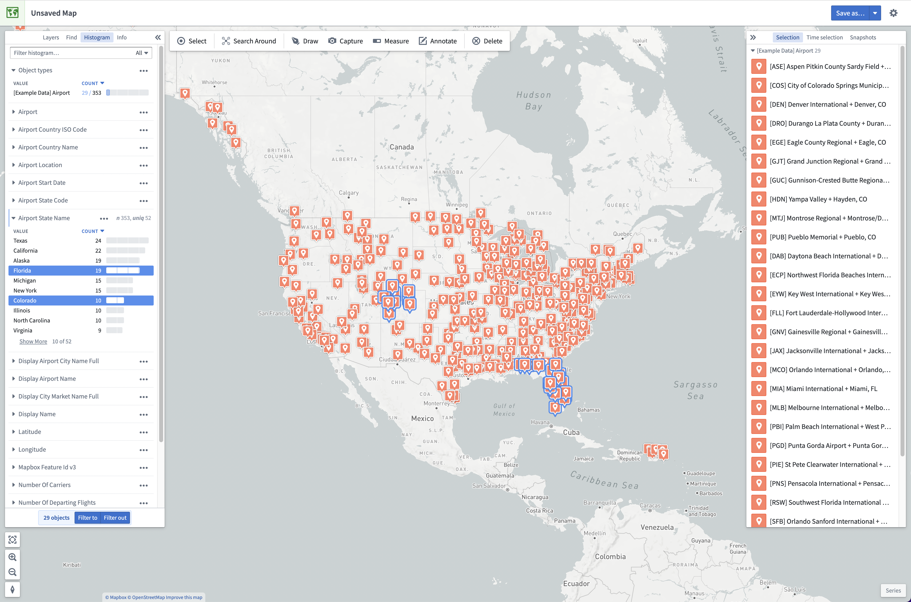

## Filtering

When histogram rows are selected, you can use the **Filter to** or **Filter out** buttons to create filters. Filters temporarily reduce the opacity of objects that do not match the filters. These objects will become uninteractive and will not contribute to the histogram statistics. When present, filters are visible in a bar above the main application toolbar. Filters can be removed using the **x** button on the filter, or by using the **Clear filters** button to remove all filters. Filters are not saved with your map.

Selecting **Filter to** will filter your map to only objects matching the selected rows.

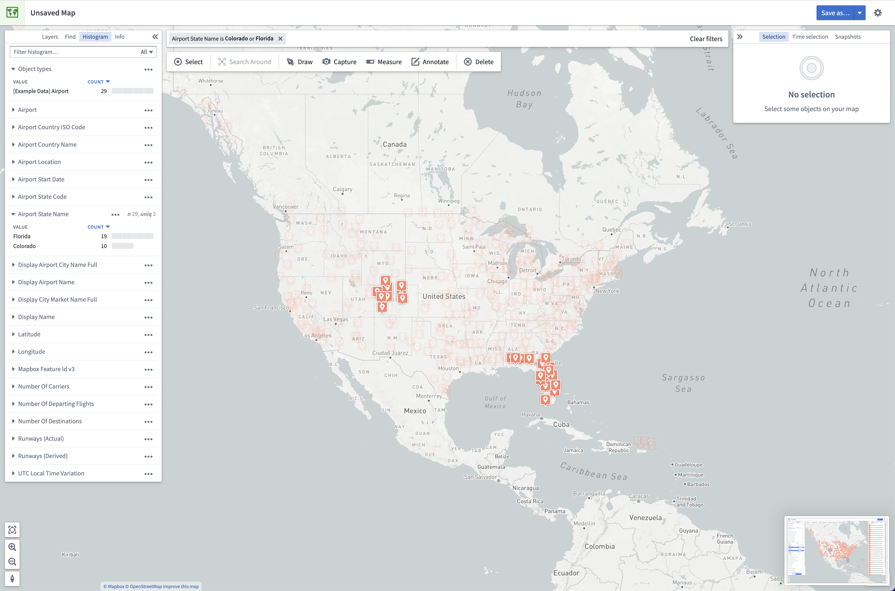

Selecting **Filter out** will filter your map to only objects that do not match the selected rows.

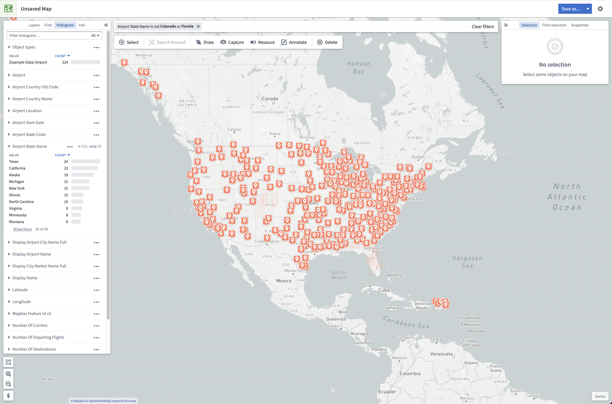

In addition to the **Filter to** and \**Filter out* buttons, you can also filter to an individual histogram row by double-clicking on it. To filter to all currently selected objects, you can use the **Filter to selected objects** menu item from the right click menu on your map.
