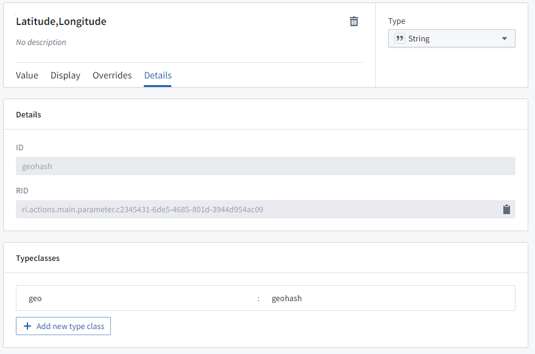
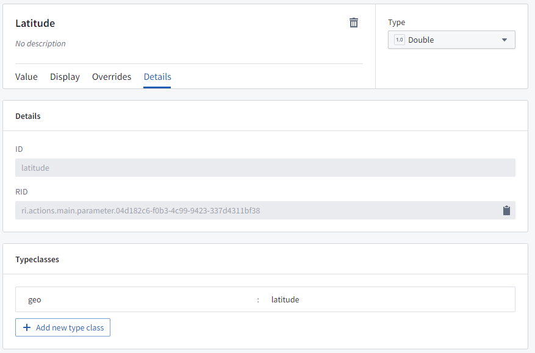
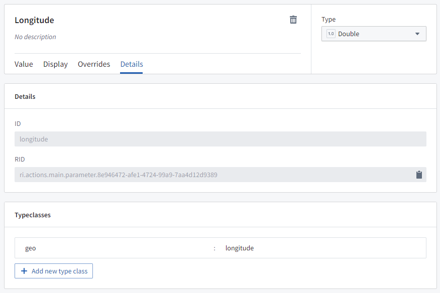
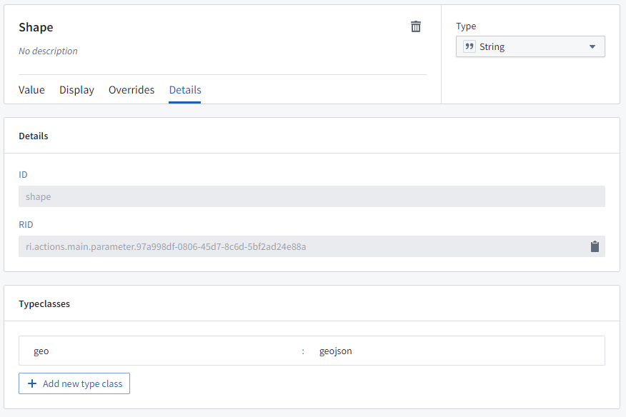
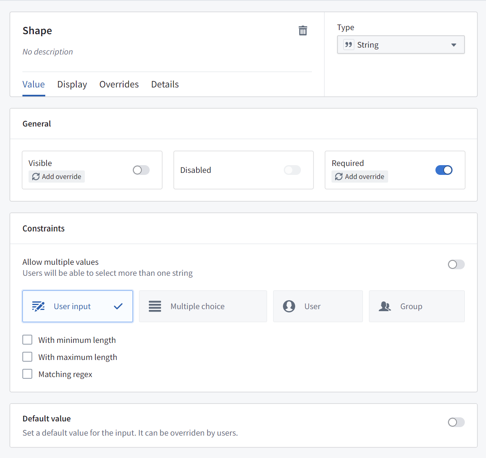
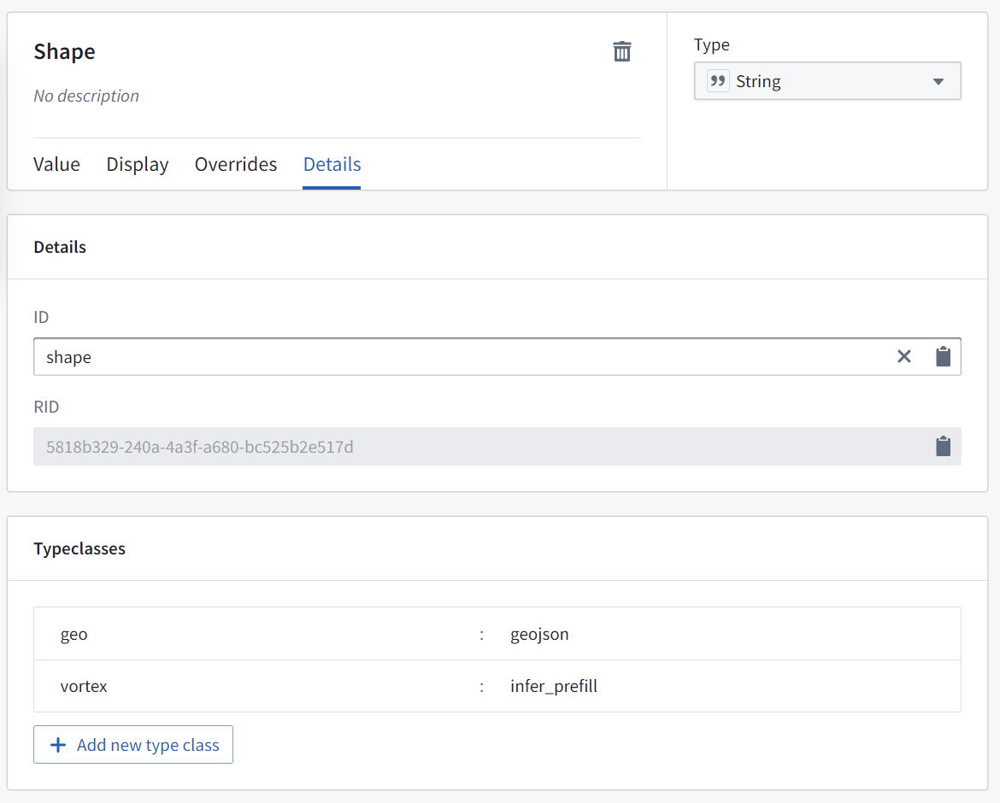

<!-- source: https://palantir.com/docs/foundry/map/integrate-actions/ · mirrored 2026-08-22 from Palantir Foundry docs -->

# Ontology Actions

You can configure [Actions](/docs/foundry/action-types/overview/) in the Ontology that users can apply to geospatial Objects in the Map application. For example, these Actions might be to create or edit objects based on points selected, polygons, or lines drawn on the map.

## Point Actions

When a user right-clicks on the map or on a point object, the Actions menu will show all Ontology Actions that apply to geospatial points. To define an Action that applies to points, it needs to have either:

* A `String` parameter with the type class: Kind: `geo` Value: `geopoint` (the data will be a string of `latitude,longitude`), or

* Two `Double` parameters:
  * One that will be passed the latitude, with the type class: Kind: `geo` Value: `latitude`, and
  * One that will be passed the longitude, with the type class: Kind: `geo` Value: `longitude`.

## Shape Actions

When a user selects a polygon object or draws a shape on the map, the **Actions** menu will show all Ontology Actions that apply to geospatial shapes. To define an Action that applies to shapes, the Action needs to have a `String` parameter with the type class: Kind: `geo` and Value: `geojson`, where the data will be a GeoJSON geometry string.

## Use actions to edit object `geoshape` properties

Actions can be configured to allow users to edit a `geoshape` property of an object on the map. A user can select the object, choose the relevant action from the **Actions** menu, and then modify the shape as necessary (for example, by adding or moving points, buffering, or translating the shape).

To configure an action to allow users to edit a `geoshape` property of an object on the map, create a "Modify object" action for the desired object type with a parameter that fulfills the following requirements:

* Is a `String` parameter
* Is mapped to the `geoshape` property on the object that you wish to update
* Has default value disabled
* With the type class: Kind: `geo`, Value: `geojson`
* With the type class: Kind: `geo`, Value: `prefill`

