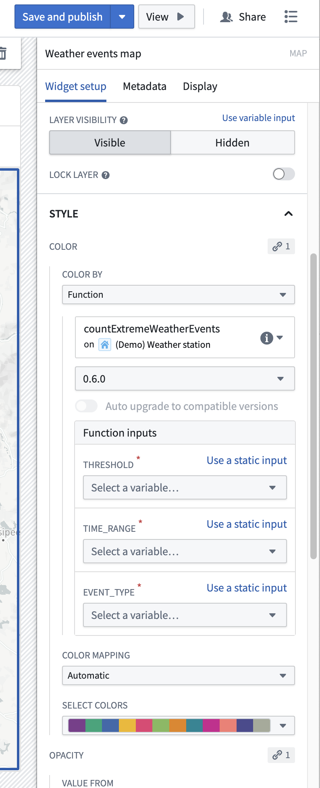

<!-- source: https://palantir.com/docs/foundry/map/integrate-functions/ · mirrored 2026-08-22 from Palantir Foundry docs -->

# Function-based styling

[Functions](/docs/foundry/functions/overview/) can be used in maps to generate dynamic values for objects. These values can be displayed in the **Selection** panel and applied to color objects on the map through [value-based styling](/docs/foundry/map/visualize-objects/#value-based-styling).

## Define a function for styling

A function must meet the following conditions to be used for styling in maps:

* It must have a single argument that is either an array or an object set.
* It must return a map where the keys are objects from the input argument, and the values are a string or numeric type.
  * In [TypeScript v1](/docs/foundry/functions/typescript-v1-getting-started/), use `FunctionsMap` to return the map.
  * In [TypeScript v2](/docs/foundry/functions/typescript-v2-getting-started/), use `Record` with `ObjectSpecifier` keys to return the map.

For example:

```typescript tab="TypeScript v1"
import { Function, FunctionsMap, Double } from "@foundry/functions-api";
import { ExampleDataRoute } from "@foundry/ontology-api";

export class DerivedPropertyFunctions {
    @Function()
    public async flightCancellationPercentage(routes: ExampleDataRoute[]): Promise<FunctionsMap<ExampleDataRoute, Double>> {
        const routeMap = new FunctionsMap<ExampleDataRoute, Double>();

        const allFlights = await Promise.all(routes.map(route => route.flights.allAsync()));

        for (let i = 0; i < routes.length; i++) {
            const route = routes[i];
            const flights = allFlights[i];
            const cancelledFlights = flights.filter(flight => flight.cancelled);
            const cancellationPercentage = (cancelledFlights.length / flights.length) * 100;
            routeMap.set(route, cancellationPercentage);
        }

        return routeMap;
    }
}
```

```typescript tab="TypeScript v2"
import { ObjectSpecifier, Osdk } from "@osdk/client";
import { Double } from "@osdk/functions";
import { ExampleDataRoute } from "@ontology/sdk";

async function flightCancellationPercentage(routes: Osdk.Instance<ExampleDataRoute>[]): Promise<Record<ObjectSpecifier<ExampleDataRoute>, Double>> {
    const routeMap: Record<ObjectSpecifier<ExampleDataRoute>, Double> = {};

    const allFlights = await Promise.all(routes.map(route => route.flights.allAsync()));

    for (let i = 0; i < routes.length; i++) {
        const route = routes[i];
        const flights = allFlights[i];
        const cancelledFlights = flights.filter(flight => flight.cancelled);
        const cancellationPercentage = (cancelledFlights.length / flights.length) * 100;
        routeMap[route.$objectSpecifier] = cancellationPercentage;
    }

    return routeMap;
}

export default flightCancellationPercentage;
```

:::callout{theme="neutral"}
The Map application passes objects to your function in batches, and expects values to be returned for all objects in the batch. All objects in a layer will *not* be provided in a single function call in the first argument. Your function should produce consistent results regardless of how objects are batched. This means that for any given object, the function should return the same value regardless of which objects are included in the same batch.
:::

## Pass additional arguments to functions

When using a function for styling in the Workshop Map widget, your function can accept arguments in addition to the primary objects input.

When working with additional arguments, the first argument will still always specify the objects for which you need to compute and return values. The widget automatically provides values for this first argument, but only the additional arguments will be shown. The widget configuration allows you to specify values for additional arguments by selecting variables.


