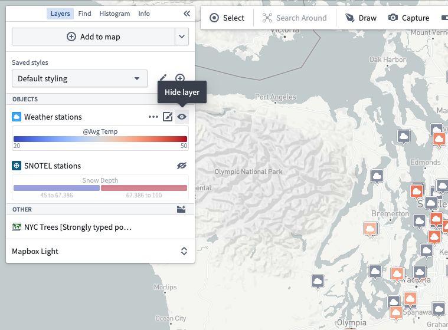
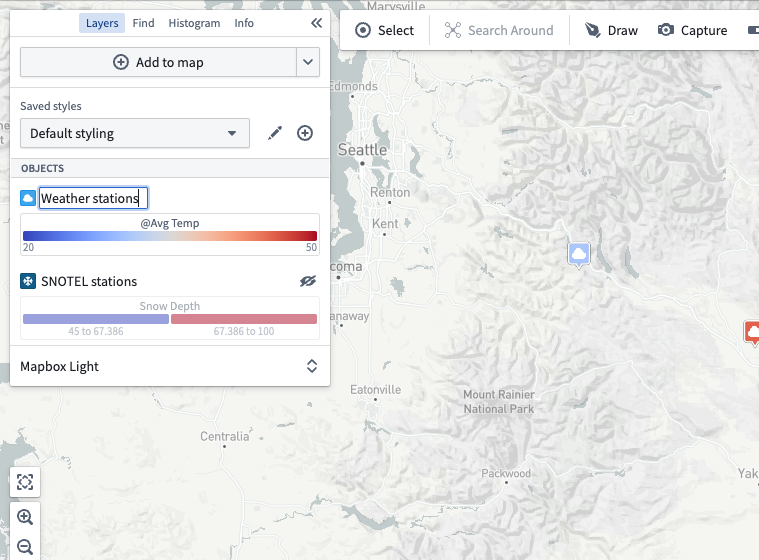
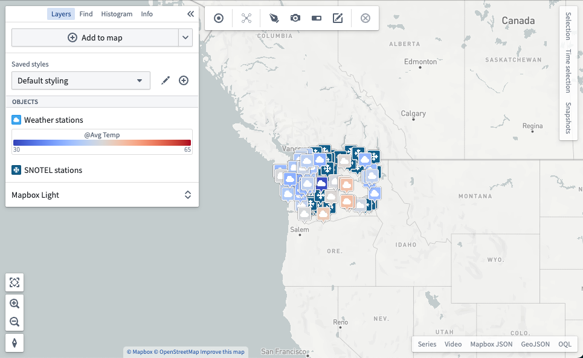
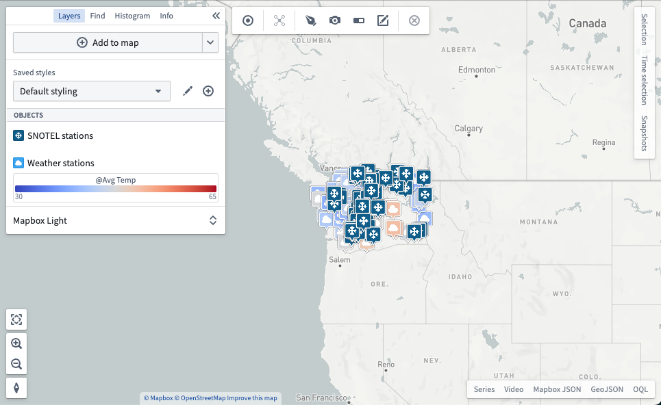
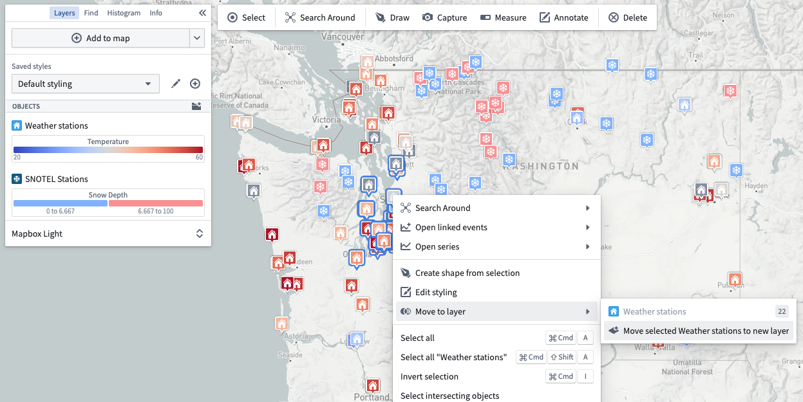
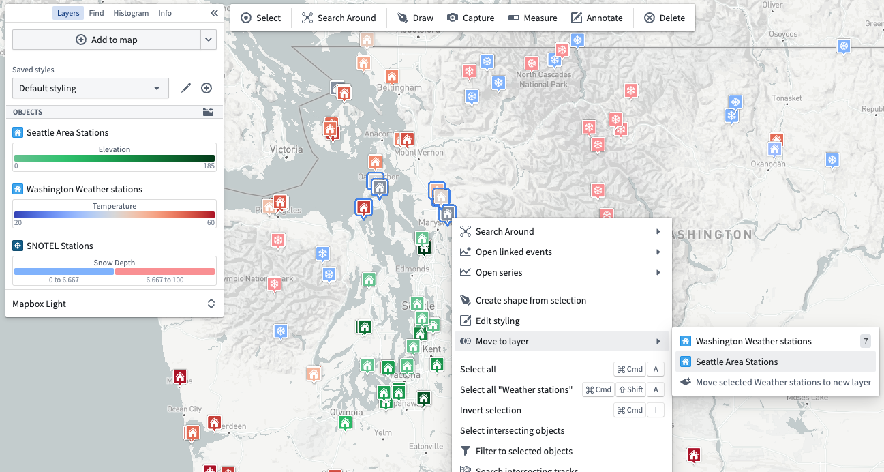

<!-- source: https://palantir.com/docs/foundry/map/layer-management/ · mirrored 2026-08-22 from Palantir Foundry docs -->

# Layer management

All data on your map is grouped into different [types of layers](/docs/foundry/map/core-concepts/), which can be managed in the **Layers** panel.

## Toggle layer visibility

Show or hide the contents of a layer by using the visibility toggle:

## Rename layers

Edit a layer's name by clicking on the current name.

## Reorder layers

Change the order of layers by dragging the layer's icon. Reordering layers can alter the rendering of your map, as layers that appear higher in the list of layers render on top of layers that appear lower in the list.

## Move objects to new or existing layers

Objects can be spread into multiple layers, as long as the contents are all of the same object type. After moving a selected set into a new layer, the objects in each set can be styled differently, as demonstrated in the images below.

