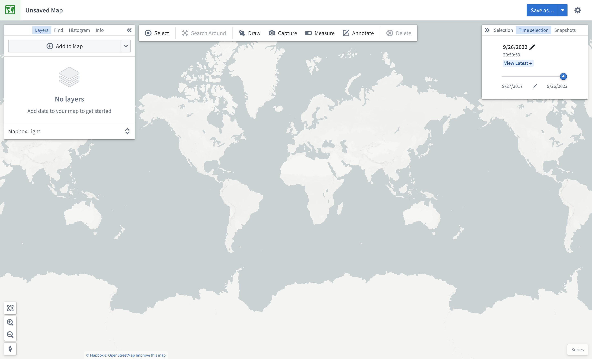

<!-- source: https://palantir.com/docs/foundry/map/map-overview/ · mirrored 2026-08-18 from Palantir Foundry docs -->

# Map interface overview

This page describes the elements of the Map application interface, shown below:

## Panels

The left side of the interface contains the following panels:

* **Layers:** Add, manage, and style object and overlay layers; set the base layer.
* **Find:** Find objects and locations; navigate to specific geospatial coordinates.
* **Histogram:** Analyze and filter objects based on property and time series values.
* **Info:** Display an overall summary of the map.

The right side of the interface contains the following panels:

* **Selection:** Analyze details about and take actions on the selected items.
* **Time Selection:** Set the time range and current timestamp to apply to the map and time series views.

At the bottom right of the interface, the **Series** panel enables temporal analysis of time series and event data.

## Toolbars

At the top of the interface is a toolbar with the following functionality:

* **Select:** Select all items on the map, invert selection, or select items intersecting with a drawn shape.
* **Search Around:** Explore object relations.
* **Draw:** Draw and interact with shapes on the map, including polygons, circles, rectangles, lines, points.
* **Capture:** Capture a screenshot of the current map state.
* **Measure:** Measure physical distances on the map.
* **Annotate:** Add text or polygon annotations to the map.
* **Delete:** Remove items from the map.
