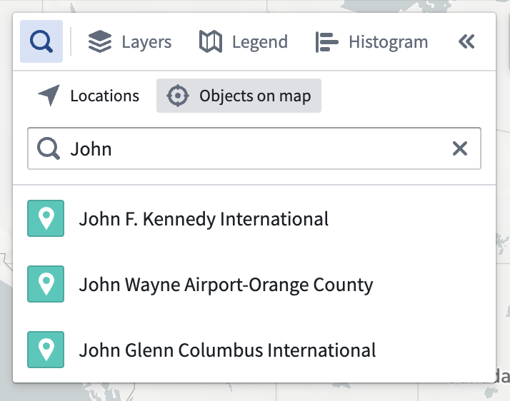
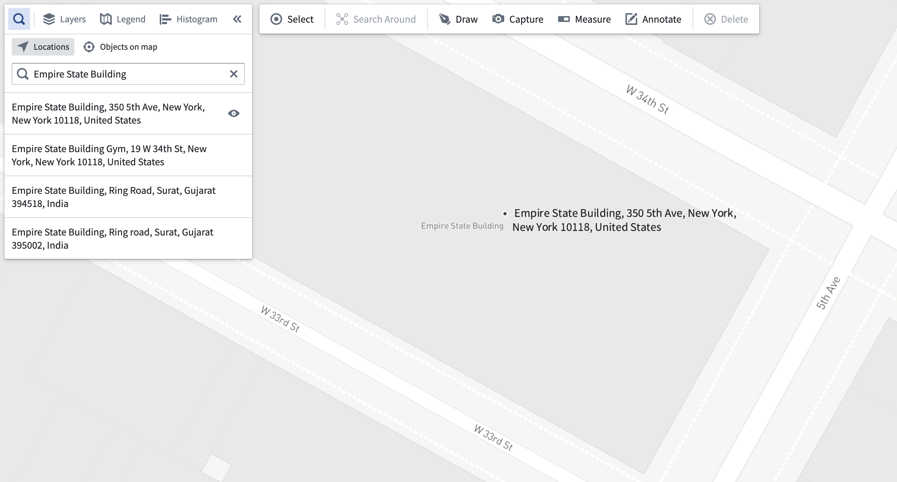
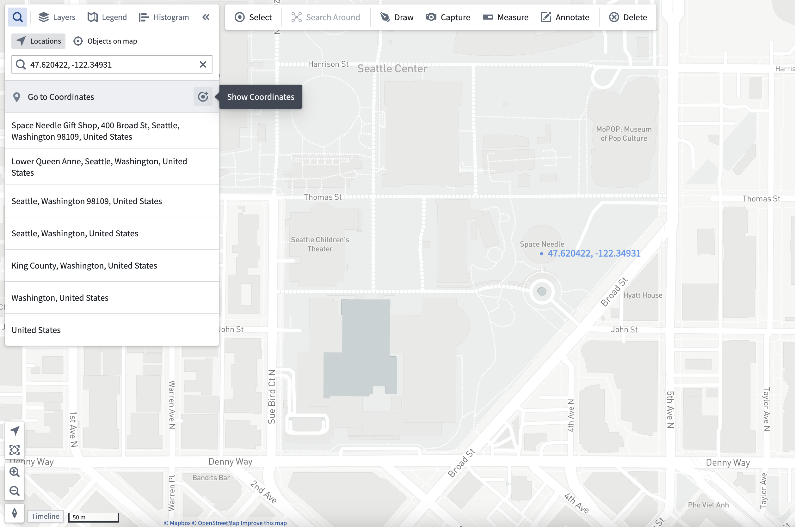

<!-- source: https://palantir.com/docs/foundry/map/navigation/ · mirrored 2026-08-22 from Palantir Foundry docs -->

# Navigation

The Map application allows you to pan, zoom, rotate, or tilt maps to facilitate viewing and analysis. You can also use shortcuts to quickly center the map or use the **Find** panel to locate objects, locations, and coordinates on a map.

## Basic map controls

* To pan, click and drag on the map viewport, or use the arrow keys on your keyboard.
* To zoom, use one of the following:
  * The **Zoom in** and **Zoom out** buttons in the bottom left
  * The mouse wheel
  * The **+** and **-** keys on your keyboard
* To rotate and tilt the map, click and drag while holding Ctrl (Windows) or Cmd (macOS).

## Center the map on items

Press **0** on your keyboard to navigate the map to display your selected objects. If you have no selected objects, **0** will navigate the map such that all objects on the map can be displayed.

## Use the Find panel

The **Find** panel allows you to navigate to objects that have been added to your map, as well as locations and coordinates.

### Find objects on map

Select the **Objects on map** tab, and enter a search query to find objects by title or property values. Selecting a result
will navigate the map to that object.

### Find locations

:::callout{theme="neutral" title="API Key Required"}
Your organization must have configured a [Mapbox API Key in Control Panel](/docs/foundry/map/control-panel/#api-keys) for this feature to be available.
:::

Select the **Locations** tab and enter a query to find locations by their address or name. Selecting a result will navigate the map to that location and show a marker with the location's address. You can hide the marker by clicking the **eye** icon next to the address in the results list.

### Navigate to Coordinates

With either the **Objects on map** or **Locations** tab selected, you can enter coordinates in the search input and navigate your map to them by selecting the result. Using the **Show coordinates** button will add a text annotation at your specified coordinates.

