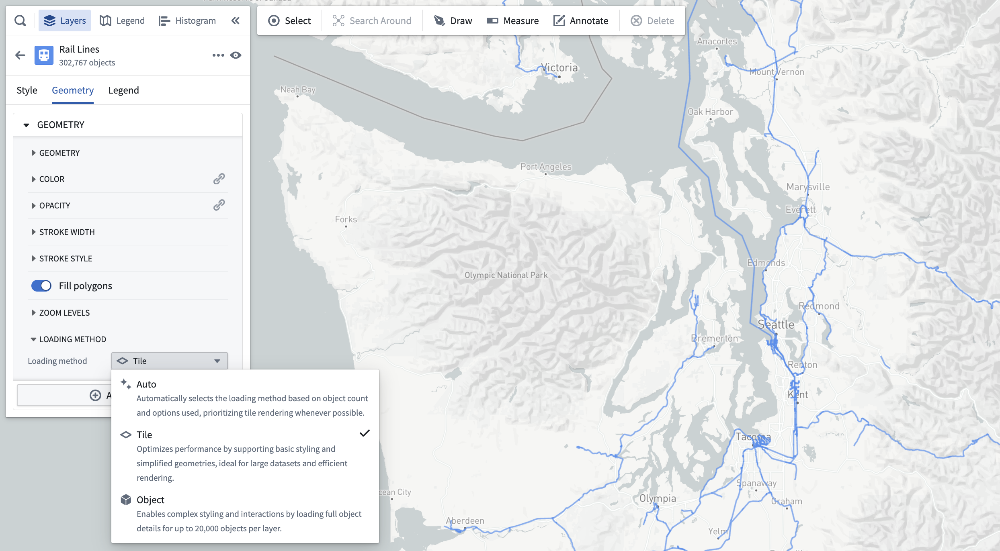

<!-- source: https://palantir.com/docs/foundry/map/objects-loading-methods/ · mirrored 2026-08-18 from Palantir Foundry docs -->

# Loading methods

By default, the Map application loads all objects in a layer to render them on the map. This inherently creates a scale limitation, as you can only render as much data as you can load from the Ontology into your browser. The **Loading method** configuration facilitates the presentation of high-scale object sets by restricting the application to load only the necessary data required to display the visible extent of the map.

## Configure loading methods

You can configure loading methods for a display with the **Loading method** dropdown menu in the style panel.

The loading method options are as follows:

* **Auto:** By default, the application will use the contents of the layer to infer the optimal choice between tile-based and object-based loading.
* **Tile:** Loads simplified geometry data within the bounds of the map viewport. This option is best suited for large object sets and prioritizing performance.
* **Object:** Loads full details for individual objects. This option is best suited for complex styling settings.

You will only be able to select a loading method selection for a display if the following is true:

* The object type for the layer has at least one [geopoint or geoshape property](/docs/foundry/geospatial/ontology/).
* The geometry property has the **Searchable** [render hint](/docs/foundry/object-link-types/metadata-render-hints/) enabled in Ontology Manager. If **Searchable** is not enabled, tiles will be empty and no objects will be visible on the map.
* Tile-based rendering is supported for the display type. Only icon, circle, and geoshape-based displays are currently supported.

## Add objects with tile-based loading methods

For object types that support tile-based loading methods, the search dialog will not limit how many objects can be added to the map. As such, the **Add all** option will always be enabled.

## Tile-based loading method compatibility

Objects rendered in a tile-backed display do not work correctly with a number of other Map application features. Many incompatible features require loading data from services that cannot support the scale of data rendered in tile-based layers.

The following sections list the Map capabilities that are not compatible with tile-based loading methods.

### Styling

Geopoint and geoshape properties are the only geometry sources supported for [object layer displays](/docs/foundry/map/visualize-objects/#displays), and only property values are supported for all [value-based styling options.](/docs/foundry/map/visualize-objects/#value-based-styling)

As such, the following options are *not* supported:

* Time series-based styling (measures and TSPs)
* Functions
* [Opacity by time](/docs/foundry/map/visualize-objects/#opacity-styling)
* [Labels](/docs/foundry/map/visualize-objects/#labels)
* [Timeline geometries](/docs/foundry/map/visualize-timeline/)
* [Search Arounds](/docs/foundry/map/integrate-searcharounds/)

### Filtering

Objects displayed in a tile-based display do not respect filtering applied in the [histogram](/docs/foundry/map/histogram/#filtering) or the [timeline](/docs/foundry/map/timeline/#filter-the-time-window).

### Shapes

Objects displayed in a tile-based display will not be included when [creating shapes from the active selection](/docs/foundry/map/shapes/#from-selection).
