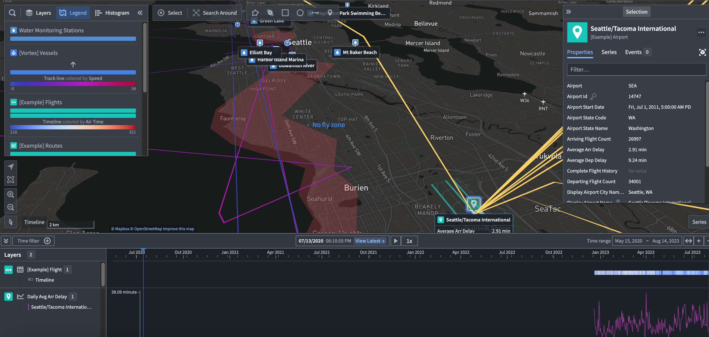

<!-- source: https://palantir.com/docs/foundry/map/overview/ · mirrored 2026-08-18 from Palantir Foundry docs -->

# Map

The **Map** application provides powerful geospatial and temporal analysis and visualization capabilities, allowing you to integrate data from across Foundry into a cohesive geospatial experience:

* Explore connections between geospatial objects, traverse physical networks.
* Search geospatially for point and polygon data, using bounding box and polygon intersection queries.
* Visualize contextual geospatial data from a variety of sources, including high-scale vector data and satellite imagery, and temporal data such as paths of object movements over time, and events.
* Interact by drawing shapes and performing geospatial actions.
* Build geospatial applications using map templates.

## Geospatial data on the Map

The Map application renders maps using the [Web Mercator Projection ↗](https://en.wikipedia.org/wiki/Web_Mercator_projection) (EPSG:3857), and expects latitude/longitude coordinates in WGS 84 degrees (EPSG:4326). See [Geospatial data in Foundry](/docs/foundry/geospatial/overview/) for more information on transforming geospatial data in Foundry.
