<!-- source: https://palantir.com/docs/foundry/map/selection/ · mirrored 2026-08-18 from Palantir Foundry docs -->

# Selection

The Map application has a variety of methods for selecting objects and annotations.

## Select items on the map

* **Select items:** Click on an object or annotation to select it. If there are multiple items under the cursor, all items will be selected.
* **Add items to existing selection:** Hold Ctrl (Windows) or Cmd (macOS) while clicking to add the items under the cursor to the selection.
* **Select all items in a rectangular region:** Hold Shift while clicking and dragging the cursor to select all items in a rectangular region.
* **Clear selection:** Click on an empty space on the map.

Additional selection options are available in the **Select** toolbar menu. These are:

* **Select All:** Select all items on your map.
  * Also available via the Ctrl+A (Windows) or Cmd+A (macOS) keyboard shortcut.
* **Select All of "Type":** Select all items matching the object type of the currently selected object.
  * Only available when there is an existing selection that contains a single type of object.
* **Invert Selection:** Swap the selection to all items that are not currently selected.
  * Also available via the Ctrl+I (Windows) or Cmd+I (macOS) keyboard shortcut.
* **Select intersecting objects:** Select all objects that intersect with all currently selected items.
  * Only available when there is an existing selection.
* **Select intersecting a shape...:** Allows you to draw a shape and select all objects that intersect with it.
  * Only available when there is no existing selection.

These functions are also available in the right-click menu.

| **Select** menu                                            | **Select** menu with existing selection                                                   | Right click menu for a shape                                                      |
| ---------------------------------------------------------- | ----------------------------------------------------------------------------------------- | --------------------------------------------------------------------------------- |
| 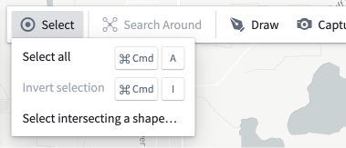 | 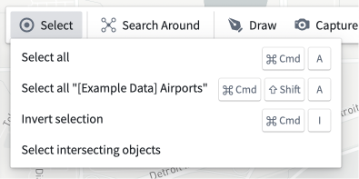 | 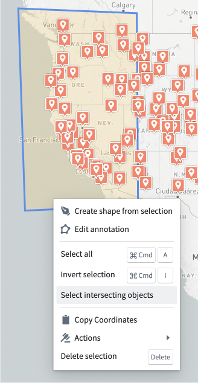 |

You can select all the objects in a given layer using the **Select objects in layer** menu item from the **Layer Actions** menu.

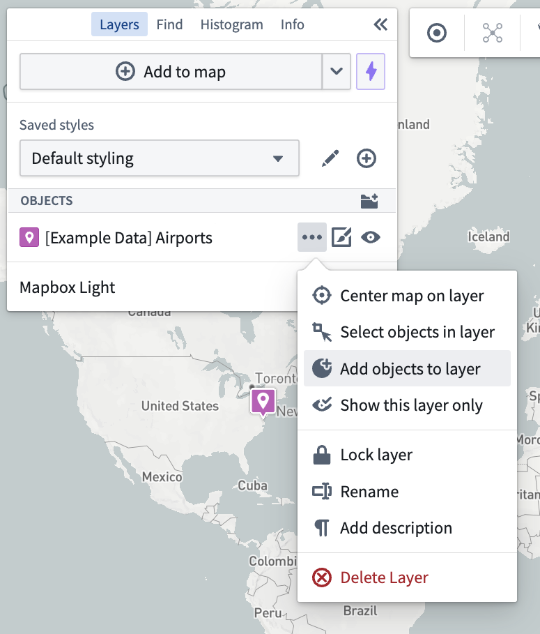

## Select items using the histogram

Click on a row within the **Histogram** panel to select all matching objects. Hold Shift while selecting a second row to select a range of rows. Holding Ctrl (Windows) or Cmd (macOS) will add the row to the existing selection. You can find more details in the [histogram and filtering documentation](/docs/foundry/map/histogram/).

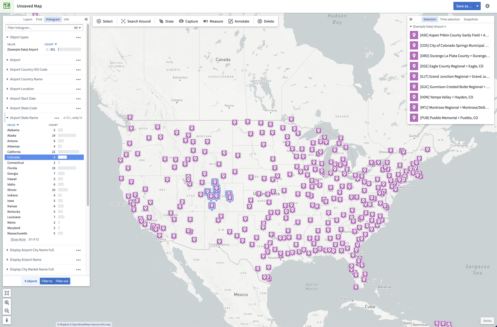

## Locking objects on the map

Lock the objects in a layer by selecting the **…** option, located in the **Layers** panel under the "Objects" section:

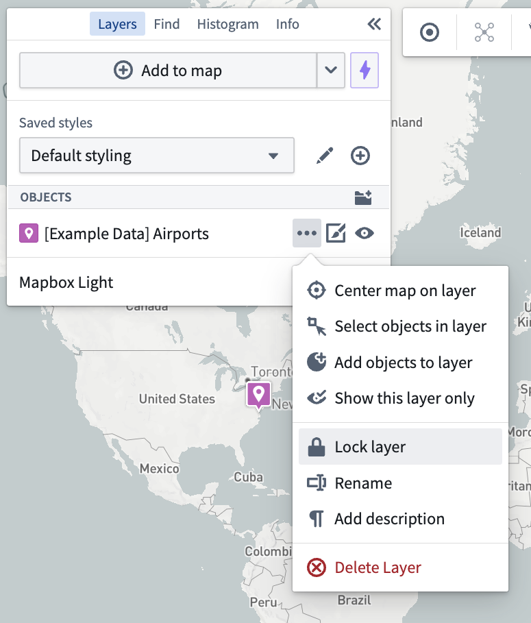

This will lock the objects of a layer so that they will not be selectable on the map. The objects can still be selected from the left **Layers**, **Find**, and **Histogram** Panel, but you cannot interact with them on the map with your cursor, selection shortcuts, or intersecting shapes. You can still edit the styling of a layer from the **…** menu button.

To unlock the objects in a layer, select the lock icon next to a layer in the **Layers** panel or access via the **…** dropdown menu.

## Selection Panel

If there are multiple objects selected, the **Selection** panel will list these objects. From this list, you can click a single object to narrow down your selection to that object. With a single object selected, the **Selection** panel on the right will show the details of the object.

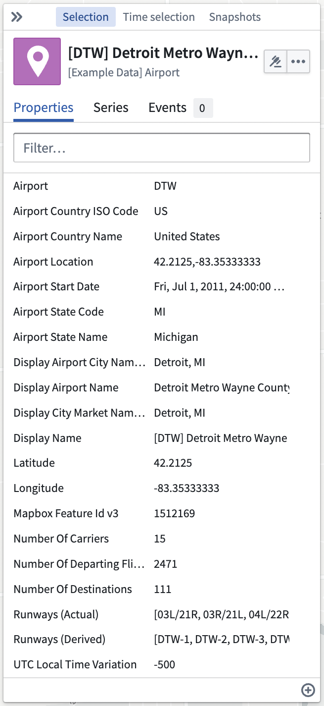

If the object has actions, these can be accessed by clicking the  icon. Additional actions such as centering the map on the object, deleting the object from the map, and opening the object in other applications are available from the **...** menu.

This panel has four tabs.

* The **Properties** tab will show the properties of the object.
  * You can pin properties by right-clicking and selecting **Pin property** which will cause the properties to be shown at the top and allow you to hide the other properties.
  * If there are any [functions](/docs/foundry/map/integrate-functions/) available, these can be added by selecting  in the bottom right. Selecting a function will add the value returned by that function to the properties list.
* The **Series** tab will show any series linked to the object.
* The **Events** tab will show any events linked to the object in the currently selected time window.
* The **Object view** tab will show the object view configured [in the Ontology Manager's **Object Views** tab](/docs/foundry/object-views/overview/).

You can change the default tab for an object in Ontology Manager's **Capabilities** tab.

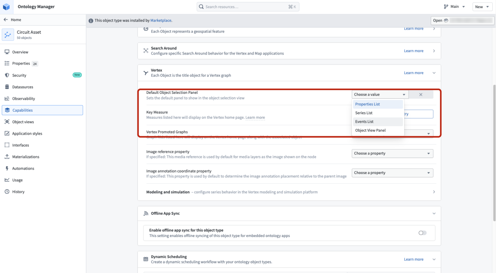

| Adding a function                                                                                                                              | Showing a function value                                                                                                             |
| ---------------------------------------------------------------------------------------------------------------------------------------------- | ------------------------------------------------------------------------------------------------------------------------------------ |
| 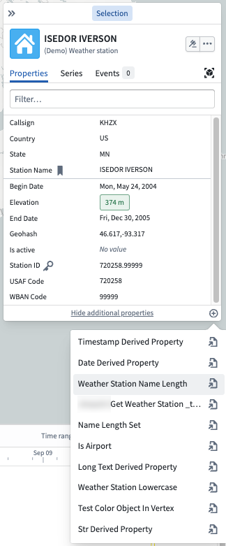 | 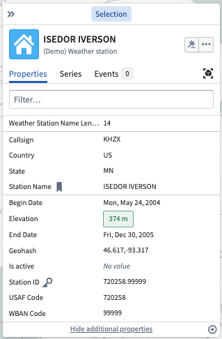 |

## Remove items from the map

To remove selected objects and annotations from your map, do one of the following:

* Click **Delete** in the toolbar
* Select the **Delete selection** entry in the right-click menu
* Press the delete key on your keyboard.

A toast will appear confirming the number of items that were deleted, with an **Undo** option to revert this action.

To remove all objects within a single layer, use the **Delete layer** item in the **Layer actions** menu.

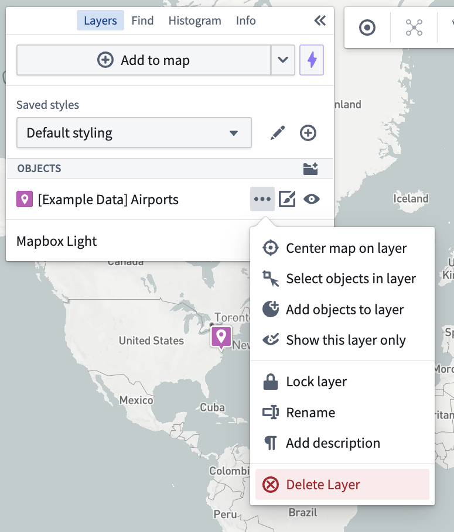
