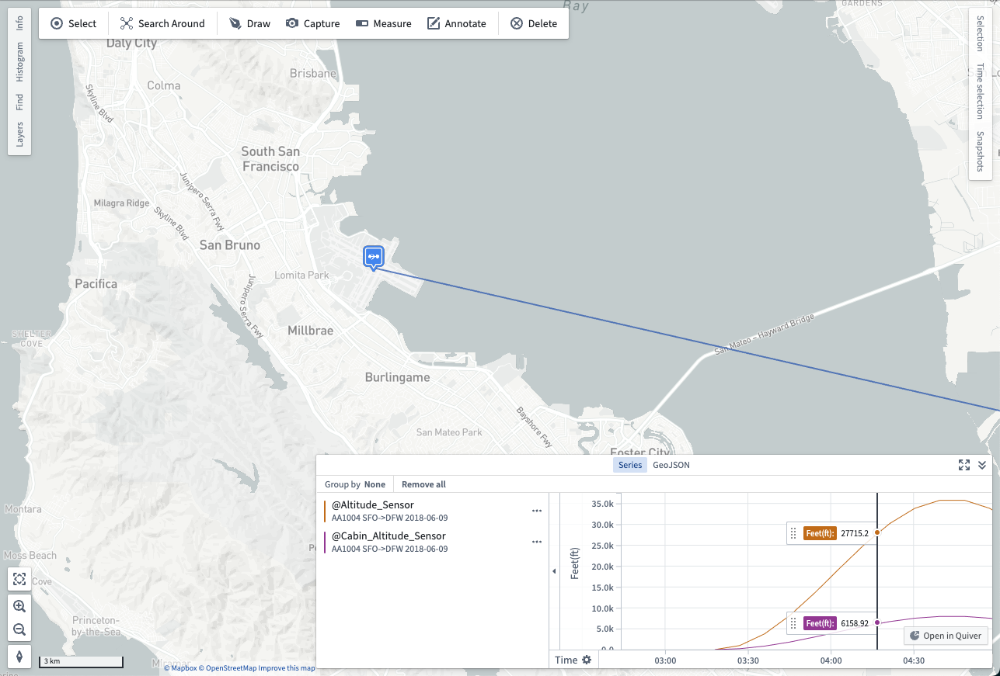
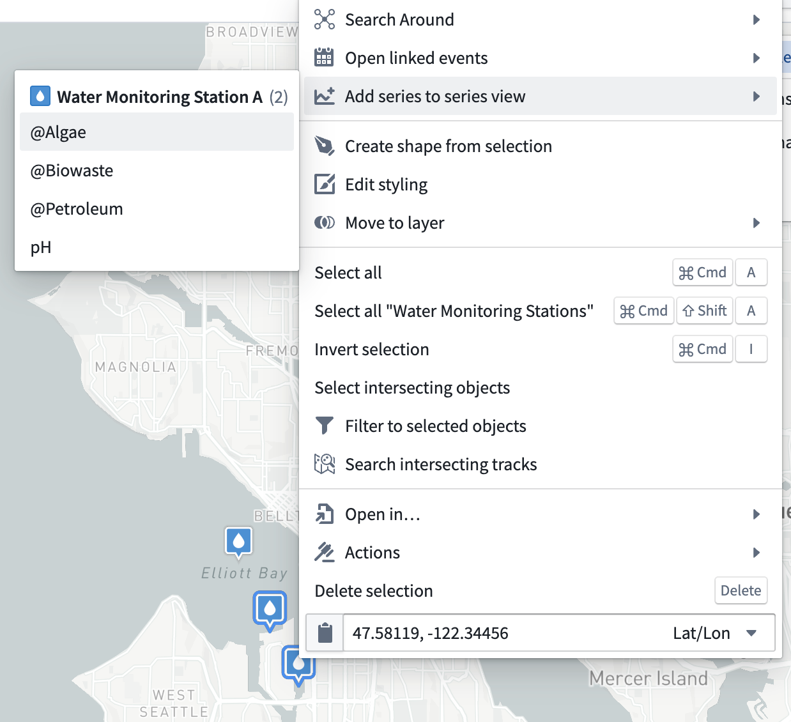
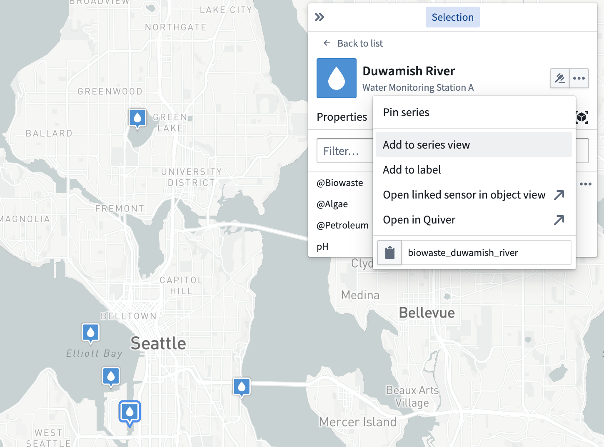

<!-- source: https://palantir.com/docs/foundry/map/series-panel/ · mirrored 2026-08-22 from Palantir Foundry docs -->

# Series panel \[Planned deprecation]

:::callout{theme="warning" title="Planned deprecation"}
The series panel in Map is in the [planned deprecation](/docs/foundry/platform-overview/development-life-cycle/) phase of development and will be unavailable after January 31, 2026. Use the [timeline](/docs/foundry/map/timeline/#time-series-beta) to view time-based data and further inspect time-based object properties in Map.   
Contact Palantir Support if you have questions about Map's timeline feature or require additional help migrating your workflows.
:::

You can use a map's **Series** panel to further inspect [time series](/docs/foundry/map/time-series/) and [linked events](/docs/foundry/map/events/#linked-events) synced with the timeline's selected time and time window.

## Time series

[Time series](/docs/foundry/time-series/time-series-overview/) are measured values that change over time.

You can add a time series to the series panel using the following methods:

* Right-click an object and choose **Add series to series view** before selecting a series from the **Add series to series panel** menu.
* Select an object, [open the **Selection** panel](/docs/foundry/map/selection/#selection-panel), and navigate to the **Series** tab. Select the **…** icon that appears when hovering over a series row to open a menu that contains additional actions related to the selected time series. Then, select **Add to series view**.

<table>
  <tr>
    <th>Right-click to add a time series</th>
    <th>Use the <b>Selection</b> panel to add a time series</th>
  </tr>
  <tr>
    <td></img></td>
    <td></img></td>
  </tr>
</table>

When you add a time series to the **Series** panel, a visualization of the series over time appears at the bottom of the map. You can use the **Series** panel to move through time by selecting the point in time you wish to view. Additionally, you can scroll across the rendered time range.
