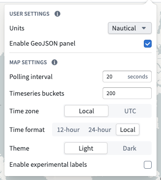
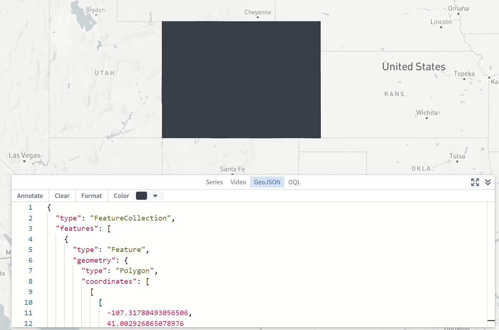
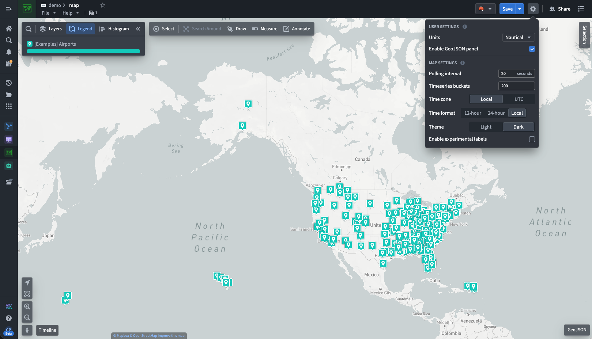

<!-- source: https://palantir.com/docs/foundry/map/settings/ · mirrored 2026-08-18 from Palantir Foundry docs -->

# Settings

Choose the settings gear icon () in the top right corner of the Map screen to open the settings menu:

Some settings will be limited by what is configured organization-wide via [Control Panel](/docs/foundry/map/control-panel/).

## User settings

Settings that are associated with your user and apply to all maps you open.

### Units

You can specify the units in which distances are displayed. This is a per-user setting and is applied for you whenever you are using the Map application. The options for units are:

* Metric
* Imperial
* Nautical

### Enable GeoJSON panel

You can enable an additional GeoJSON panel in the bottom-right corner of the screen that allows you to enter and edit GeoJSON data, and create annotations based on the GeoJSON geometries. This is a per-user setting and is applied for you whenever you are using the Map application.

## Map settings

Settings that are stored per-map. These settings will apply for all users when using this specific saved map.

### Polling interval

You can specify the frequency at which new time series and time series property values will be loaded when in ["View Latest" mode](/docs/foundry/map/time-overview/#selected-time-and-time-range).

### Time series buckets

You can specify the number of points to load for each track.

### Time zone

You can specify the time zone in which to display the map. The options for time zone are:

* Local (this will use the time zone of the viewer's computer)
* UTC

### Time format

Time format in which to display the map.

* 12-hour
* 24-hour
* Local

Note that 24-hour is the only time format available if the time zone is set to UTC.

### Theme

Switch between **Light** and **Dark** mode for the map app. This setting does not change the base map to be light or dark, only the UI of the map application.

### Enable experimental labels

You can enable an experimental method for displaying and positioning [objects labels](/docs/foundry/map/visualize-objects/#labels) on the map. This method applies a positioning algorithm that attempts to minimize instances of labels overlapping each other, or obscuring objects.  However, in some circumstances (such as with large numbers of labels) the resulting label positioning could be undesirable, or labels could reposition in undesirable or distracting ways. This is a per-map setting that applies for all users when using this specific saved map.
