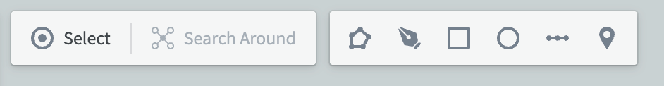
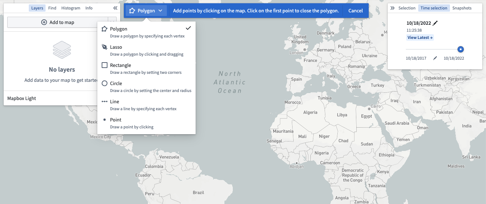
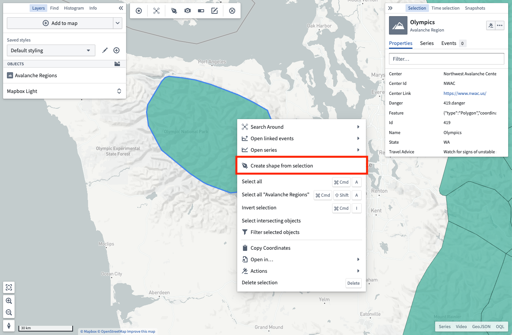
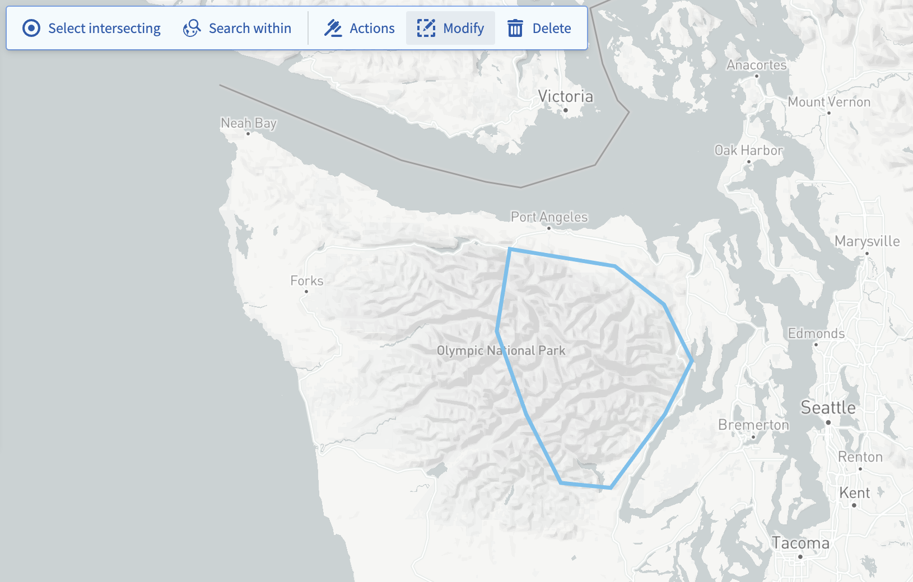
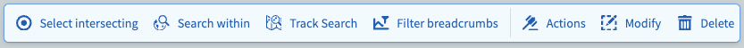

<!-- source: https://palantir.com/docs/foundry/map/shapes/ · mirrored 2026-08-18 from Palantir Foundry docs -->

# Shapes

Use shapes to select a geospatial area on your map in which to search for objects, select objects already on your map, take actions, or create annotations.

## Create a shape

All operations available on shapes first require an active shape. Create a shape in one of the ways below:

* Construct a shape yourself using the [drawing tools](#draw-a-shape).
* Use the currently selected objects and annotations to create shapes that cover the [same geospatial area as your selection](#from-selection).

### Draw a shape

Choose one of the **Drawing method** options in the toolbar or press `D` on your keyboard to manually draw a shape on the map.

Select from the various modes available using the dropdown accessible by clicking on the current drawing mode:

### From selection

You can also create shapes from the active selection on the map. Right-click on any selected object and use the **Create shape from selection** menu entry.

## Modify a shape

You can edit active shapes on your map by using the **Modify** button in the shapes toolbar.

There are a number of modification tools available:

* **Edit points:** Lets you drag individual vertices to modify polygons, lines, or points.
* **Buffer:** Allows entering a specific distance by which to grow or shrink the perimeter of shapes.
* **Translate:** Enables moving an entire shape by dragging it.
* **Replace:** Discards the currently drawn shape and opens the drawing tools to draw a new shape.

Once finished applying modifications, use the **Done** button to return the shapes toolbar.

## Perform operations with an active shape

With an active shape, use the **Shapes** toolbar to perform various operations:

* **Select intersecting:** Selects every object on your map that is in a visible layer and that intersects the current shape.
* **Search within:** Opens the **Add objects** panel and filters the results to only include objects that have geospatial data that intersects the current shape. Note that only objects with [`geohash` or `geoshape` properties](/docs/foundry/map/integrate-objects/) can be searched.
* **Actions:** Shows every available ontology action that consumes shapes. Read more about configuring geospatial actions at [Actions](/docs/foundry/map/actions/). Note that the actions button will only appear if geospatial actions have been configured in the ontology.
* **Delete:** Removes the selected shapes from the map interface.
