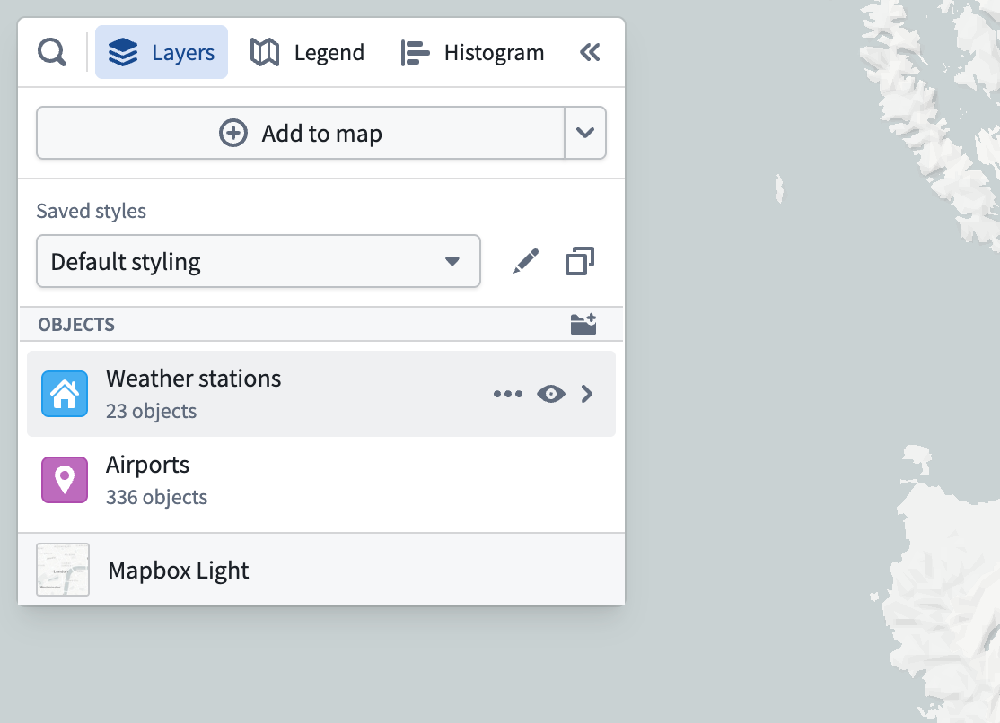
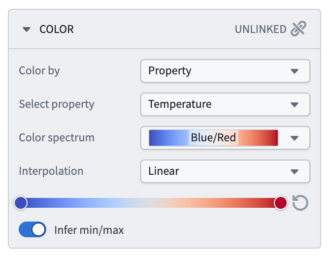
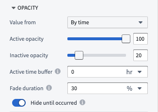
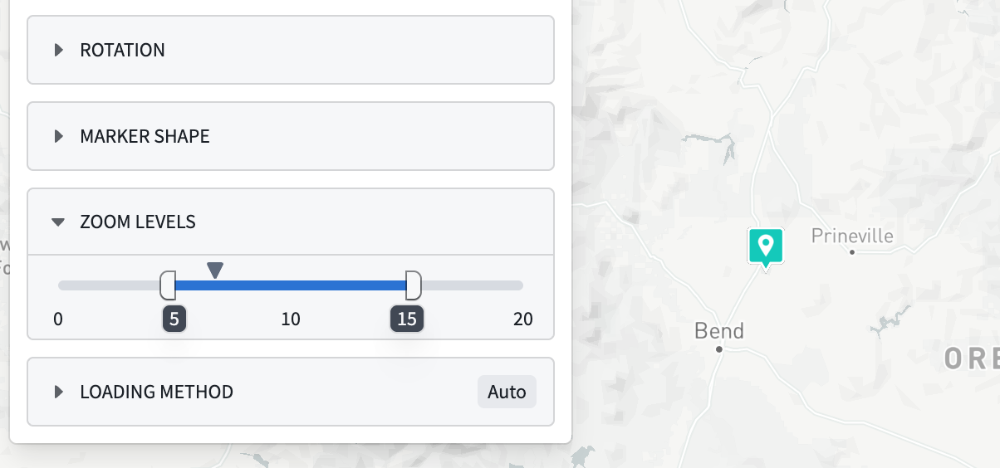
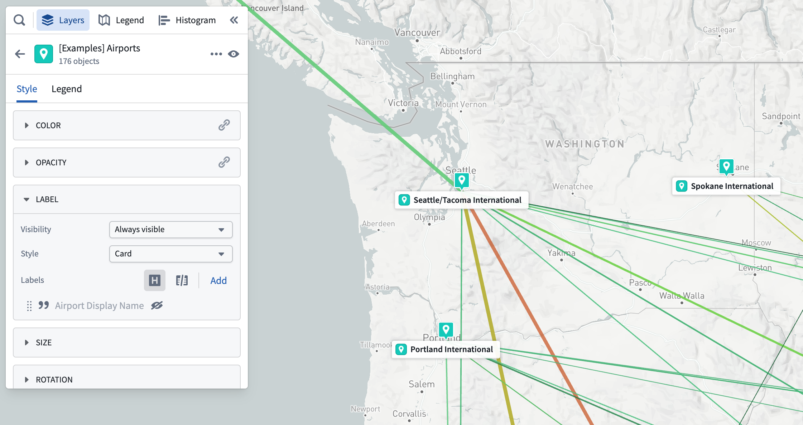
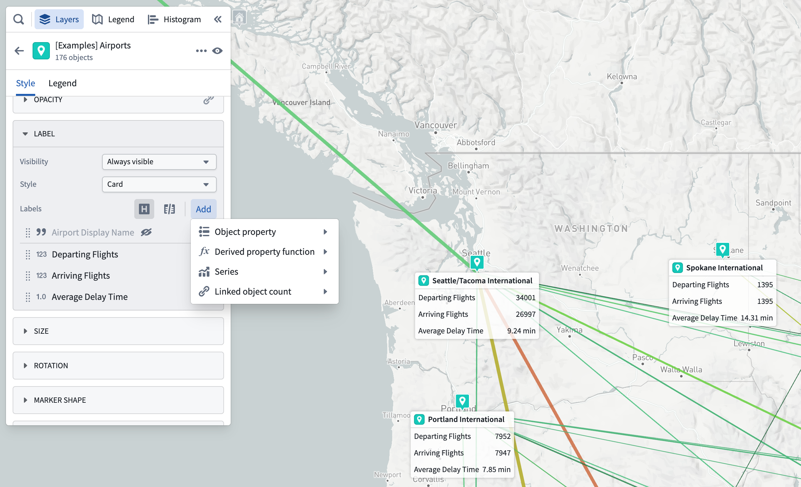
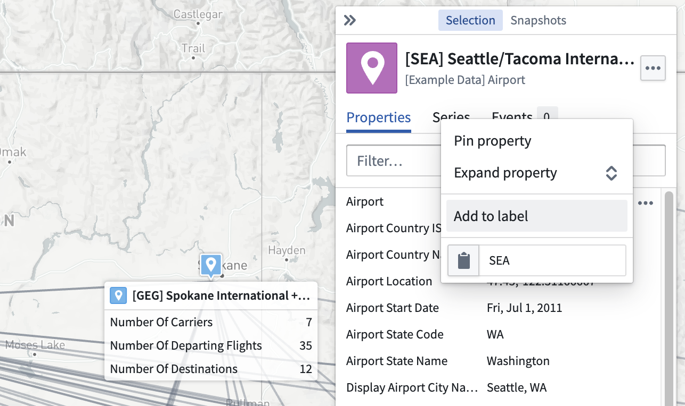
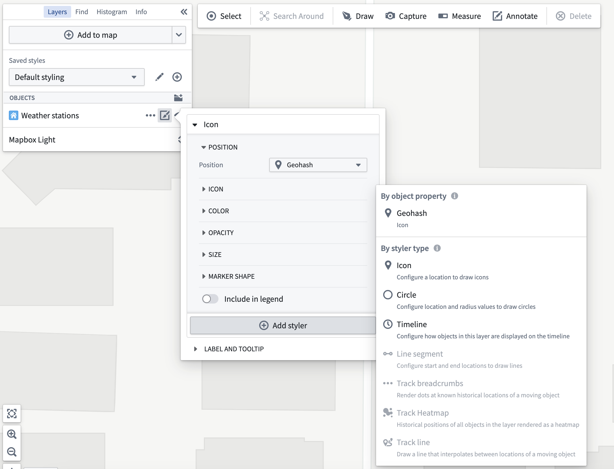
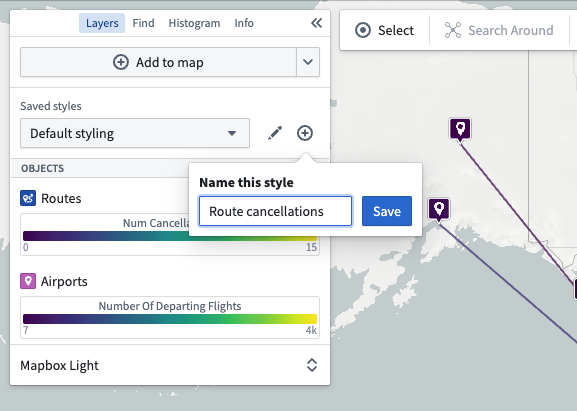
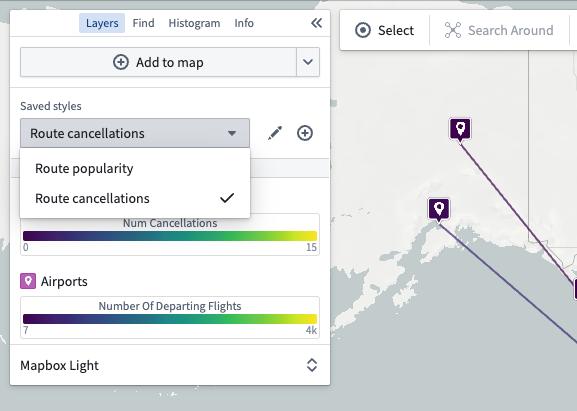

<!-- source: https://palantir.com/docs/foundry/map/styling/ · mirrored 2026-08-22 from Palantir Foundry docs -->

# Styling

Use **styling** to control the visualization of the data contained in your map's layers. By editing attributes like color, size, stroke width, and more, you can highlight key attributes of your data and create maps that help you understand patterns or identify outliers in your geospatial data.

## Styling options

Edit styling for a layer by using the edit styling button in the **Layers** panel:

:::callout{theme="neutral"}
This list contains styling options that are used across different layers, but the options available for each layer vary based on the kind of data contained within the layer. For example the **Fill polygons** option only appears when the styler being configured renders as a polygon. Within each option, the available modes also vary by the layer type: property, function, and measure based styling are only available on object layers, while fixed styling is available on every layer type.
:::

### Color

Use the **Color** section to control the coloring for objects in the layer. The **Color by** dropdown contains the various modes that can be used for coloring:

* **Fixed:** Select a single color that uniformly applies to all objects in the layer.
* **Function:** Color objects using values computed by a function.
* **Property:** Color objects using values from a property.
* **Measure:** Color objects using values from a [time series](/docs/foundry/time-series/time-series-overview/).

When coloring by a function, property, or time series that has numeric values, use the gradient editor to map values to output colors. The colors used in the gradients can be edited by selecting points on the gradient bar. The numerical range (min/max) for the color gradient is automatically inferred, but this can be toggled off to set the range manually.

When coloring by a function, property, or time series that has string values, the **Color mapping** dropdown contains methods for mapping values to colors:

* **Manual:** Explicitly specify colors to use per-value.
* **Automatic:** Assign colors from a color scheme automatically, to differentiate between different values without having to configure specific values.
* **None:** Attempts to apply each value directly as a hex color.

### Opacity

Use the **Opacity** section to control the transparency for objects in the layer.

The **Value from** dropdown contains the various ways you can specify opacity:

* **Fixed:** Select a single opacity that uniformly applies to all objects in the layer.
* **By time:** When rendering [tracks](/docs/foundry/map/integrate-objects/#track-objects) or objects that are [events](/docs/foundry/map/integrate-objects/#event-objects), control their opacity based on the global [time selection](/docs/foundry/map/time-overview/#selected-time-and-time-range).

  

  * **Active opacity:** Sets the opacity when the object or point is considered active.
  * **Inactive opacity:** Sets the opacity when the object or point is not considered active.
  * **Active time buffer:** Sets how temporally close an event or track point's timestamp must be to the current time cursor for it to be considered active
  * **Fade duration:** Sets the time period over which an object's opacity fades from the active to inactive opacity, once it becomes inactive.
  * **Hide until occurred:** If enabled, an object will be fully hidden until the time cursor has passed the start of the event or a track point's timestamp.

  :::callout{theme="neutral"}
  The **Value from** dropdown and **By time** opacity options will only appear when styling [tracks](/docs/foundry/map/integrate-objects/#track-objects) or objects with [event data](/docs/foundry/map/integrate-objects/#event-objects).
  :::

### Zoom levels

Use the **Zoom levels** section to control the visibility range of the objects in the layer. The caret symbol indicates your current zoom level.

When the viewport is at a zoom level within the active range, the corresponding display will be rendered on the map. When outside the range, the corresponding display will be hidden.

The zoom level configuration only applies to layers that are toggled to be [visible](/docs/foundry/map/layer-management/#toggle-layer-visibility).

### Stroke width

Use the **Stroke width** section to control the width used when rendering lines.

### Stroke style

Use the **Stroke style** section to control the dash pattern used when rendering lines. The available options are:

* **Solid**

  
* **Dashed**

  
* **Dotted**

  

For [line segments](#edit-object-layer-stylers), use the stroke style section to optionally display arrows, as pictured below.

### Fill polygons

When **Fill polygons** is enabled, polygons render with a minimal stroke and their interior filled with the specified color. When disabled, the polygon is instead only stroked, using the styling configuration in **Stroke width** and **Stroke style**.

### Icon

When configuring an icon styler, use the **Icon** section to configure the icon that is rendered for each object. The **Icon source** dropdown contains the modes that can be used for assigning icons:

* **Object default:** Use the icon assigned to the object in the Ontology.
* **Fixed icon:** Select a single icon that will apply to all objects in the layer.
* **Property:** Assign icons to objects by mapping property values to icons.

### Marker shape

When configuring an icon styler, use the **Marker shape** section to configure the shape of the marker that the icon is rendered within. The available options are:

* **Circle**

  
* **Pin**

  
* **None**

  

### Include in legend

By default, when coloring a layer by property, function, or measure, a legend will display the color mapping to help you interpret the colors when viewing your map. You can remove the legend by disabling the **Include in legend** toggle. Similarly, when coloring by a fixed color, you can opt-in to showing a legend entry by turning **Include in legend** on.

### Labels and tooltips

There are two optional toggles related to labels and tooltips:

**Show labels:** Controls whether a label appears on the map for each item in the layer.
**Show tooltips:** Controls whether items in the layer will show a pop-up with contextual information when hovered.

#### Label content for object layers

For object-backed layers, labels and tooltips may contain the following:

* Properties (including [time-series properties](/docs/foundry/map/integrate-objects/#track-objects))
* [Functions](/docs/foundry/map/integrate-functions/)
* [Series](/docs/foundry/time-series/time-series-overview/)
* Linked object counts

Properties or series can also be added from the selection panel using the **…** menu that appears when hovering on a property or series, as pictured below.

## Object layer stylers

Each object in an object layer can render in multiple ways on the map by specifying multiple **stylers**. For example, an object with a `geopoint` type property could be rendered as both a pin marker and a circle.

### Edit object layer stylers

Edit the stylers for an object layering by opening the layer's styling panel. Expand any individual styler to edit its styling options (color, opacity, and so on), or add a new styler using the **Add styler** button:

The add styler menu contains two sections:

* **By object property:** Simple pre-configured stylers that are inferred by the Map from the object type for the layer.
* **By styler type:** Advanced stylers that have more configuration options. Only those stylers which can be fully configured for the layer's object type are enabled.

The advanced styler types that you can explicitly configure for an object layer are:

* **Icon:** Renders a marker with an icon per object.
* **Circle:** Renders a circle per object from a center point and a radius value.
* **Line segment:** Renders a line segment between two points.
* **Track breadcrumbs:** For a moving object, renders a circle at every recorded position of the object.
* **Track line:** For a moving object, renders a line that connects every recorded position of the object.

#### Moving geometry interpolation

When the geometry source used in a styler is a track--a position that changes over time--there are additional options that configure how the map selects the point location to use given the track and the [temporal cursor](/docs/foundry/map/time-overview/#selected-time-and-time-range).

* **Interpolation mode:** Changes whether the map interpolates linearly between known points, or uses the last known point.
* **Max time gap:** When two consecutive track points have a time difference greater than the value configured, the track is considered as having no data for that time period and the  will render when the time cursor is in that time period.

## Saved Styles

**Saved styles** allow you to save multiple different stylings of your map and switch between them. Providing many styles with one map can help you or consumers of your map understand many different dimensions of the data being visualized without needing to manually edit layer styles.

Create a saved style using the **New style** button, and give it a name that will help users understand what that style helps them visualize:

Then switch between styles using the **Saved styles** dropdown:

