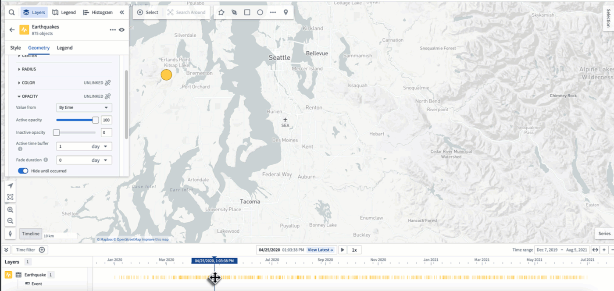
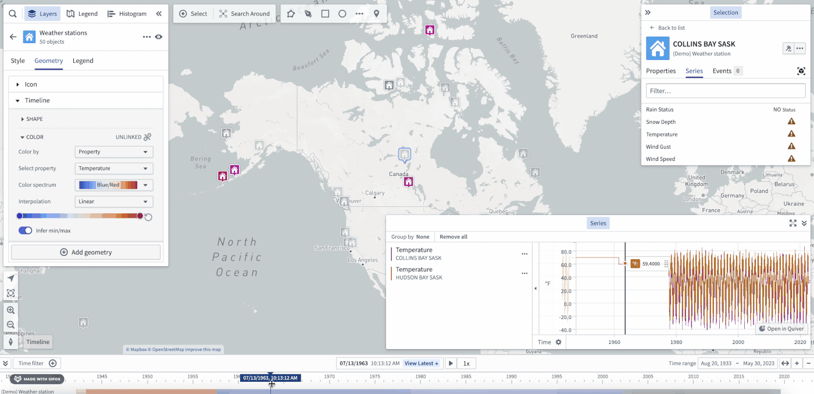

<!-- source: https://palantir.com/docs/foundry/map/time-overview/ · mirrored 2026-08-22 from Palantir Foundry docs -->

# Time and temporal data in the map

The map has a collection of features for visualizing and working with data that varies over time. There are a variety of forms that temporal data takes, each of which can be used and visualized in different ways.

## Time-based data types available on a map

### Time series

[Time series](/docs/foundry/map/time-series/) are measured values that change over time. You can configure time series values in the Ontology as [time series properties](/docs/foundry/time-series/time-series-setup/). Use time series to [style objects](/docs/foundry/map/visualize-objects/#value-based-styling) on your map, and view them in the [timeline](/docs/foundry/map/time-series/#explore-related-time-series).

### Events

[Events objects](/docs/foundry/map/events/) are objects that have additional metadata that associate the object with a specific time or time range. Event objects can be used to [control the opacity of objects](/docs/foundry/map/visualize-objects/#opacity-styling) on your map and visualized in the [timeline](/docs/foundry/map/visualize-timeline/).

### Tracks

Use [tracks](/docs/foundry/map/integrate-objects/#track-objects) to represent objects that have a position which changes over time. The [track styling options](/docs/foundry/map/visualize-tracks/) let you customize how you visualize the positions of an object over time.

## Selected time and time range

All temporal data shown on a map respects the current selected time and time range, enabling you to see how your data changes over time and to inspect specific times in the past.

Select **View latest** to launch the **Latest Data** view, where the selected time will automatically update to match the current time. Use the **Latest Data** view in combination with [streaming data](/docs/foundry/building-pipelines/pipeline-types/#streaming) to visualize data on your map that updates in real time.

You can view the map's selected time and time range in the [timeline](/docs/foundry/map/timeline/).

For example, depending on the selected time, the color of time-based styling will vary.

:::callout{theme="neutral"}
The select time and time range will affect the way data is shown on the map even if the timeline is not open.
:::

## Adjust the selected time, time range, and filtered time window

Use the [timeline](/docs/foundry/map/timeline/) to adjust the:

* [Selected time](/docs/foundry/map/timeline/#adjust-the-selected-time)
* [Time range](/docs/foundry/map/timeline/#adjust-the-time-range)
* [Filtered time window](/docs/foundry/map/timeline/#filter-the-time-window)
