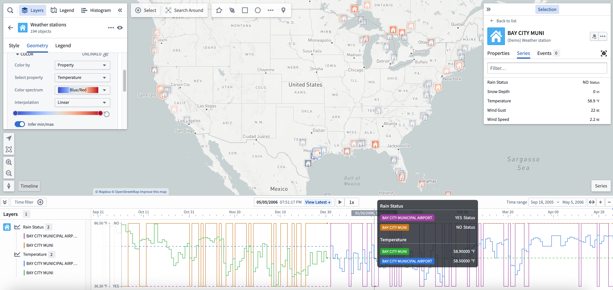
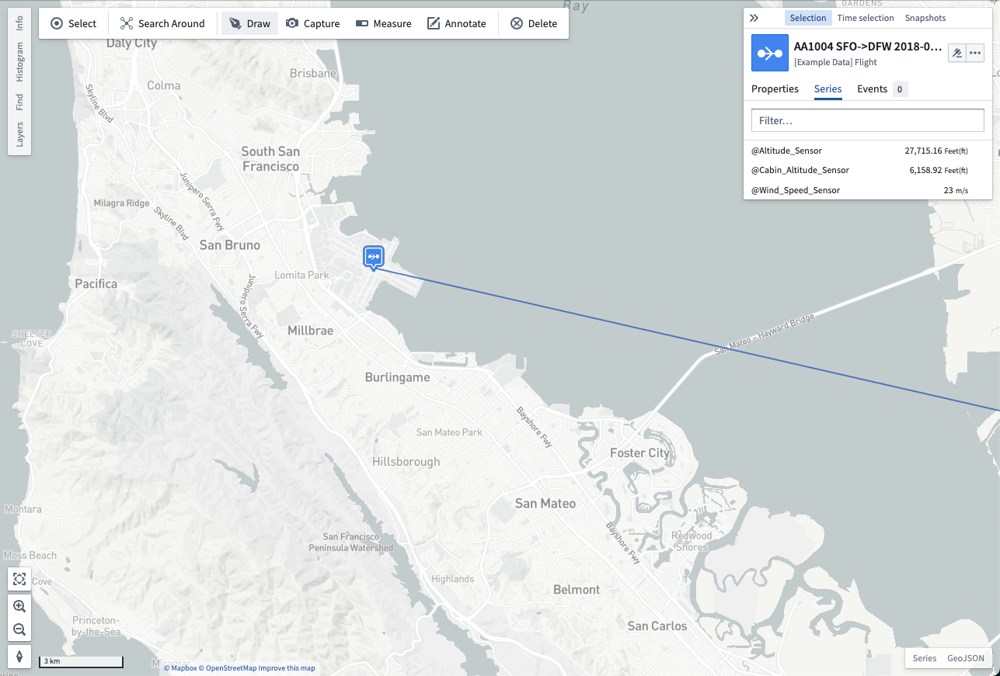
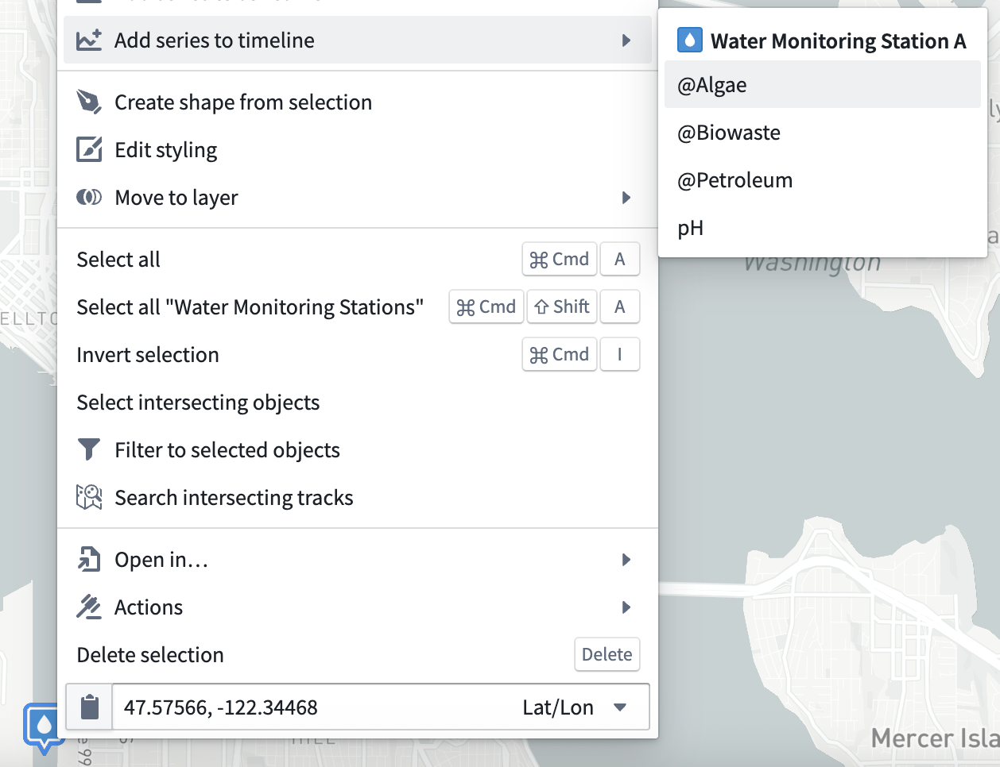
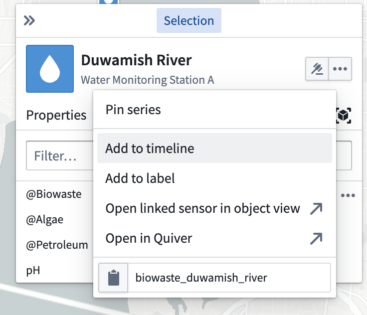

<!-- source: https://palantir.com/docs/foundry/map/time-series/ · mirrored 2026-08-18 from Palantir Foundry docs -->

# Time series

[Time series](/docs/foundry/time-series/time-series-overview/) are measured values that change over time. You can configure time series values in the Ontology as [time series properties](/docs/foundry/time-series/time-series-setup/). The map contains features to help you view and analyze time series data that is associated with geospatial objects.

## Explore related time series

Select an object on your map that has associated time series data. You can see any related time series in the **Series** tab of the selection panel. The value shown next to a series reflects the value of the series at the current [selected time](/docs/foundry/map/time-overview/#selected-time-and-time-range).

You can also add a [time series](/docs/foundry/time-series/time-series-overview/) explicitly to the series-panel by right-clicking an object and selecting **Add series to series view**. Additionally, you can select an object to render the [**Selection** panel](/docs/foundry/map/selection/#selection-panel) before navigating to the **Series** tab. From the **Series** tab, select the ellipsis icon that appears when hovering over a series row to open a menu that contains additional actions related to the time series where you can select **Add to series view**.

<table>
  <tr>
    <th>Right-click to add a time series</th>
    <th>Use the <b>Selection</b> panel to add a time series</th>
  </tr>
  <tr>
    <td></img></td>
    <td></img></td>
  </tr>
</table>

When you add a time series to the timeline, a visualization of the series over time will appear at the bottom of the map. You can use the [timeline](/docs/foundry/map/timeline/) to examine the series and access more time series actions from its entry on the timeline legend.

## Use time series for styling

When objects on your map have associated time series data, you can color the objects by an associated time series. Use this to make your map responsive to the current [time selection](/docs/foundry/map/time-overview/#selected-time-and-time-range) and help you understand how your data is changing over time. Read more about using time series for [value-based styling](/docs/foundry/map/visualize-objects/#value-based-styling).

## Interact with time series in the timeline \[Beta]

:::callout{theme="neutral" title="Beta"}
Interacting with a time series in the Map timeline is in the [beta](/docs/foundry/platform-overview/development-life-cycle/) phase of development and may not be available on your enrollment. Functionality may change during active development. Contact Palantir Support to request access to this feature.
:::

You can add a time series to your map's timeline in two ways:

* **Right-click menu:** Right-click an object on your map and select **Add series to the timeline** before choosing a series from the menu.
* **Selection panel:** Select an object on your map, [open the **Selection** panel](/docs/foundry/map/selection/#selection-panel), and navigate to the **Series** tab. Next, select the **…** that appears when hovering over a series row to open a menu that contains additional actions related to the selected time series before choosing **Add to timeline**.

Once you add a time series to the timeline, you can configure its rendered styles and optionally toggle its visibility using the timeline legend.
