<!-- source: https://palantir.com/docs/foundry/map/timeline/ · mirrored 2026-08-22 from Palantir Foundry docs -->

# Timeline

You can use the timeline to view time-based data as well as configure the time window and [selected time](/docs/foundry/map/time-overview/#adjust-the-selected-time-time-range-and-filtered-time-window). You can set the [selected time and time range](/docs/foundry/map/time-overview/#selected-time-and-time-range), further inspect the time-based properties of objects, and filter to specific objects in a given time range.

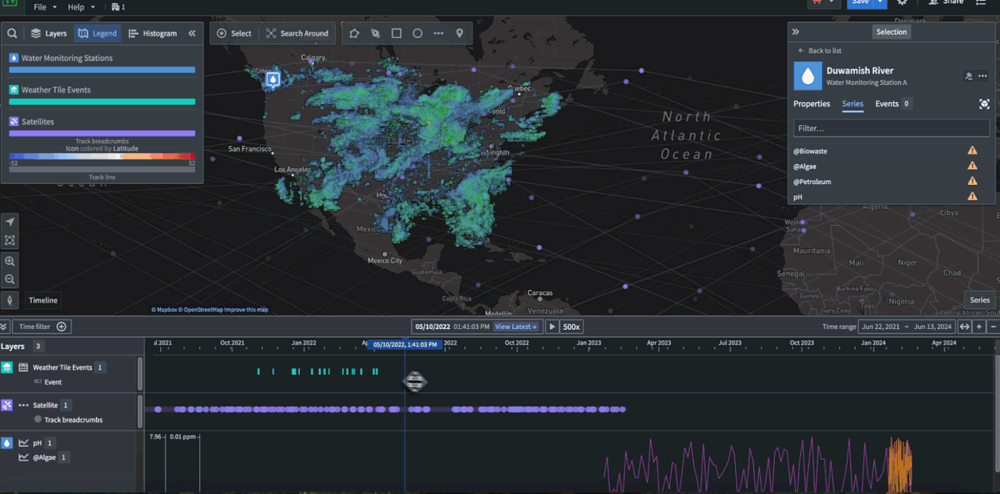

The timeline can be used to view [events](#events), such as [event objects](/docs/foundry/map/events/#event-objects) and [timeline geometries](/docs/foundry/map/events/#timeline-geometries), [track breadcrumbs](#track-breadcrumbs), and [time series](#time-series-beta).

Even when the timeline is not open, the timeline's time range and [selected time](/docs/foundry/map/time-overview/#selected-time-and-time-range) can affect any time-based data that is visible on the map.

## Basic controls

### Open and enable the timeline

Select **Timeline** in the lower-left of the map canvas to show or hide the timeline.

When embedding a map in [Workshop](/docs/foundry/workshop/overview/) using the [Map widget](/docs/foundry/workshop/widgets-map/), you can configure the timeline to open by default.

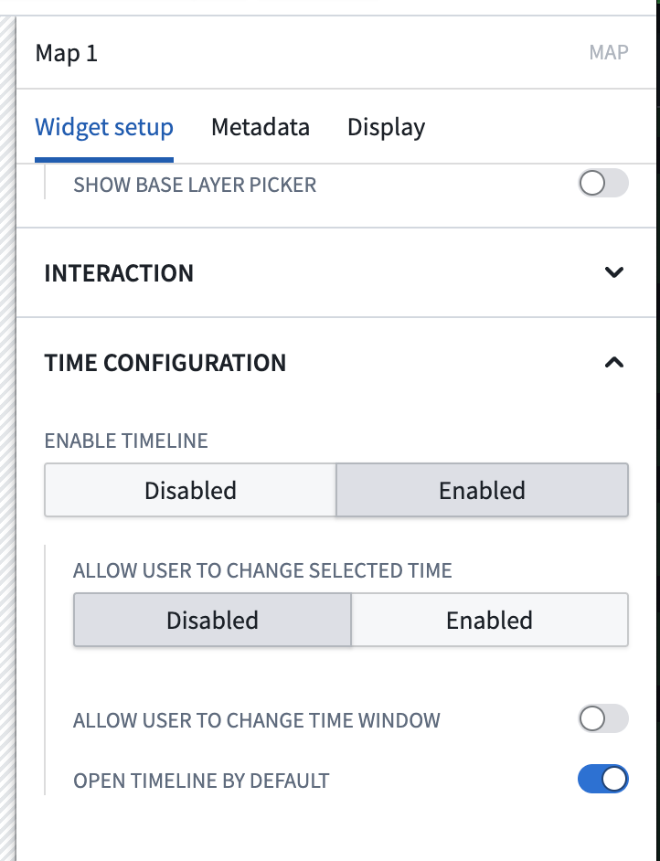

### Adjust the selected time

The cursor position on the timeline represents the map's [selected time](/docs/foundry/map/time-overview/#selected-time-and-time-range). You can adjust the selected time by:

* Double-clicking or right-clicking on the timeline.
* Dragging the cursor to a new position.
* Selecting the date or timestamp in the middle of the timeline header to render a date and time picker.

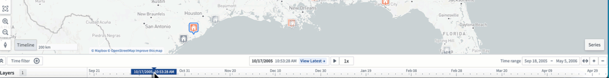

To get a more specific date for the cursor, you can click the cursor form to input a specific date and time.

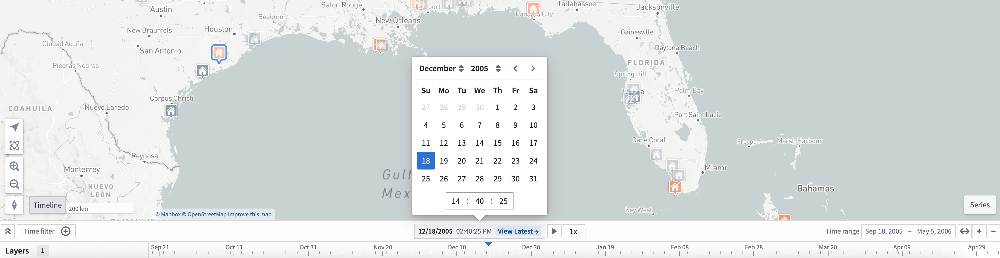

Select **View latest** to set the selected time to the current time. When on the **Latest Data** view, the selected time will automatically update to match the current time. Use **Latest Data** mode in combination with [streaming data](/docs/foundry/building-pipelines/pipeline-types/#streaming) to visualize data on your map that updates in real time.

:::callout{theme="neutral"}
When using the date and time selector, you can only select a time that lies within your object layer's current time range.
:::

You can [configure the default time selection and polling interval when in **View latest** mode for time series for all maps in Control Panel](/docs/foundry/map/control-panel/). Additionally, you can configure [per-map polling interval, time zone, and time format in the settings panel](/docs/foundry/map/settings/#polling-interval).

### Adjust the time range

You can view the [time range](/docs/foundry/map/time-overview/#selected-time-and-time-range) in the top right header of the timeline as well as from the start and end time of the timeline's view. You can adjust the time range with a mouse or trackpad by following the guidelines below.

Scroll controls:

* Use your mouse's scroll wheel to zoom in or out on the timeline, and press `Cmd` (macOS)/`Ctrl` (Windows) before scrolling to pan the time range.
* Use your trackpad to zoom in or out on the timeline by vertically swiping or pinching in or out.

Select **Time range** in the top right ribbon of the timeline header to input a specific date and time range for the timeline.

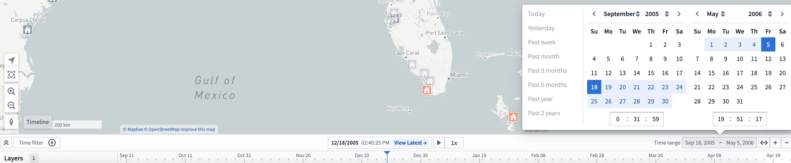

To get an automatic time window based on the data in the timeline, select the **Zoom to fit** button, marked by bidirectional arrows.

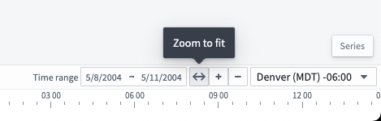

### Filter the time window

You can filter events on a map by:

* Holding `Shift`, selecting a point in the timeline, and dragging your cursor on the timeline to create a time filter window.
* Using the **Time filter** button in the control bar of the timeline.

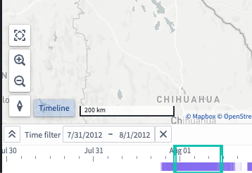

The **Time filter** is also available at the top of your map canvas. Objects on the map that match the filter are fully opaque, while objects that do not match the time filter are faded out.

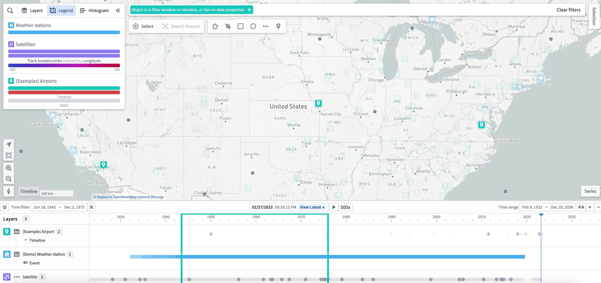

### Timeline playback

You can use the play button (⏵) to move the time cursor automatically; playback speed can be adjusted with the speed presets (1x, 2x, 5x, 10x, 100x, and so on).

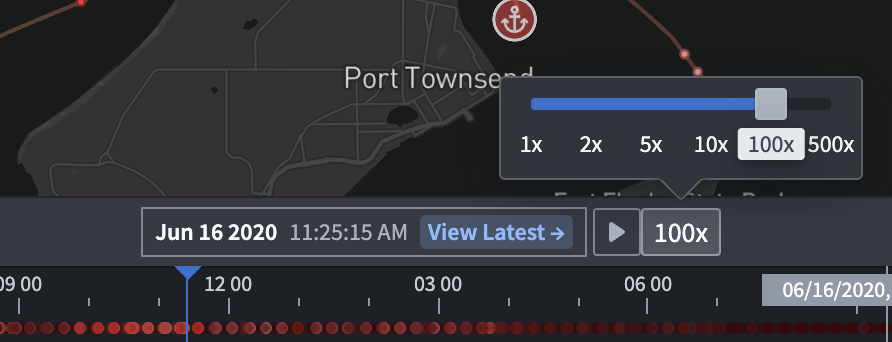

The cursor will loop automatically through the time window on the timeline or a time filter if it exists.

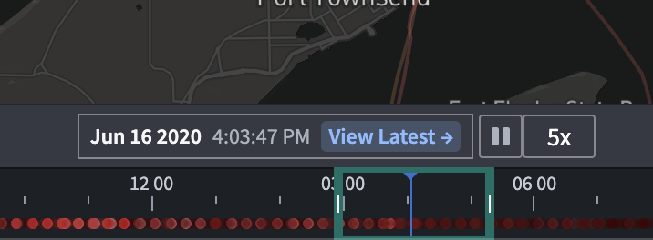

### Expand the timeline

When the timeline is collapsed, data added to the timeline is not visible. However, you can still change the time range, filtered time window, and [selected time](/docs/foundry/map/time-overview/#selected-time-and-time-range).

To show each object type on its own timeline row, select the **Expand** () in the control bar of the timeline.

## Add data to the timeline

All data added to the timeline is grouped by object type.

### Events

#### Event objects

[Event objects](/docs/foundry/map/events/#event-objects) will automatically add an event layer to the timeline.

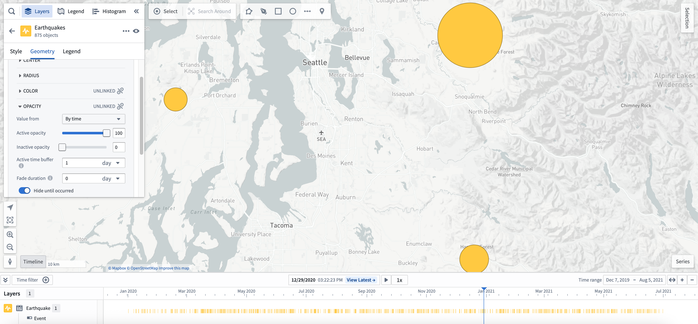

#### Timeline geometries

To make a new timeline event geometry layer appear on the timeline, add a [timeline geometry](/docs/foundry/map/visualize-timeline/) from the **Layers** panel. [Learn more about applying custom styling to timeline geometries.](/docs/foundry/map/visualize-timeline/#styling)

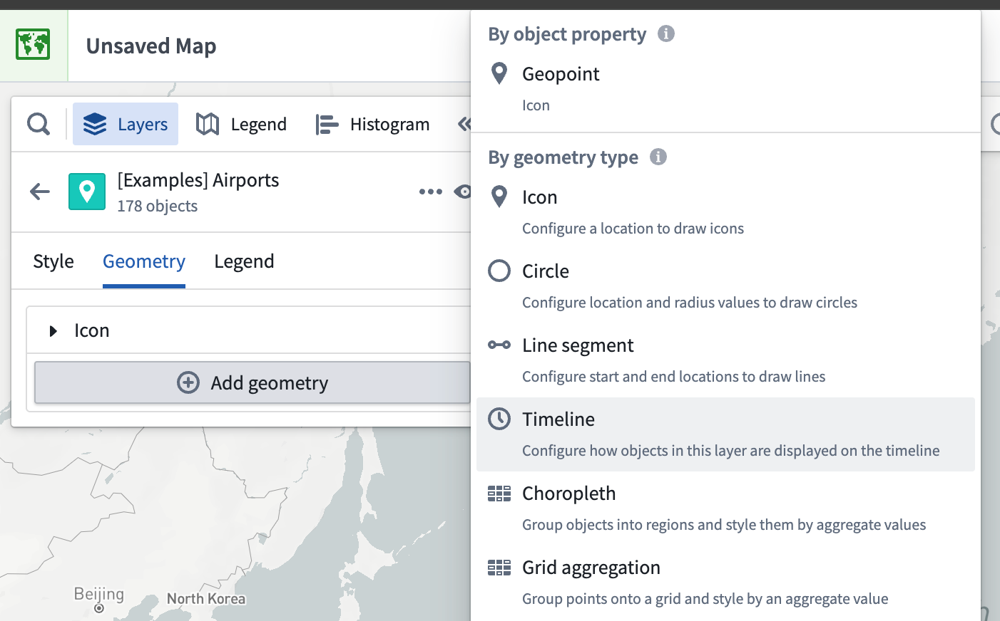

### Track breadcrumbs

Tracks with a breadcrumb geometry also render on the timeline depending on the [time range](#adjust-the-time-range) and the map viewport.

You can animate the paths of objects on their track by moving the selected time to other points.

To make a new track breadcrumbs layer render on the timeline, add a [track breadcrumbs geometry](/docs/foundry/map/visualize-tracks/#track-breadcrumbs) from the **Layers** panel.

Once you add a track breadcrumbs layer on the timeline, you can access more timeline geometry actions from the layer's entry in the timeline legend, such as [further styling](/docs/foundry/map/visualize-tracks/#styling) in the **Layers** panel.

### Time series \[Beta]

Review the [time series documentation](/docs/foundry/map/time-series/#interact-with-time-series-in-the-timeline-beta) to learn about adding and configuring a time series in your map's timeline.

## FAQs

### Will time-based data be visible on the map or timeline for large object sets?

If you add a large (greater than 1,000 objects) object set, then your map automatically loads objects on your map through [tile-based loading](/docs/foundry/map/objects-loading-methods/).

For tile-based loading, [timeline events](#events), time-based styling, and [filtered time window](#filter-the-time-window) will not be available. To fix, switch to **Object-based** loading. This also may require reducing the number of objects to enhance performance.

### Why am I unable to see time series styling on my map?

If styling from time series properties are not visible, this means that Map is unable to derive color from a temporal property. You should verify the [selected time](/docs/foundry/map/time-overview/#selected-time-and-time-range) contains your data.

### Why am I unable to see time-based opacity on my objects on my map?

Select a specific object that is not visible and check if the timestamp or date property on the object matches the [selected time](/docs/foundry/map/time-overview/#selected-time-and-time-range).
You can only configure time-based object opacity on an [event object](/docs/foundry/map/events/#use-event-objects-for-styling).

### Why am I unable to see any track breadcrumbs on my map?

Tracks with a breadcrumb geometry also render on the timeline depending on the [time range](#adjust-the-time-range).

### Why am I unable to see any time-based data in my timeline?

If nothing is visible on the timeline, use the **Zoom to fit** button to show time events on the map in the timeline's **Time range**.

When visible, the timeline displays lines for an object's time properties.

Additionally, the timeline displays bars for time ranges in an object's properties.

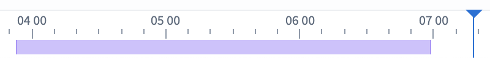
