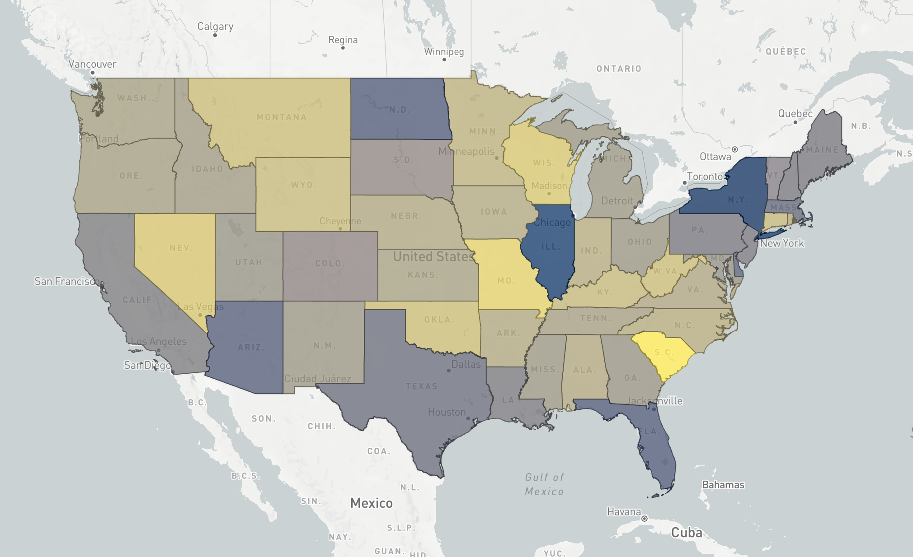
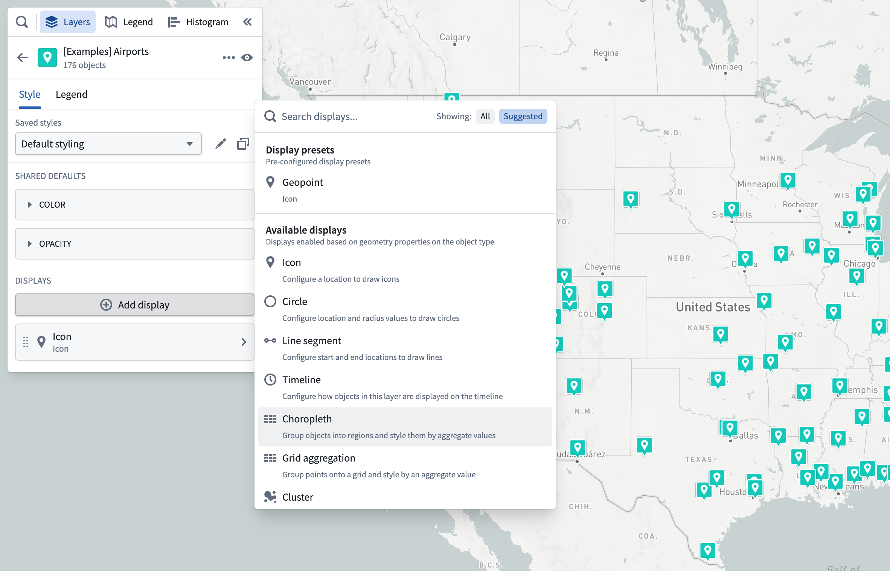
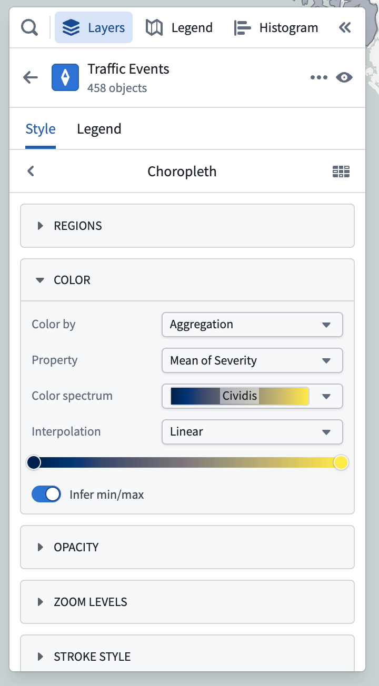
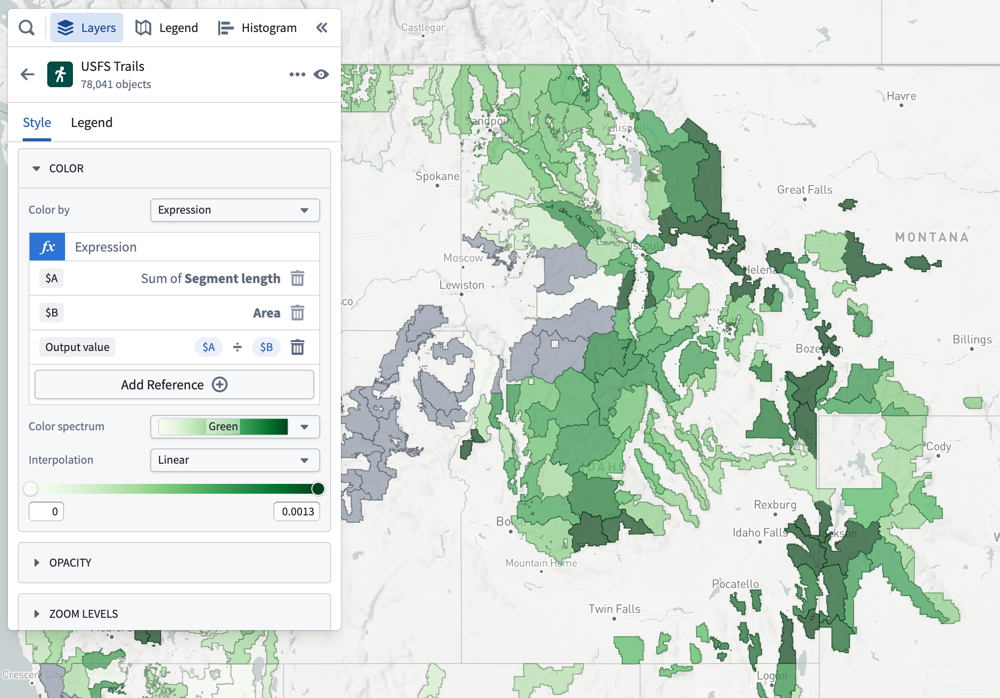

<!-- source: https://palantir.com/docs/foundry/map/visualize-choropleths/ · mirrored 2026-08-18 from Palantir Foundry docs -->

# Choropleths

A choropleth map displays regions colored by an aggregation computed across all objects in each region. Choropleths are useful for visualizing spatial patterns in large datasets. This example map shows a choropleth map generated from 31 million traffic accident objects, where each US state is colored by the average severity of accidents that occurred within it.

To configure a choropleth map, add the objects you want to compute aggregations over to the map, and add a choropleth styler from the **Add display** menu in the **Styling** panel.

You then need to specify how to group objects into regions, as well as how each region should be displayed. A choropleth region has the same styling options as [polygon displays](/docs/foundry/map/visualize-polygons-lines/), with the only difference that all the values are based on aggregations computed over all objects in each region.

## Grouping objects into regions

The **Regions** section of styling for choropleths lets you specify how to group objects into regions, where each region will show as a single polygon on the map. You can group objects together by a property that has a boundary identifier type supported by the Map application, or an object type linked to the objects in your layer.

### Group by boundary identifiers

The map application supports rendering choropleths for objects that are configured with some common identifier types. The polygon geometry for these boundary types is built in to the Map application, making your data integration easier if your data already has one of these identifier types attached.

Some examples of identifier types that the map supports are:

* ISO 3166 country codes
* US State abbreviations (CA, TX, OR, …)
* US County FIPS codes

See the [Ontology objects for the map](/docs/foundry/map/integrate-objects/#boundary-identifiers) page for more information on the full range of identifiers supported, and how to configure property types to reference them for use in maps.

To configure a boundary identifier, select the **Property** option in the **Group by** dropdown menu, and then choose from the properties that have an identifier configured in the **Property** dropdown menu. Only properties that are configured in the Ontology as a boundary identifier will be shown.

After selecting a boundary property, all objects with the same value for that property type will be grouped together when computing aggregations for styling.

### Group by linked objects

If you need to provide your own geometry for regions, you can group objects together by selecting an ontology link. The Map application will then group together objects that are linked to the same object. [Learn more about the ontology configuration](/docs/foundry/map/integrate-objects/#linked-objects) for custom region geometry.

## Styling by aggregation

Value-based styling is different in choropleth maps, since each region is colored based on an aggregation computed over the objects within. There are two ways to define aggregations for a choropleth, **standard**, and **expression**.

### Standard aggregations

A standard aggregation is a simply way to define an aggregation over a property of the objects in a region. To configure a standard aggregation, open the **Property** menu and select the property and aggregation function (sum, mean, max, min) you want to use.

## Expression aggregations

An expression aggregation lets you define a custom aggregation over the objects in a region. Build an expression aggregation by adding multiple expression references, and the last reference in the list provides the value that will be used to color the region. Each reference can be one of:

* A simple aggregation over a property of the objects grouped into a region
* A property from the region itself (only available when grouping by linked objects)
* An operation that combines two other references

For example, this map uses an expression aggregation to color US Forest Service Ranger Districts by the density of trails in each district.

It uses three expressions to compute the trail density:

* The first computes the total length of trails within each US Forest Service Ranger District.
* The second references the total area of the region.
* The third is an operation that computes the average trail length per acre, by dividing the first reference by the second.
