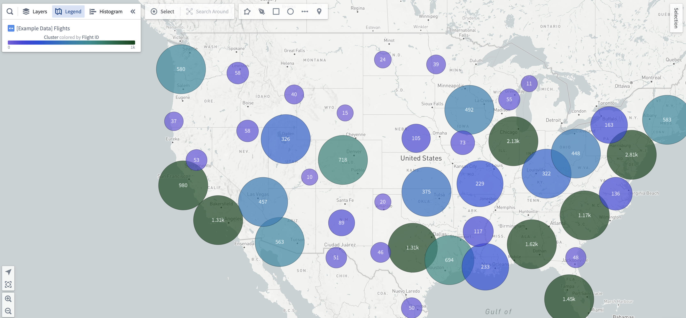

<!-- source: https://palantir.com/docs/foundry/map/visualize-clusters/ · mirrored 2026-08-18 from Palantir Foundry docs -->

# Clusters

Cluster displays are ideal for larger object sets based on a geopoint location property. Clusters are similar to points, but instead of plotting a single marker per object, the objects being plotted are aggregated based on their geographic proximity to clusters. The size and/or color of the cluster can be configured to represent the number of objects within a given area, or some other aggregation metric such as the sum or average of a property across the objects within a region. The contents of each cluster region will update automatically as the user zooms in, zooms out, or pans to introduce new data.

Cluster displays can be added to object layers using the **Add geometry** option. The **Center** configuration of a cluster display accepts only **Geopoint** properties.

## Styling by aggregation

Cluster displays have the roughly the same styling options as [circle geometries](/docs/foundry/map/visualize-points/#circle-configuration), but the color and radius configurations are computed as aggregate values over all objects in a singular cluster. To learn more about styling via aggregate values, see the [styling by aggregation](/docs/foundry/map/visualize-choropleths/#styling-by-aggregation) section for choropleth displays.

## Cluster text labels

While cluster displays are in the beta phase of development, the content of the text labels will reflect either the aggregate value used in the color configuration, or the aggregate value used in the radius configuration if the color style is fixed.
