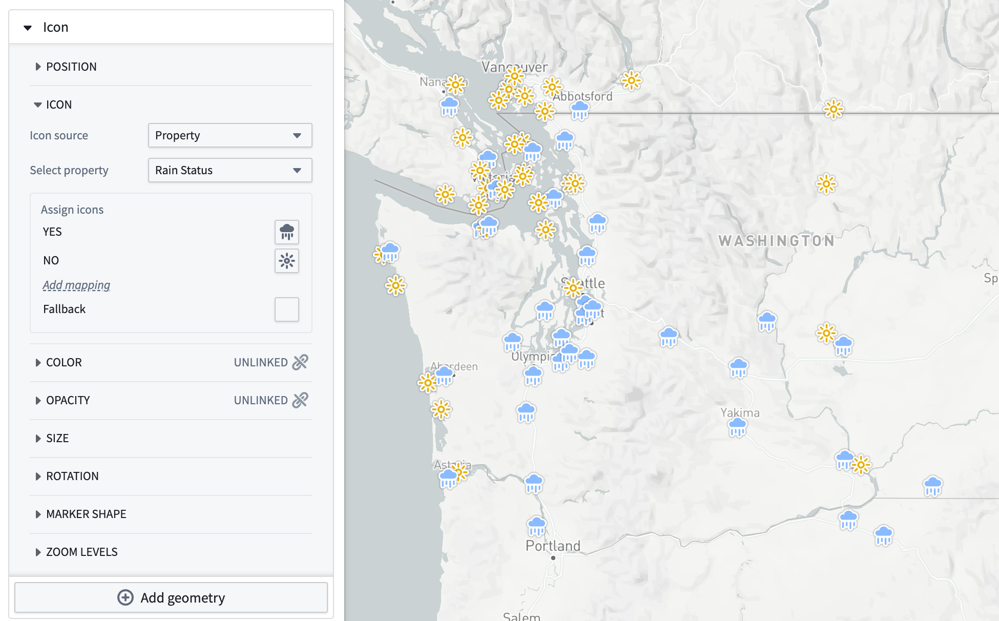
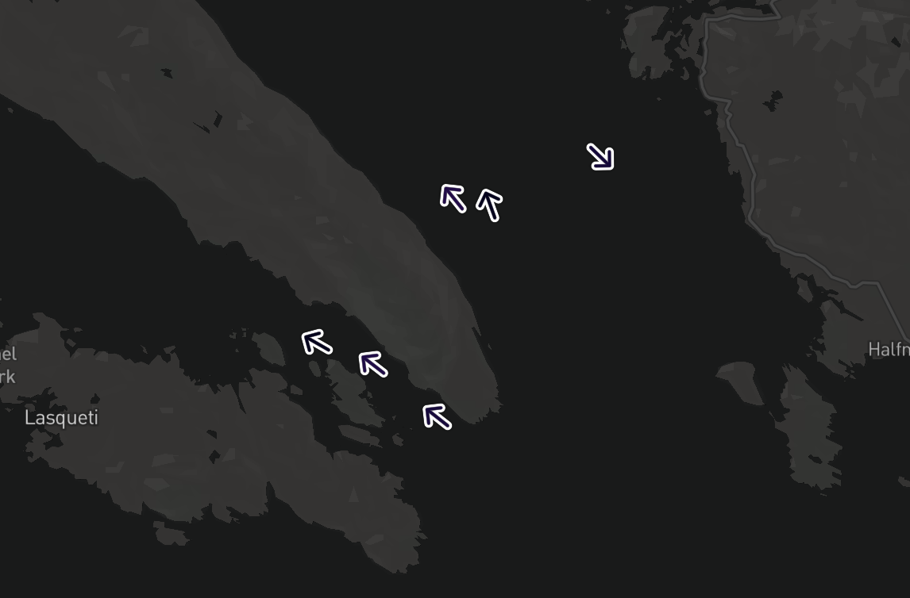
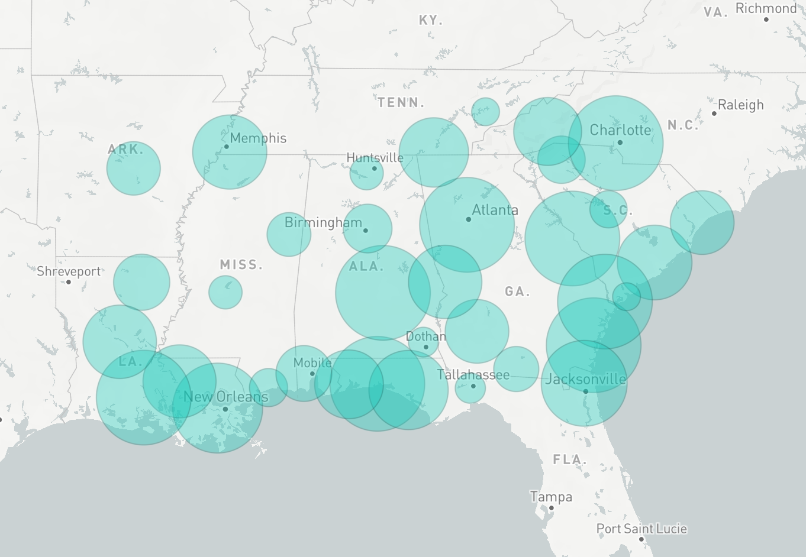

<!-- source: https://palantir.com/docs/foundry/map/visualize-points/ · mirrored 2026-08-18 from Palantir Foundry docs -->

# Point displays

Maps contain two ways to visualize point displays: icons and circles. To display an icon or circle, you need a geometry source that provides a location for each object. The supported geometry sources are [geopoint properties](/docs/foundry/geospatial/ontology/) and [tracks](/docs/foundry/map/integrate-objects/#track-objects).

When using a track as a point geometry source, the map will extract a location from the track that corresponds to the current [selected time](/docs/foundry/map/time-overview/#selected-time-and-time-range). There are configuration options that control how that location is interpolated, which are covered on the [tracks](/docs/foundry/map/visualize-tracks/) page.

## Icon configuration

Icons are one of the most common ways to visualize point data. Each icon is placed at the location provided by the geometry source, and can be styled in a variety of ways to generate a visualization that suits your workflow.

### Icon

The **Icon** section allows you to control the icon that will be displayed for each object. The options for specifying the icon that is displayed are:

* **Object default:** The icon will be the default icon for the object type, as configured in the Ontology Management application.
* **Media image:** Choose an image media item to display for all objects in the layer.
* **Fixed icon:** Choose a specific icon to display for all objects in the layer.
* **Property:** Each object is displayed with an icon that is determined by a property on the object.

The example below uses a rain status time series with both color and icon styling to visualize which weather stations across the Pacific Northwest observed rain on the selected day.

### Image media items

The property option supports [media reference](/docs/foundry/media-sets-advanced-formats/media-overview/#media-references) type object properties and will display underlying media as icons. Image media references are the only supported media format for icons.

### Rotation

You can control the rotation of the icon by any of the [value-based styling](/docs/foundry/map/visualize-objects/#value-based) options. For track geometry sources, there is also an **Automatic** option which rotates the icon in the direction of the object's movement according to the track.

The example below uses a fixed arrow icon and rotation styling to display the direction of movement for vessel objects.

### Marker shape

There are three styles of markers that you can configure for icons:

| Circle                                              | Pin                                           | None                                          |
| --------------------------------------------------- | --------------------------------------------- | --------------------------------------------- |
|  |  |  |

## Circle configuration

Each circle is centered on the location provided and drawn with a radius value that you can configure in the **radius** section of styling.

The other circle style options are the same as [the options for polygon displays](/docs/foundry/map/visualize-polygons-lines/).

## Loading methods

When displaying a large number of objects, icon and circle displays can also support tile-based [loading methods](/docs/foundry/map/objects-loading-methods/).
