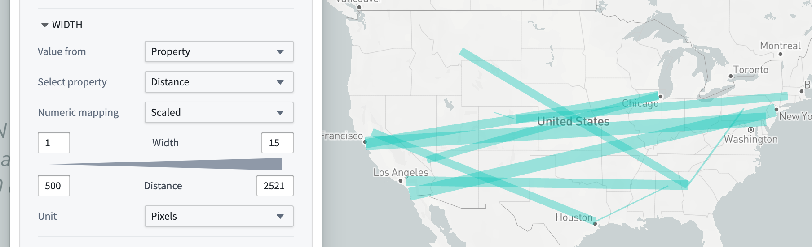
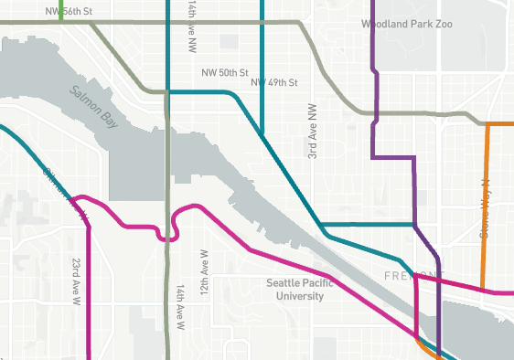
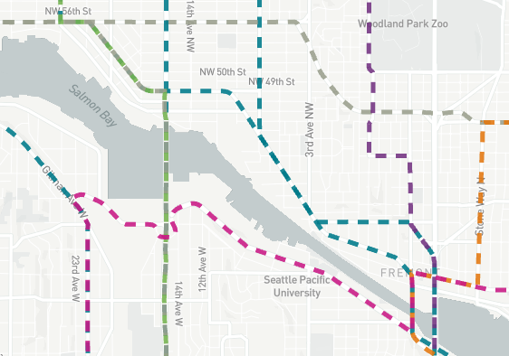
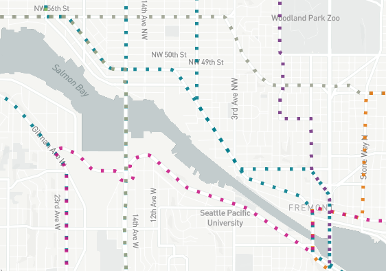
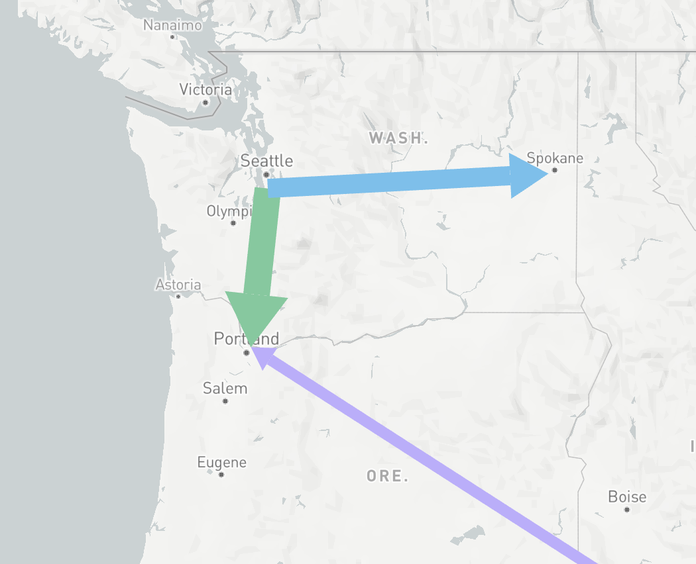
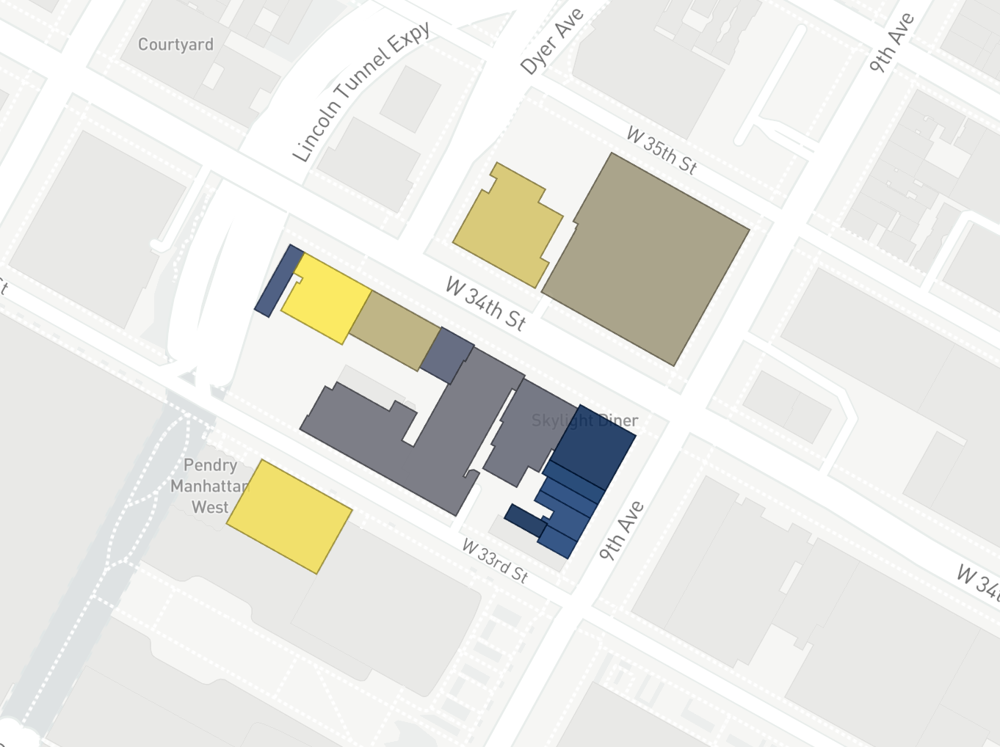
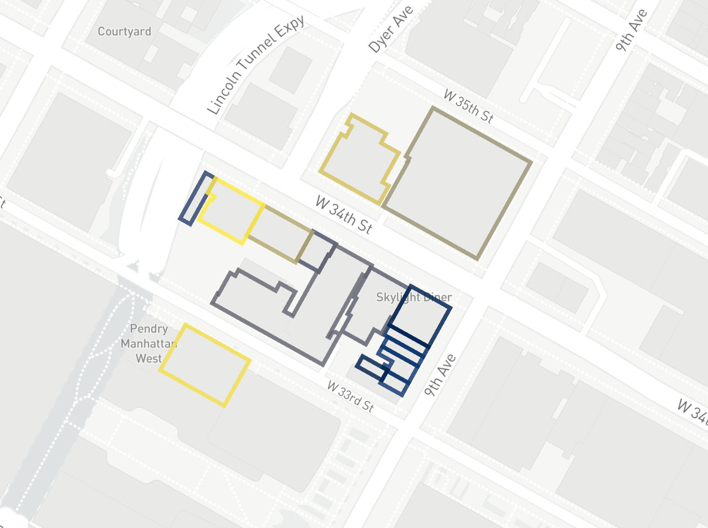

<!-- source: https://palantir.com/docs/foundry/map/visualize-polygons-lines/ · mirrored 2026-08-22 from Palantir Foundry docs -->

# Polygon and line displays

Maps can render polygons and lines based on your ontology objects. There are two ways to specify the line or polygon geometry to draw:

* **Geoshape properties:** Display GeoJSON line and polygon geometries stored in a geoshape property on your objects.
* **Line segment:** Display lines between two geopoint properties on objects.

See [value-based styling](/docs/foundry/map/visualize-objects/#value-based-styling) for more information on how styling rules are configured, as well as color and opacity styling configuration. Polygons and lines can be styled with the following additional attributes.

## Stroke width

Use the **Stroke width** section to control the width used when rendering lines, or the stroke of polygons that are not filled.

## Stroke style

Use the **Stroke style** section to control the dash pattern used when rendering lines, or the stroke of polygons that are not filled. The available options are:

| Solid                                           | Dashed                                            | Dotted                                            |
| ----------------------------------------------- | ------------------------------------------------- | ------------------------------------------------- |
|  |  |  |

For line segments, you can also configure arrows to indicate the direction of the line.

## Fill polygons

When **Fill polygons** is enabled, polygons render with a minimal stroke and their interior filled with the specified color. When disabled, the polygon is instead only stroked, using the styling configuration in **Stroke width** and **Stroke style**.

| Fill enabled                                        | Fill disabled                                         |
| --------------------------------------------------- | ----------------------------------------------------- |
|  |  |

## Loading methods

When displaying a large number of objects, polygon and line geometries can also support tile-based [loading methods](/docs/foundry/map/objects-loading-methods/).
