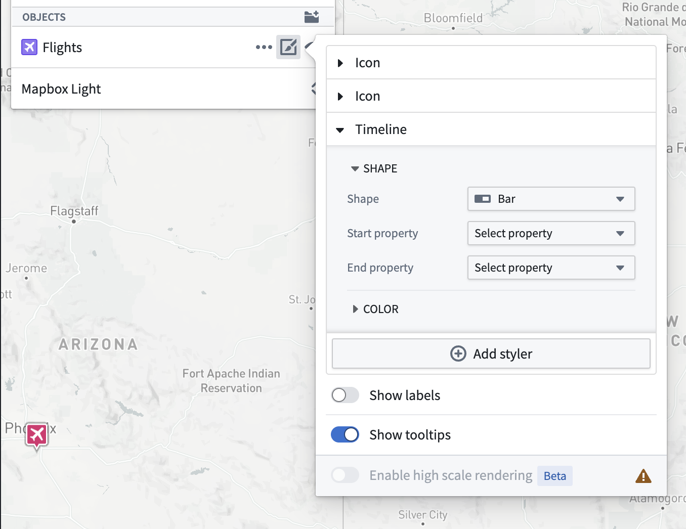
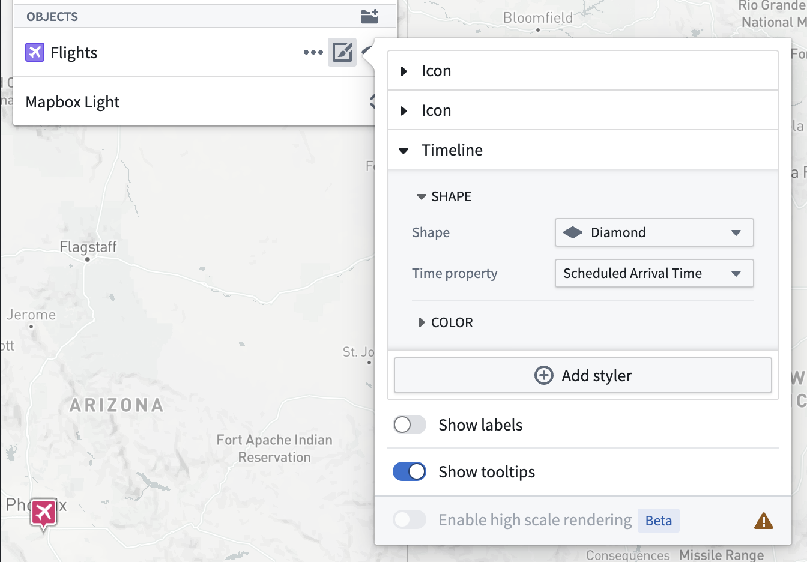
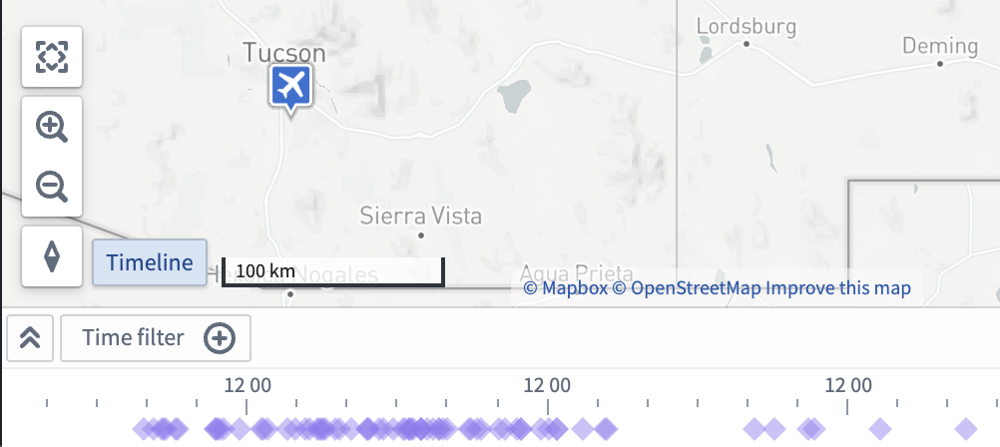
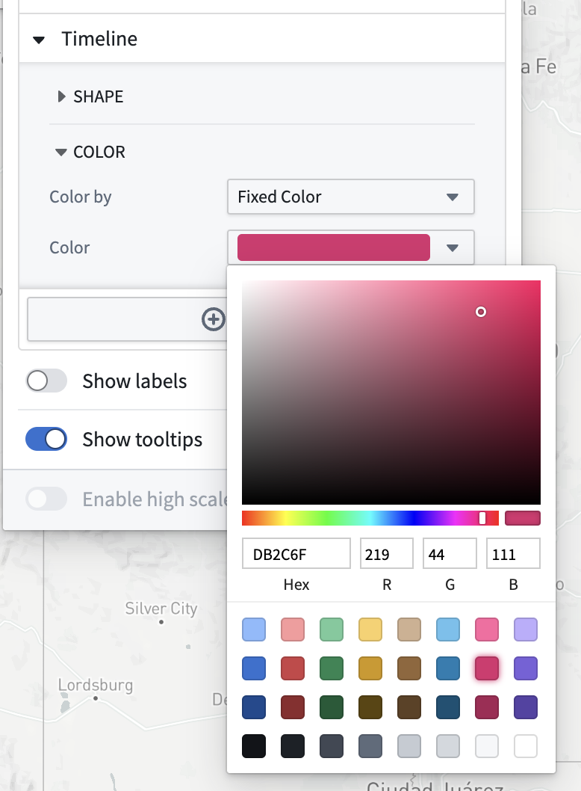
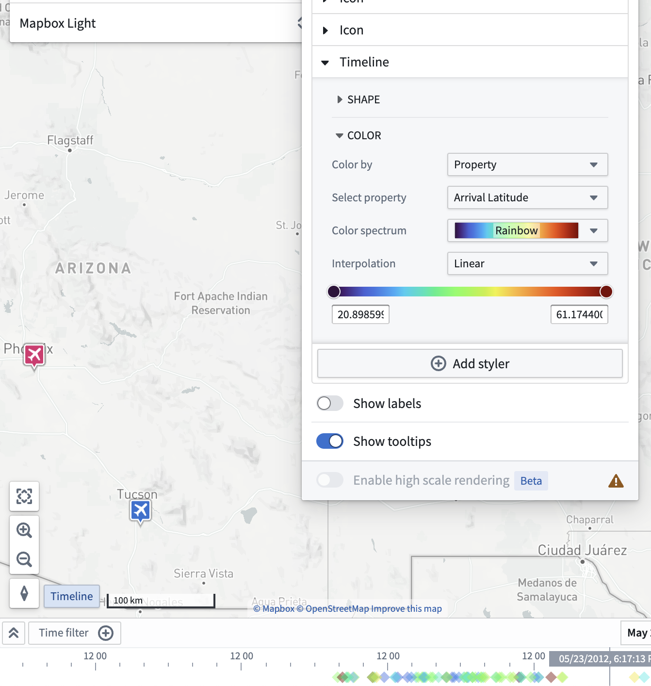

<!-- source: https://palantir.com/docs/foundry/map/visualize-timeline/ · mirrored 2026-08-22 from Palantir Foundry docs -->

# Timeline geometries

To visualize time-based properties of all objects in a layer on the timeline, you can configure a timeline geometry to appear on the [timeline](/docs/foundry/map/timeline/).

![Timeline geometry example where a user can see the time properties of the '\[Example\] Airports' object on the timeline.](/docs/resources/foundry/map/styling-timeline-event.png)

Timeline geometries differ from [event objects](/docs/foundry/map/events/#event-objects), as you can configure multiple timeline geometries per object layer and apply additional styling options, such as property-based color shading.

Once you add a timeline geometry, you can access its additional configuration actions from the geometry's entry in the timeline legend.

## Styling

To make a new timeline event geometry layer appear on the timeline, add a **Timeline** geometry from the **Layers** panel.

A **Timeline** section appears in the style menu once you add the timeline geometry, where you can change the properties used when drawing the selected shape on the timeline. Select the **Start property** and **End property** dropdown menus for shapes that use two time properties, or select **Time property** for shapes that use a single property.

The timeline geometry will not appear in the timeline unless all its properties have been set.

The **Shape** you choose in the **Timeline** style configuration section renders for every instance of the object type in the timeline. For example, the image below shows diamond shapes to represent the `Flights` object type on the timeline.

Select the **Color** menu in the **Geometry** section to configure how shape colors render on your map's timeline.

You can also use properties and measures to configure timeline color styling by changing the selected option in the **Color by** dropdown menu. For example, the image below shows a timeline geometry configured to color by the `Arrival Latitude` property with a rainbow color spectrum.

