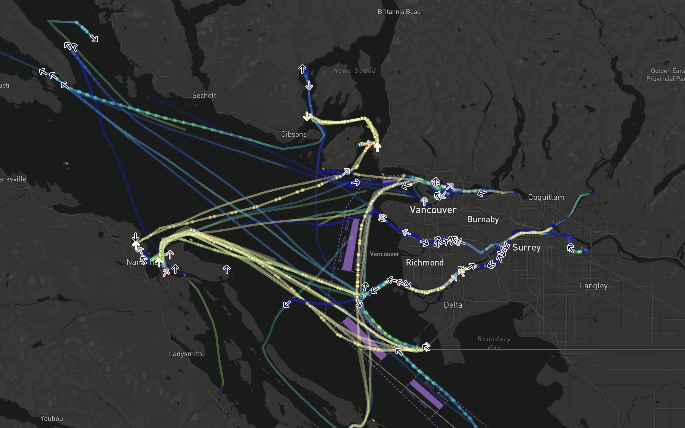
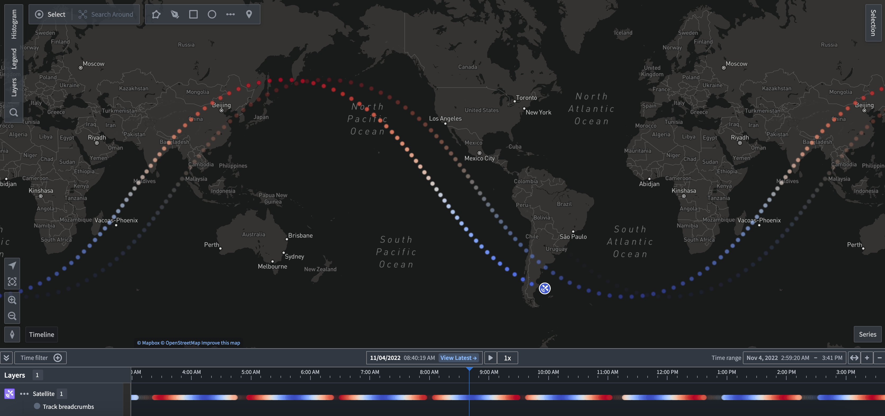
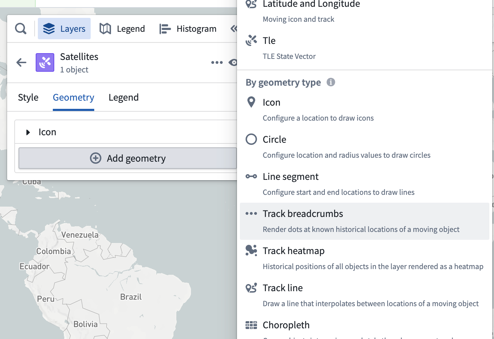
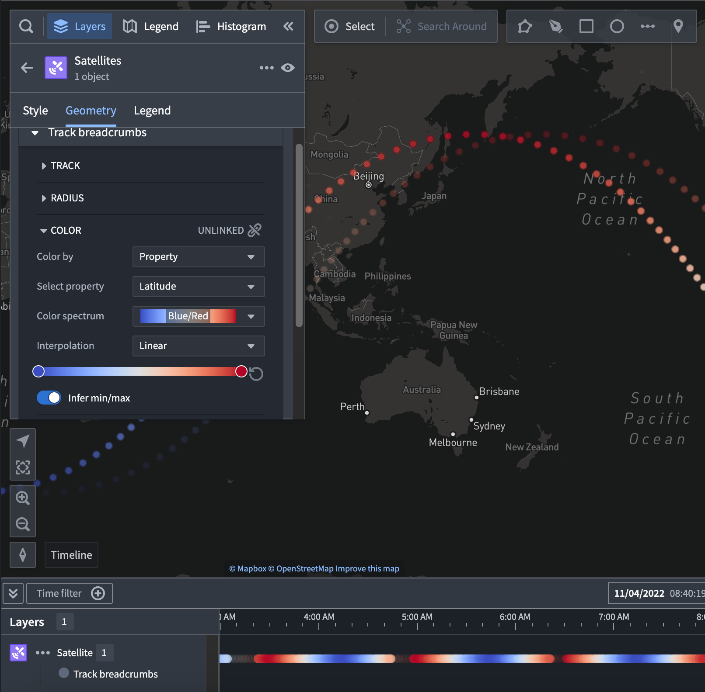

<!-- source: https://palantir.com/docs/foundry/map/visualize-tracks/ · mirrored 2026-08-22 from Palantir Foundry docs -->

# Track displays

Maps include displays for rendering objects that move over time. These displays are designed to help you visualize the paths that objects take and the patterns that emerge as objects move across the map.

All track displays have the ability to use [time-based opacity styling](/docs/foundry/map/visualize-objects/#opacity-styling). In addition to the track displays below, you can also use a track geometry source as the way to position [icons and circles](/docs/foundry/map/visualize-points/). [Learn more about configuring tracks in the Ontology.](/docs/foundry/map/integrate-objects/#track-objects)

The notional example below uses a track geometry source to display a track line, breadcrumbs, and icon at the current position for vessel objects moving near the City of Vancouver:

You can also configure the number of time series points per track in Control Panel [on an organization-level](/docs/foundry/map/control-panel/#data-loading) or [per-map in the settings menu](/docs/foundry/map/settings/#time-series-buckets).

#### Moving geometry interpolation

When using tracks as a geometry source, there are additional options you can use to configure how the map interprets the point location from the track and the [selected time](/docs/foundry/map/time-overview/#adjust-the-selected-time-time-range-and-filtered-time-window).

* **Interpolation mode**
  * **Linear:** Smoothly interpolate between known points in the track.
  * **Last known:** Show the object at the last recorded position before the selected time.
* **Max time gap:** When two consecutive track points have a time difference greater than the value configured, the track is considered as having no data for that time period.

## Track lines

Track lines visualize the paths that objects take by connecting adjacent recorded positions with a line. If two points have a time difference greater than the configured **Max time gap**, the line will not be drawn between those points. Otherwise, track lines have the same styling options as [lines](/docs/foundry/map/visualize-polygons-lines/).

## Track breadcrumbs

Track breadcrumbs are a way to visualize only the exact recorded positions of an object. Each object's track is rendered as a series of small circles, or breadcrumbs, that show the object's location at different times. Otherwise, breadcrumbs have the same styling options as [circles](/docs/foundry/map/visualize-points/#circle-configuration).

Track breadcrumbs also display in the timeline to allow you to see the exact time at which object positions were recorded. This example visualizes a satellite's ground trace, and colors the line and breadcrumbs by the latitude of the satellite at every point. The breadcrumbs in the timeline also reflect that color style configuration.

Breadcrumbs that are not visible in the map viewport are faded out to help you to understand the object path over time and at what time ranges the object will be visible on the map.

:::callout{theme="neutral"}
If there are no breadcrumbs in the current [time range](/docs/foundry/map/time-overview/#adjust-the-selected-time-time-range-and-filtered-time-window), they will not appear on the map or timeline.
:::

Once you add track breadcrumbs, you can access the geometry's additional configuration actions from the its entry in the timeline legend.

### Styling

To make a new track breadcrumb geometry layer appear on the timeline, add a breadcrumb geometry from the **Layers** panel.

Once the track breadcrumbs geometry is added, a **Track breadcrumbs** section will appear in the style menu. You can change the properties used when drawing the selected path on the map.

Select the **Color** menu in the **Track breadcrumb** geometry to configure how shape colors are represented on your timeline.

You can also use properties and measures to configure track breadcrumbs color styling by changing the selected option in the **Color by** dropdown menu. For example, the image below is configured to color by the `Latitude` property with a rainbow color spectrum:

