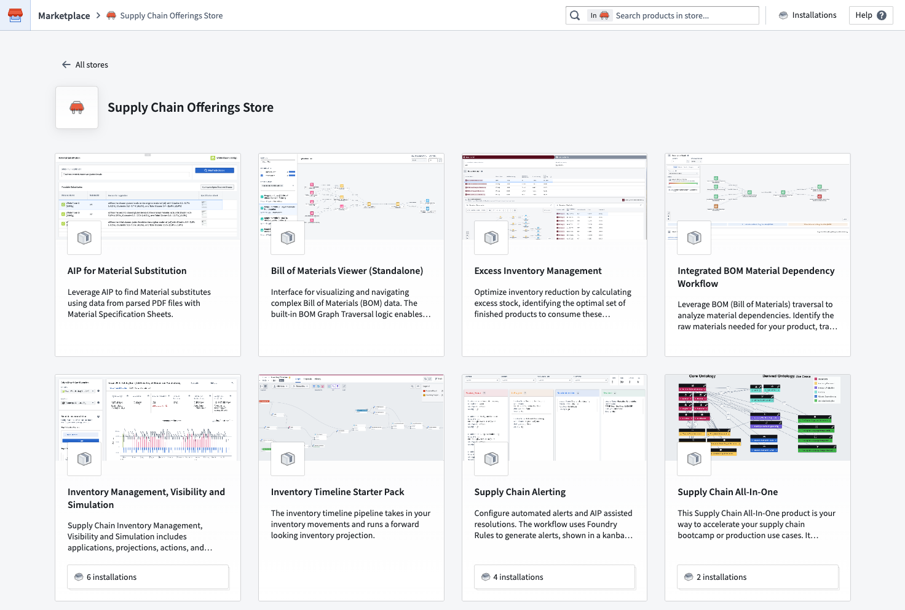
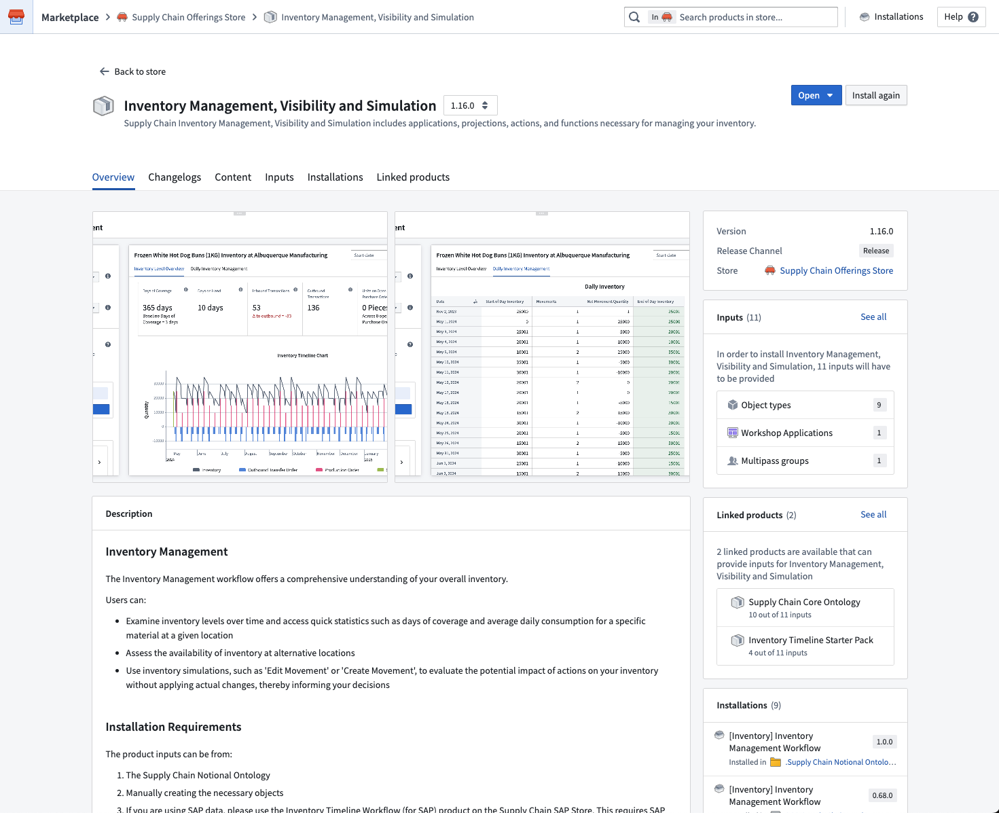
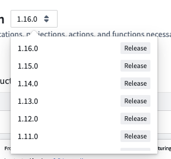
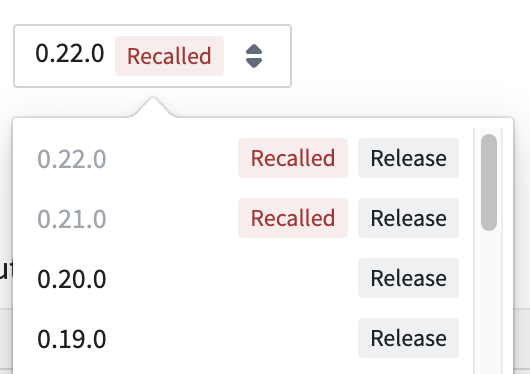
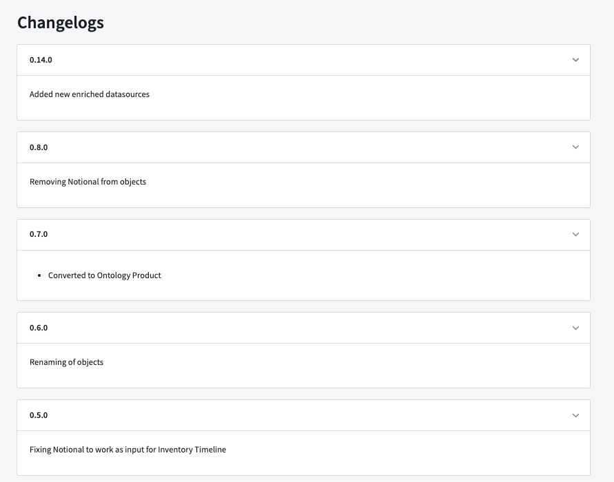

<!-- source: https://palantir.com/docs/foundry/marketplace/browse-products/ · mirrored 2026-08-11 from Palantir Foundry docs -->

# Browse products in Foundry Marketplace

Products are collections of Foundry resources that a product builder has made available to install.

## Store

In Marketplace, a store is a collection of products. Stores can also have featured products that are promoted by the product builders and store owners.

:::callout{theme="neutral"}
You may have access to one or more stores. Some stores, such as the **Foundry Store** are available to all customers, while others are specific to your enrollment. For example, a builder in your organization could create a store to house a collection of task management applications that are installed across a number of departments. This store will not be available to other customers. [Learn more about configuring access to remote stores](/docs/foundry/administration/configure-remote-marketplace-stores/).
:::

## Product details

After selecting a product from a store, you can view a variety of information about that product, including:

* [Versions](#versions)
* [Overview](#overview)
* [Changelogs](#changelogs)
* [Outputs](#outputs)
* [Inputs](#inputs)

### Versions

If a product has multiple versions, you can choose which version to install with the version selector. In most cases, we recommend installing the latest version.

#### Recalls

Product versions may be recalled by the product builder. If a product version has been recalled, you will see a red `Recalled` tag next to the version name.

Automatic upgrades will not install recalled versions, and you will not be able to install a recalled version manually. If you have already installed a recalled version, you can continue to use it; however, we recommend updating to a non-recalled version as soon as possible.

### Overview

A product's overview includes any builder-provided product details, as well as a preview of required [inputs](#inputs) and [outputs](#outputs) that will be installed.

### Changelogs

A product's changelogs include any builder-provided context on differences between product versions.

### Outputs

A product's outputs are the Foundry resources that will be installed once required inputs have been mapped. This section was previously labeled **Content**.

### Inputs

A product's inputs are dependencies that must be mapped to create a product's outputs. Not all products require inputs.

Once you have decided you want to install a product, you can [begin an installation](/docs/foundry/marketplace/install-product/).
