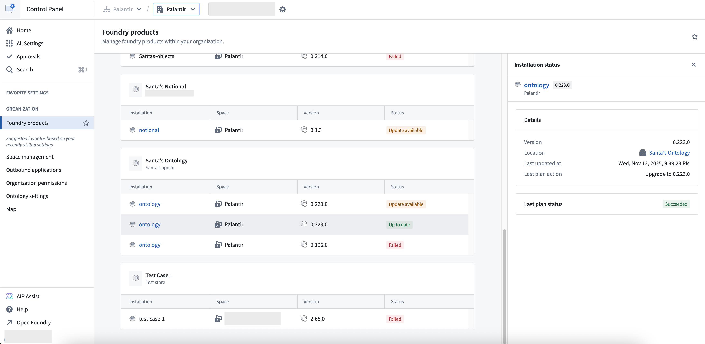

<!-- source: https://palantir.com/docs/foundry/marketplace/foundry-products/ · mirrored 2026-08-11 from Palantir Foundry docs -->

# Foundry products \[Beta]

:::callout{theme="warning"}
Foundry products is in the [beta](/docs/foundry/platform-overview/development-life-cycle/) phase of development and may not be available on your enrollment. Functionality may change during active development. Contact Palantir Support to request access to Foundry products.
:::

Foundry products are Marketplace products that are published across multiple Foundry enrollments and managed through [Apollo](../../apollo/core/introduction.md). These fully portable products leverage Apollo's orchestration capabilities for deployment and lifecycle management.

Foundry products are managed by Palantir. The **Foundry products** Control Panel extension provides visibility into the installations on your enrollment. This document outlines the core concepts, installation mechanisms, and management strategies for Foundry products.

## What are Foundry products

A Foundry product is a Marketplace product that is portable across enrollments. It includes enhanced capabilities for cross-environment deployment and Apollo-based management.

Key characteristics of Foundry products:

* **Environment portability:** Products can be deployed across different Foundry enrollments without modification.
* **Self-contained packaging:** All necessary components and dependency metadata are bundled with the product.
* **Apollo-managed lifecycle:** Products leverage Apollo's orchestration for installation, upgrades, and management.
* **Version control:** Products maintain clear versioning for consistent deployments and rollbacks.

## Install Foundry products

Foundry products are installed through Apollo, which provides sophisticated orchestration and management capabilities. They can be installed using one of two distinct installation modes, each serving different operational requirements.

### Managed installation

Managed installations are delivered from Palantir and managed directly in Apollo. In this mode, a Marketplace product [installation](/docs/foundry/marketplace/installations/) is created and actively managed. The status of the installation is reported directly to Apollo, and maintenance is orchestrated by Palantir.

This mode is ideal for production environments where centralized management, monitoring, and governance are critical.

### Artifact installation

Artifact installations deliver only the Marketplace product onto an environment. Users can then install the product through [Marketplace](/docs/foundry/marketplace/install-product/). This mode is suitable for scenarios where teams need autonomy in managing their installations or where Apollo management overhead is not desired.

## Foundry product management

Once installed, you can view Foundry products in the **Foundry products** extension in Control Panel. This extension provides you with tools to:

* View the status of an installation and the last change that was made on such an installation
* View all product installations within an organization
* Debug installation, upgrade, and uninstall issues of products in an organization

