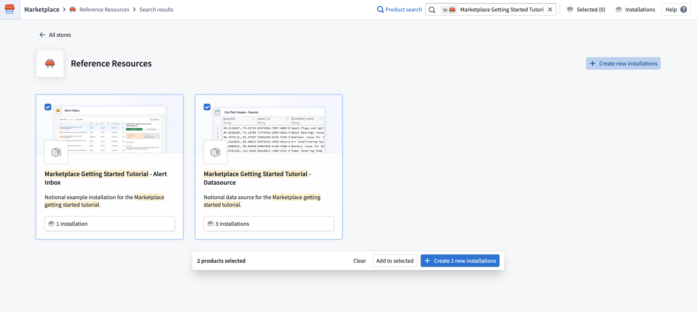
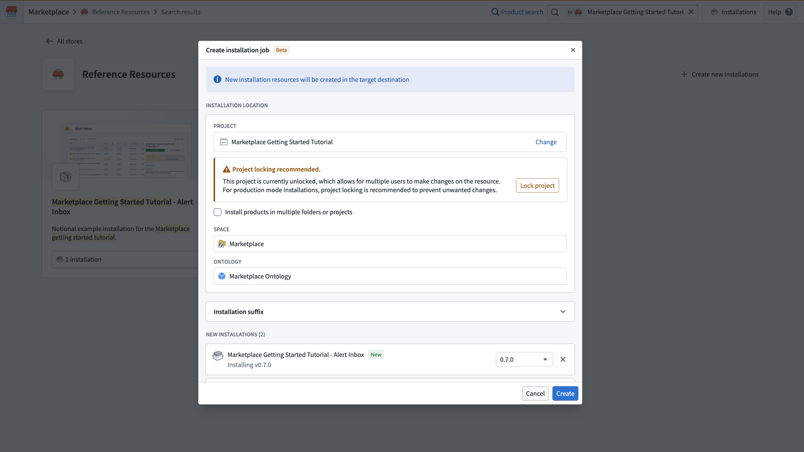
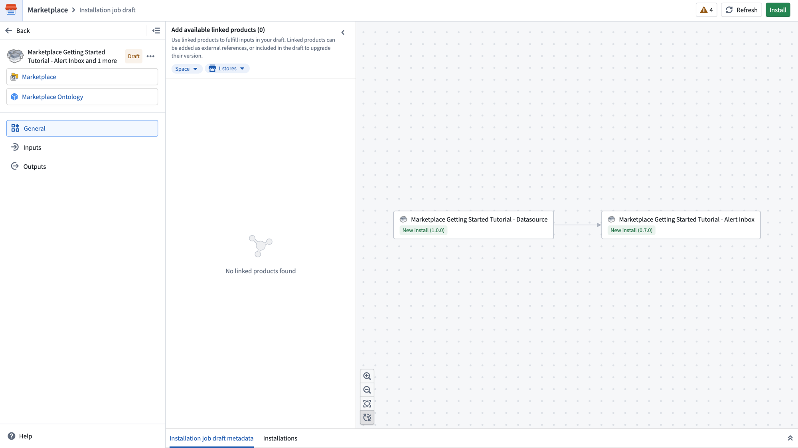
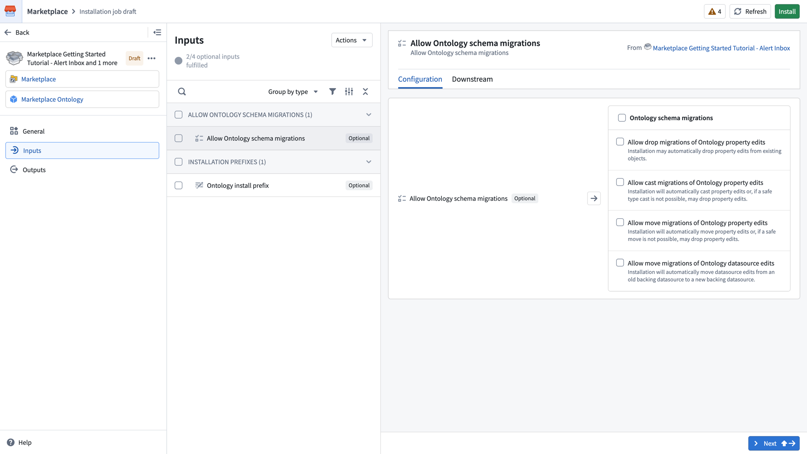
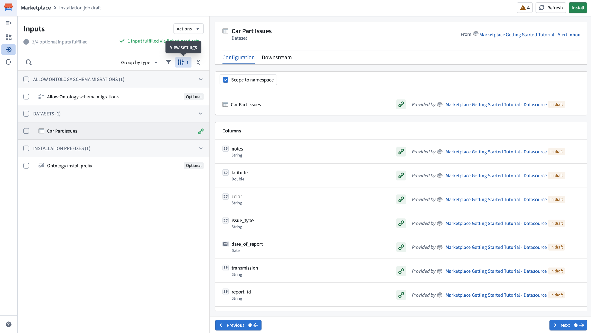
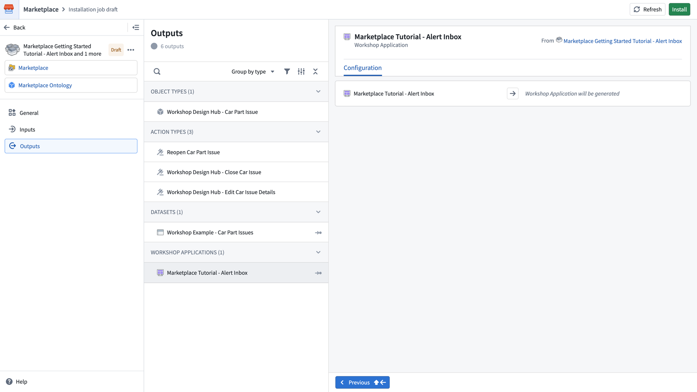
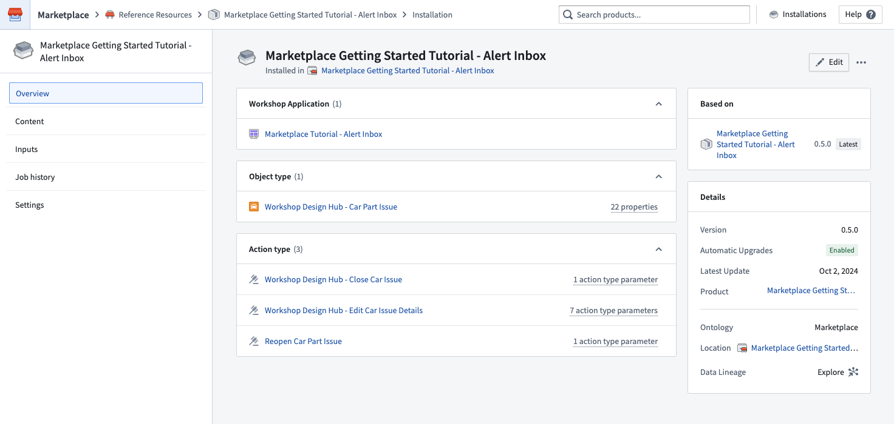
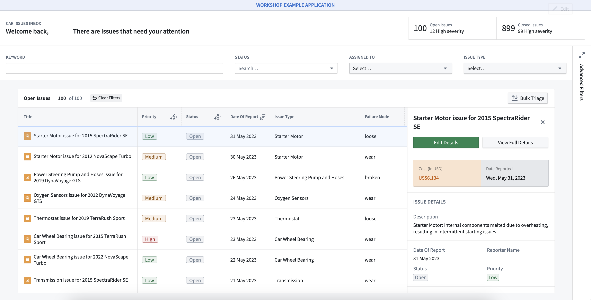

<!-- source: https://palantir.com/docs/foundry/marketplace/getting-started/ · mirrored 2026-08-11 from Palantir Foundry docs -->

# Getting started

This tutorial walks through a basic installation. For a full reference on all available options, see [Install a product](/docs/foundry/marketplace/install-product/).

In this tutorial, you will install an alert inbox application using a notional data source that contains car part issues, which we have provided as its own Marketplace product.

To begin, navigate to Marketplace on your Foundry instance and search for `Marketplace Getting Started Tutorial`. If you are not able to locate these products, contact Palantir Support to verify your access.

## Select products to install

From the search results, select **Create new installations** in the top right corner. This enables selection mode, allowing you to check the boxes on each product card. Select both the **Marketplace Getting Started Tutorial - Alert Inbox** and **Marketplace Getting Started Tutorial - Datasource** products. With both products selected, select **Create 2 new installations** at the bottom of the page.

## Create installation job

A **Create installation job** dialog will appear, allowing you to configure the installation location for both products at once. Choose a project, and select **Create** to create the installation job draft. For a full description of all available settings, see [Create an installation job](/docs/foundry/marketplace/install-product/#create-an-installation-job).

## General

After creating the installation job, you will land on the **General** page of the installation job draft. This page displays a dependency graph showing how the selected products relate to each other. In this tutorial, the `Alert Inbox` product depends on the `Datasource` product.

The left panel shows navigation for the draft, including the **Inputs** and **Outputs** pages. The linked products panel allows you to add available linked products to fulfill inputs in your draft.

## Inputs

Select **Inputs** in the left panel. Because both the `Datasource` and `Alert Inbox` products are included in the same installation job, the `Car Part Issues` dataset input required by the `Alert Inbox` is automatically fulfilled by the output of the `Datasource` product. Fulfilled inputs are hidden by default.

To view the fulfilled input, select **View settings** and then enable **Show inputs fulfilled by linked products**. You will see the `Car Part Issues` dataset listed with its column mappings, provided by the `Marketplace Getting Started Tutorial - Datasource` product.

The **Inputs** page displays any remaining optional inputs that are not yet fulfilled. For this tutorial, you do not need to configure any additional inputs. Optional inputs such as **Allow Ontology schema migrations** and **Ontology install prefix** can be configured if needed but are not required for the installation to succeed.

You can search, filter, and group inputs by type using the controls at the top of the list. Selecting an input displays its **Configuration** and **Downstream** tabs in the right panel.

## Outputs

Select **Outputs** in the left panel. This page provides a summary of all resources that will be created by the installation, grouped by type.

For the `Alert Inbox` product, you will see the following outputs:

* **Object types:** `Workshop Design Hub - Car Part Issue`
* **Action types:** `Reopen Car Part Issue`, `Workshop Design Hub - Close Car Issue`, `Workshop Design Hub - Edit Car Issue Details`
* **Datasets:** `Workshop Example - Car Part Issues`
* **Workshop applications:** `Marketplace Tutorial - Alert Inbox`

Selecting an output displays its **Configuration** tab in the right panel, showing details about what will be generated.

## Install

Once you are satisfied with the configuration, select **Install** in the top right corner to begin the installation. You will land on the installation job page where you can monitor progress. Once your installation is complete, select **View installation** in the upper right corner.

## Open your application

From your installation, open up your `Marketplace Tutorial - Alert Inbox` application in a new tab. It may take a few minutes for your `Car Part Issue` objects to index, before which your application will not be available.

You now have an alert inbox workshop application to help you triage your `Car Part Issues - Source` issues. As long as the required input columns are present, you can install this application again with any issues source to use it for new use cases.

