<!-- source: https://palantir.com/docs/foundry/marketplace/install-product/ · mirrored 2026-08-11 from Palantir Foundry docs -->

# Install a product in Foundry Marketplace

When you have found a product you would like to install, Marketplace will guide you through creating an installation job, mapping any required inputs, and reviewing the product's outputs. For a step-by-step walkthrough of a basic installation, see [Getting started](/docs/foundry/marketplace/getting-started/).

## Create an installation job

To begin installing a product, select **Create new installations** in the top right corner of the Marketplace interface. Check the boxes on product cards to select them for installation. You can select one or more products to install together. Once your products are selected, select **Create new installations** at the bottom of the page.

Alternatively, from a product's detail page, select the **Install again** button in the top right corner to install the product. If you already have access to an existing installation, this button will instead prompt you to **Open**, which will navigate you to the existing installation where you can [upgrade](/docs/foundry/marketplace/upgrades/) it. You can select **Install again** if you prefer to install the product again (for instance, if you would like to create a new version with different inputs). If the product version is recalled by the publisher, the **Install** button will be disabled.

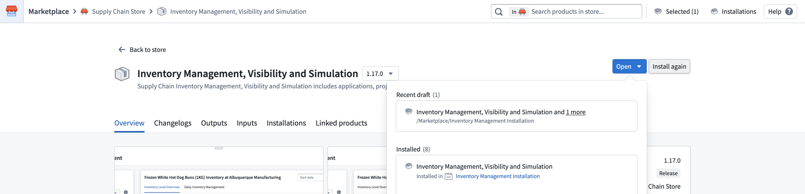

In this example, we will choose **Install again**. A **Create installation job** dialog will appear for you to configure the installation location.

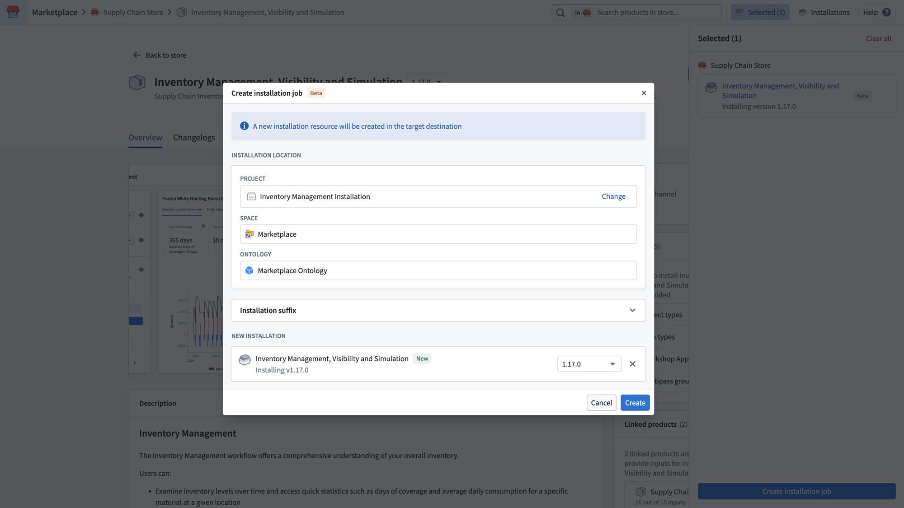

Configure the following settings:

* **Project:** The [project](/docs/foundry/security/projects-and-roles/) in which your installed resources will live. Select **Change** to choose a different project.
* **Project locking:** For [production mode installations](/docs/foundry/foundry-devops/create-products/#installation-mode), project locking is recommended to prevent unwanted changes to installed resources. Select **Lock project** to lock the project. Learn more about [project locking](/docs/foundry/marketplace/installations/#project-locking).
* **Install products in multiple folders or projects:** Select this option if you want to install each product into a separate location.
* **Space:** The space for your installed resources. This is automatically selected based on the project you choose.
* **Ontology:** The [Ontology](/docs/foundry/ontologies/ontologies-overview/) in which any objects, links, actions, and [functions](/docs/foundry/functions/marketplace-functions/) will be created. This is automatically selected based on the space. If you do not see the Ontology you want, contact your platform administrator as this means you do not have permission to edit.
* **Installation suffix:** Optionally customize the name of the project in which content will be installed. For example, you might add a suffix to distinguish this installation from others or to separate environments (such as `DEV`, `TEST`, or `PROD`). Learn more about [using DevOps for release management](/docs/foundry/devops-release-management/use-devops-for-release-management/#use-devops-for-release-management).

The **New Installation** section at the bottom lists the products that will be installed along with their version numbers. You can change the version using the version dropdown menu.

Select **Create** to create the installation job draft.

## General

After creating the installation job, you will land on the **General** page of the installation job draft. This page displays a dependency graph showing the products in your draft and their relationships.

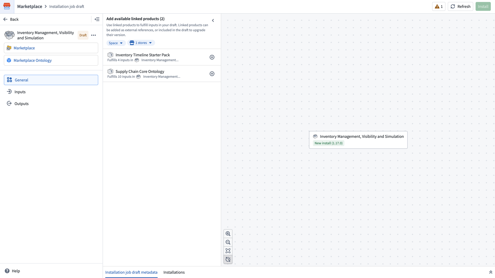

The left panel shows navigation for the draft:

* **General:** The dependency graph and linked products panel.
* **Inputs:** Input mapping configuration for your installations.
* **Outputs:** A summary of all resources that will be created.

### Linked products

The **Add available linked products** panel on the **General** page shows products that can fulfill inputs in your draft. Linked products can be added as external references or included in the draft to install or upgrade their version.

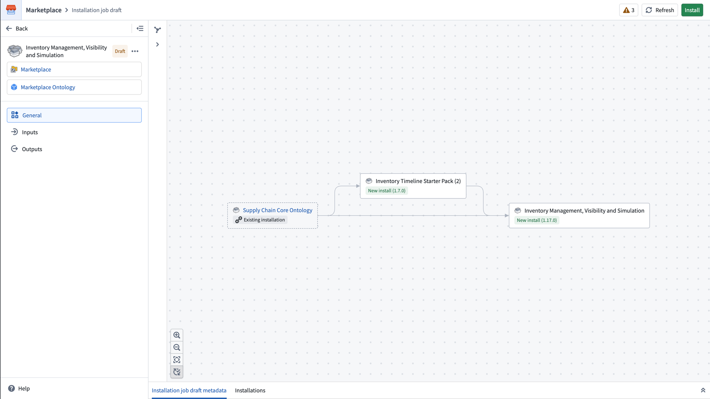

You can filter the linked products panel by space to show only installations in the same space, or by store to find products from other stores.

Select the add (**+**) icon next to a linked product to view options. If an existing installation of the linked product is available, you can reference it to fulfill inputs without creating a new installation. If an upgrade is available for the existing installation, this will be indicated.

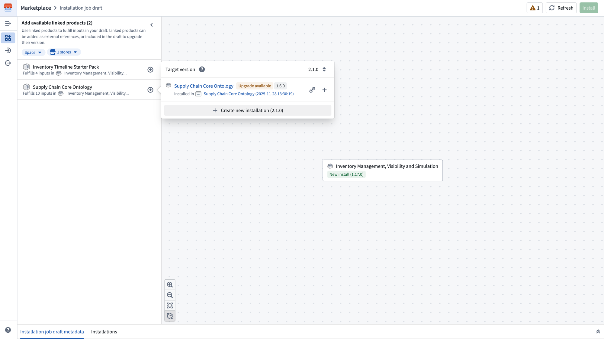

You can choose to:

* **Reference an existing installation** to fulfill inputs using content that was already installed. External references can link across stores, which is useful for [cross-store linked products](/docs/foundry/marketplace/linked-products/#cross-store-linked-products).
* **Upgrade an existing installation** if a newer version is available.
* **Create a new installation** of the linked product to include in your draft. Installations included in the job must be from the same store and space.

After adding linked products, the dependency graph updates to show the new relationships. A banner at the bottom indicates pending changes. Select **Apply changes** to confirm.

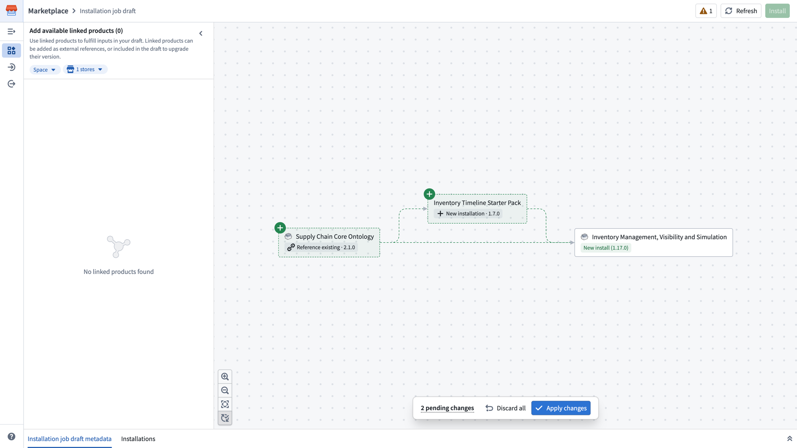

Once applied, the graph displays the final structure of your installation job, showing which products are new installations, which are existing installations being referenced, and how they relate to each other. In the example below, `Supply Chain Core Ontology` is an external reference that will provide inputs to this job but will not be upgraded as part of this job. `Inventory Timeline Starter Pack` will be included in this job as a new installation alongside `Inventory Management, Visibility and Simulation`.

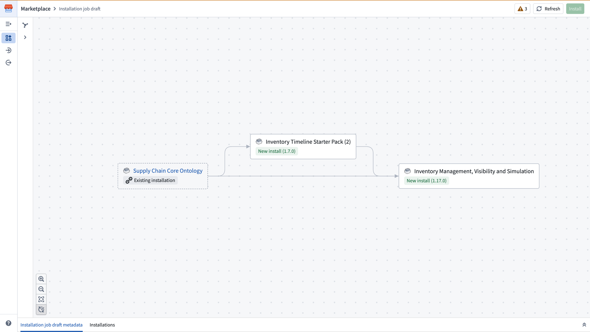

To modify a linked product after it has been added, select the product node in the graph to see options such as **Include in draft** or **Remove from draft**.

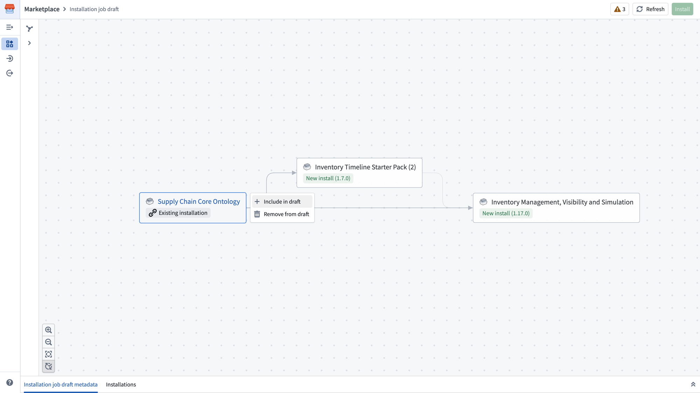

For more information on how linked products work, see [Linked products](/docs/foundry/marketplace/linked-products/).

## Inputs

Select **Inputs** in the left panel to configure the inputs required by your installation. The **Inputs** page shows a count of mandatory and optional inputs and their fulfillment status. Inputs fulfilled by linked products are hidden by default.

Inputs are grouped by type (for example, datasets, Multipass groups, Ontology schema migrations, or installation prefixes). You can search, filter, and group inputs using the controls at the top of the list.

### Filter and search inputs

The **Inputs** page supports powerful filtering options for managing large numbers of inputs. Select the filter icon to open the **Filters** panel, where you can filter by:

* **Status:** Show only inputs that are missing, have errors, are optional, or are fulfilled.
* **Type:** Filter to specific input types such as object types, link types, Multipass groups, or installation prefixes.
* **Product:** Filter inputs by the product they belong to.

You can also search inputs by name using the search bar, and group inputs by type or by product using the **Group by** dropdown menu.

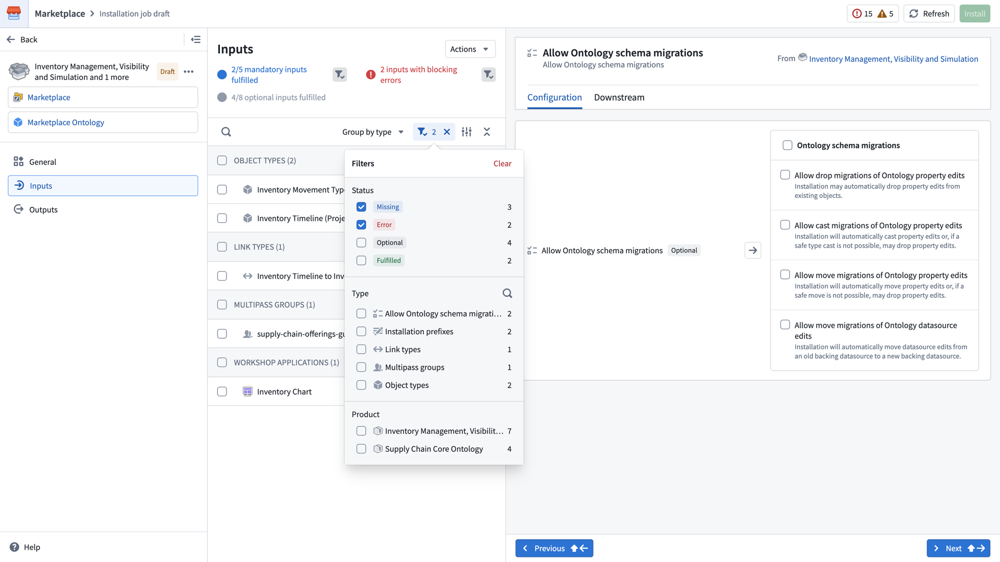

### Input mapping

To map a mandatory input, select it from the list. The right panel displays the **Configuration** tab where you can search for and select the resource to fulfill the input.

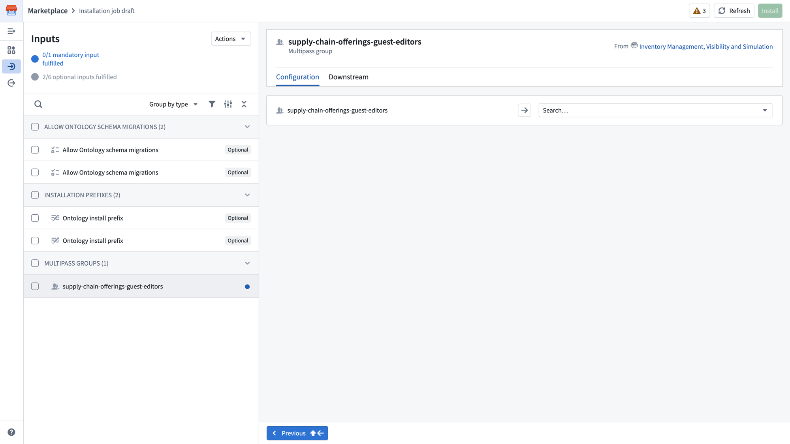

The **Downstream** tab shows which resources in the installation depend on this input, helping you understand why it is needed.

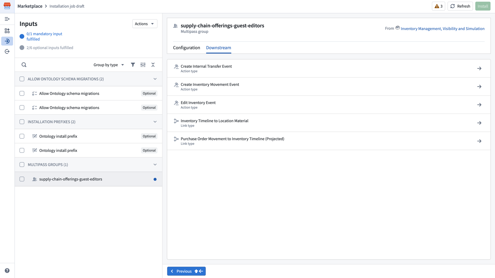

#### Bulk-set inputs

To configure multiple inputs of the same type at once, select the checkboxes next to each input you want to configure. The right panel will display the **Bulk-set inputs** view, showing the selected inputs and allowing you to apply the same configuration to all of them.

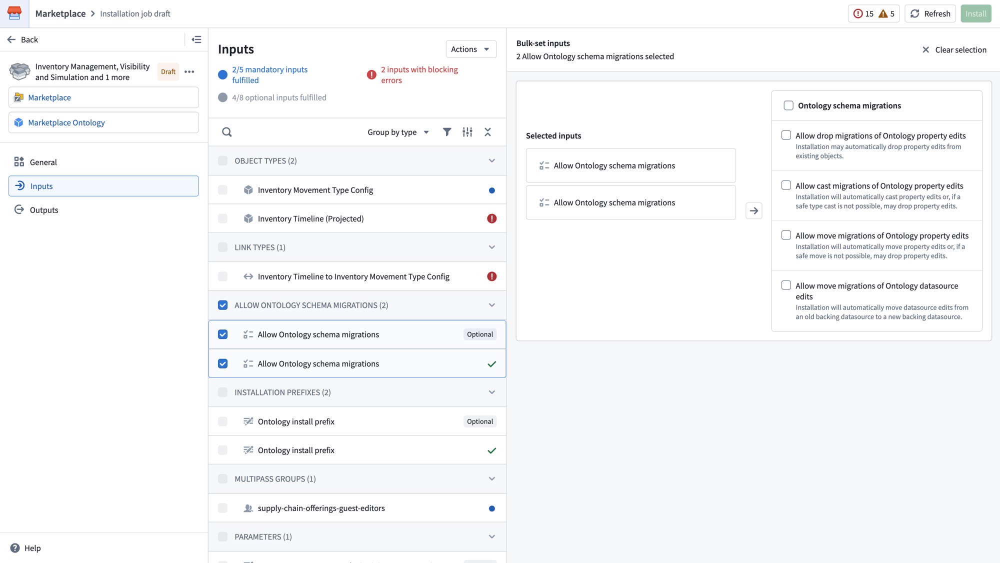

#### Ontology install prefix

The **Ontology install prefix** input allows you to customize the names of all object types, link types, and action types with a user-specified prefix. You can choose to apply the prefix to the **Display name only** or to both the **Display name and API name**.

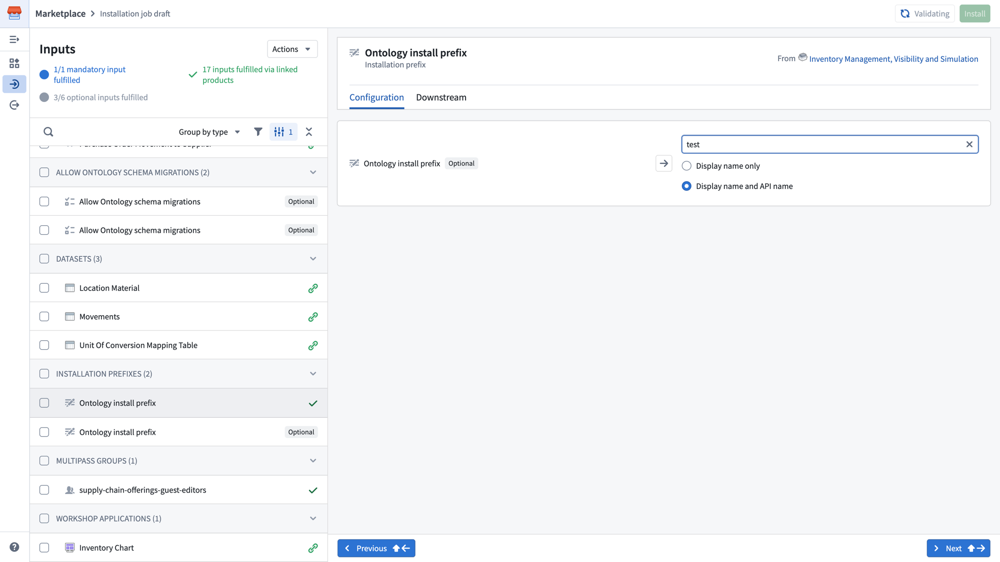

#### Placeholder inputs

To deploy Marketplace products before all resources are available, you can create temporary stub resources to continue with the installation. Only dataset inputs are currently supported.

To generate placeholder inputs, select **Actions** at the top of the **Inputs** page, then select **Placeholder inputs**. Alternatively, you can select **Generate placeholder** from the toolbar on an individual input's **Configuration** tab.

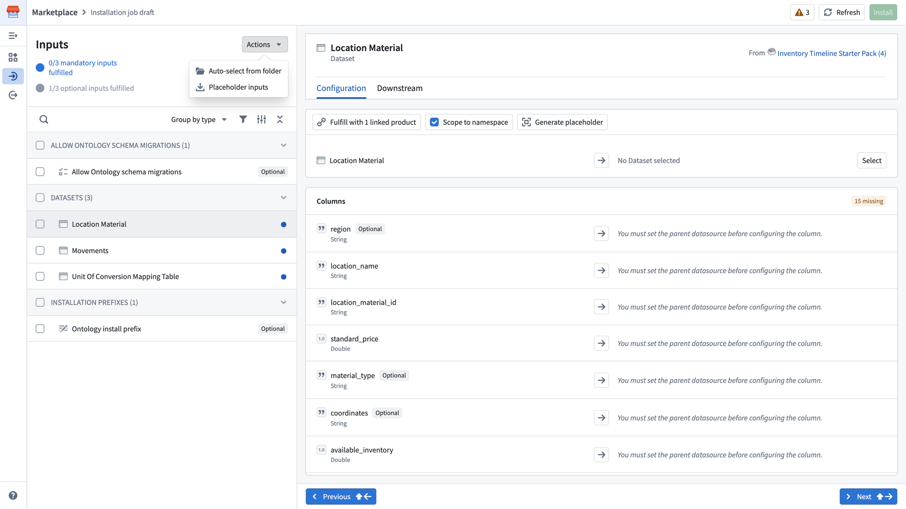

A dialog will appear where you can select the folder in which placeholder inputs will be saved, and choose which inputs to generate placeholders for. Select **Generate placeholder inputs** to create the placeholders.

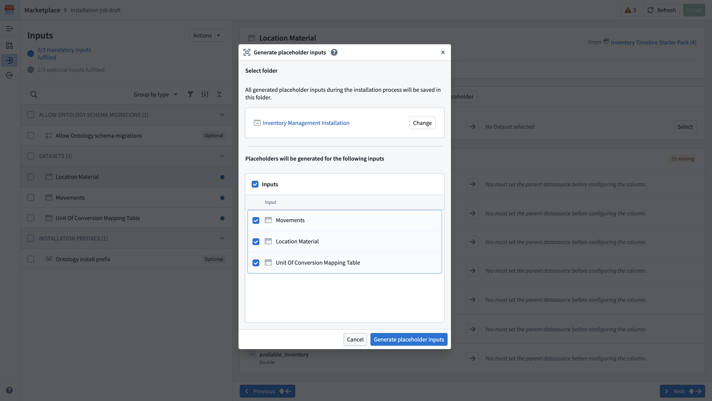

Once the actual resources become available, you can remap these inputs by selecting the ellipsis (**...**) on the installation page and choosing **Edit**.

#### Auto-select from folder

You can also auto-select inputs from an existing folder. Select **Actions** at the top of the **Inputs** page, then select **Auto-select from folder** to automatically map inputs using resources from a specified folder.

## Outputs

Select **Outputs** in the left panel. This page provides a summary of all resources that will be created by the installation, grouped by type (for example, action types, data health checks, datasets, folders, and Workshop applications).

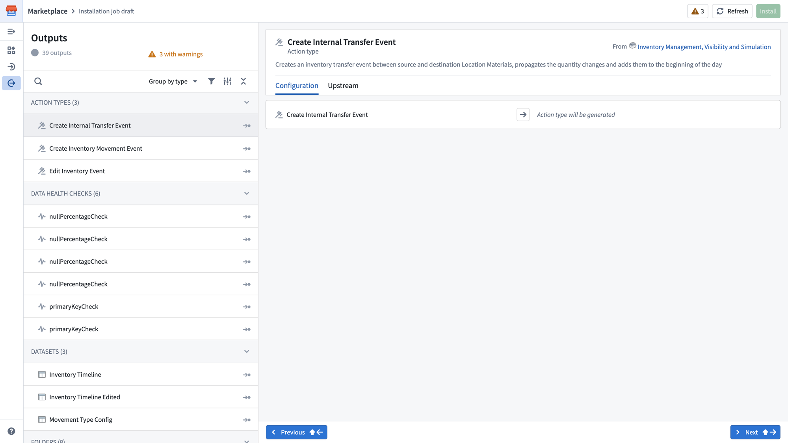

The **Outputs** page also displays warnings if any outputs require attention. You can search, filter, and group outputs using the controls at the top of the list.

Selecting an output displays its details in the right panel:

* **Configuration:** Shows what will be generated for this output.
* **Upstream:** Shows which inputs or other resources this output depends on.

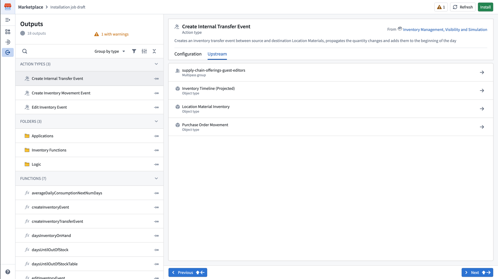

## Install

Once all mandatory inputs have been mapped, select **Install** in the top right corner to begin the installation. This submits the installation draft and a job starts running to create the resources. You will be redirected to the job page where you can monitor progress.

If there are warnings (indicated by the warning count in the top right), you should review them before proceeding. Select the warning indicator to review any issues. Warnings do not block the installation, but blocking validation errors must be resolved before you can install.
