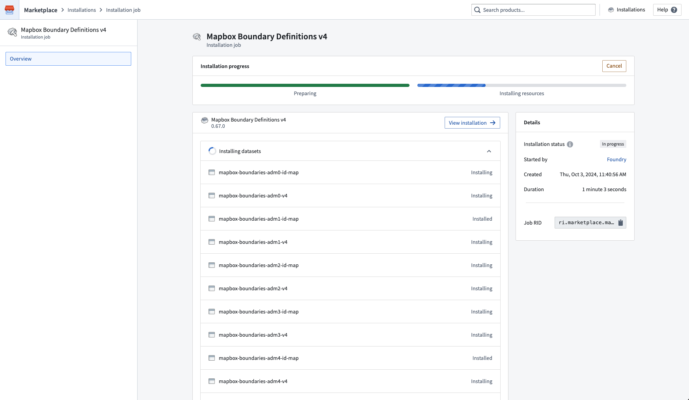
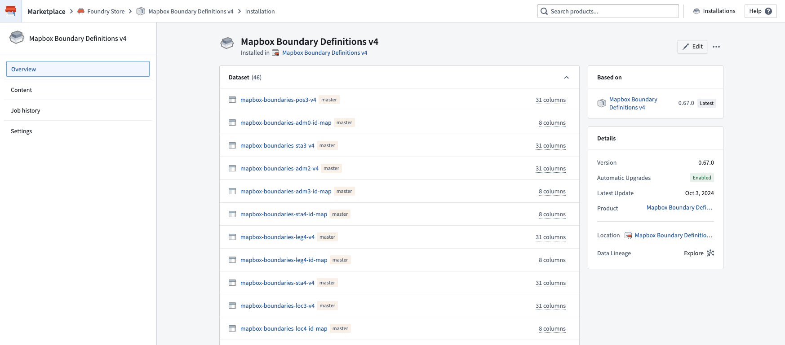
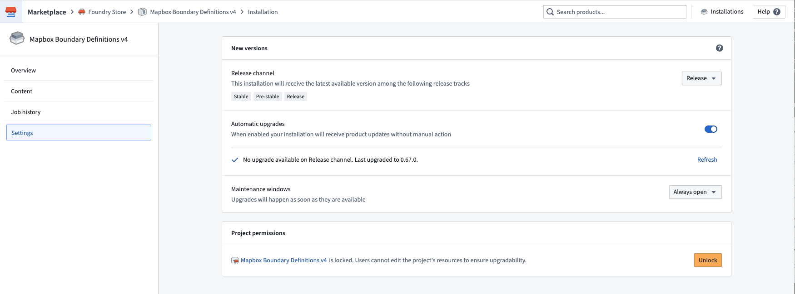
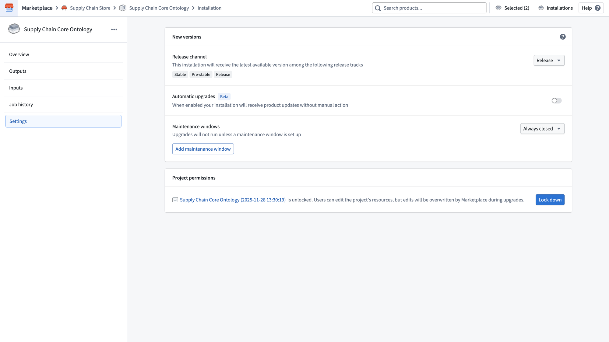
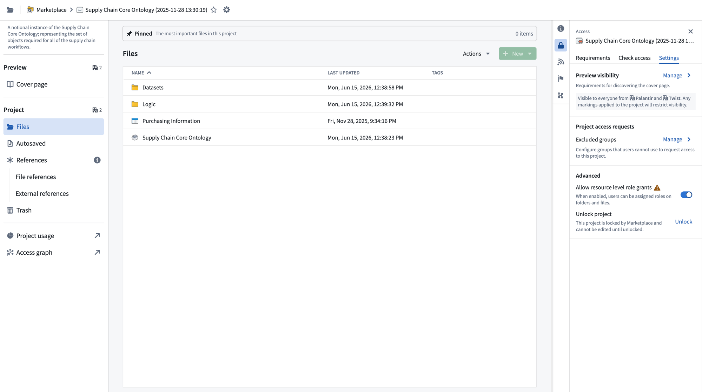
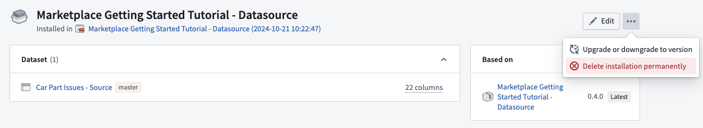
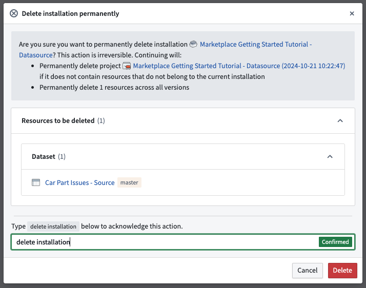
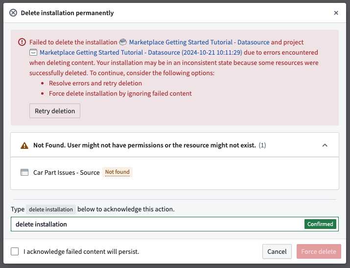

<!-- source: https://palantir.com/docs/foundry/marketplace/installations/ · mirrored 2026-08-11 from Palantir Foundry docs -->

# Installations in Foundry Marketplace

Once you’ve begun a product installation, you can monitor your installation job. The screenshot below shows the installation job view of Marketplace.

Select **View installation** in the top right to see your completed installation. From here, you can navigate to your installed resources to begin using them. The project or folder location where your resources are saved is linked in the right panel.

The screenshot below shows a completed product installation in Marketplace.

## Installation settings

After installation, you can configure a number of options for an installation from the **Settings** panel.

* **Release channel:** Set the release channel you want your installation to track. New versions that are tagged with that release channel will be surfaced as new versions available for upgrade. See [Upgrades](/docs/foundry/marketplace/upgrades/) for more information.
* **Automatic upgrades:** Enable automatic upgrades for new product versions; see [Automatic upgrades](/docs/foundry/marketplace/upgrades/#automatic-upgrades-beta) for more information.
* **Maintenance windows:** This setting allows you to control the timing of upgrades; for instance, you can set upgrades to occur as soon as they are available, or to take place during a specified period of time (the maintenance window).
* **Lock or unlock your installation:** Locking an installation prevents edits to downstream content. Keep your installation locked if you want to guarantee safe upgrades; you can unlock your installation to fork the content you installed. See [Project locking](#project-locking) for more information.

The screenshot below shows the **Settings** panel of Marketplace's installation view. From here, the automatic upgrades configuration can be set and the installation can be locked or unlocked to allow edits to the installed content.

### Known limitations

For some resource types, unlocking an installation may not allow edits to the installed resources. Note that **Code Repositories** must be packaged with the source code for it to be editable in an installation.

## Project locking

Locking a project prevents users from editing installed resources directly. This is recommended for **[Production mode](/docs/foundry/foundry-devops/create-products/#installation-mode)** installations to ensure safe upgrades, as edits to installed content will be overwritten when a new product version is applied.

You can lock a project during installation from the **[Create installation job](/docs/foundry/marketplace/install-product/#create-an-installation-job)** dialog, or after installation from the **Settings** page of the installation. On the **Settings** page, the **Project permissions** section shows the current lock status of the project. Select **Lock down** to lock an unlocked project.

When a project is locked:

* Users cannot edit resources within the project directly.
* Marketplace can still apply changes during upgrades.
* The default lock behavior depends on the [installation mode](/docs/foundry/foundry-devops/create-products/#installation-mode) specified by the product builder.

### Unlock a project

To unlock a locked project, navigate to the **Settings** page of the installation and select **Unlock** in the **Project permissions** section.

Alternatively, you can unlock the project from Compass. Navigate to the project, open the **Access** panel, select the **Settings** tab, and under **Advanced** select **Unlock**.

Once unlocked, users can edit the project's resources, but edits will be overwritten by Marketplace during upgrades.

## Upgrades

For information on automatic upgrades, manual upgrades, and downgrades, review our [documentation](/docs/foundry/marketplace/upgrades/).

## Delete installations

To delete an installation along with all its resources, start by selecting the ellipsis (**...**) in the upper-right corner of the installation page. Next, choose **Delete installation permanently**, as shown in the screenshot below.

Selecting **Delete installation permanently** will show a preview of the resources that will be permanently deleted if you proceed.

Next, type `delete installation` in the confirmation text box and select **Delete** to initiate the uninstallation process.

:::callout{theme="danger"}
**Warning:** Deleting an installation is *irreversible*. Uninstallation will *permanently* delete resources across all installation versions as well as the installation itself. If the installation project or folder only contains resources that belong to the installation selected for deletion, uninstallation will also permanently delete the installation project or folder. Otherwise, the deletion of the project or folder will be skipped.
:::

If uninstallation is successful, you will be redirected to the installations page. If uninstallation fails, you will receive an error message, as shown below:

The error message will list the resources that failed to be deleted and the reasons for the failure, as well as the resources that were successfully deleted. You can choose to resolve issues with failed resources before retrying uninstallation, or you can tick the box acknowledging that failed content will persist and select the **Force delete** button. This will ignore failed resources and delete the installation. The installation project or folder will also be deleted, provided that the project or folder does not contain any other resources that do not belong to the given installation.
