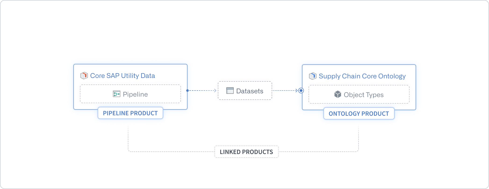
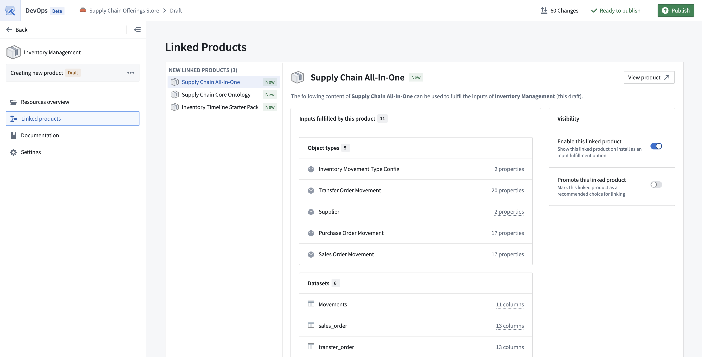
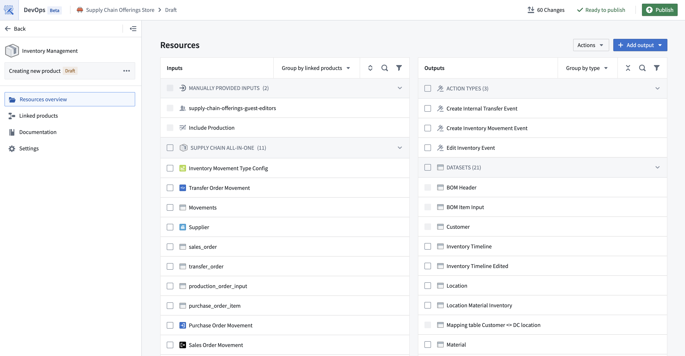
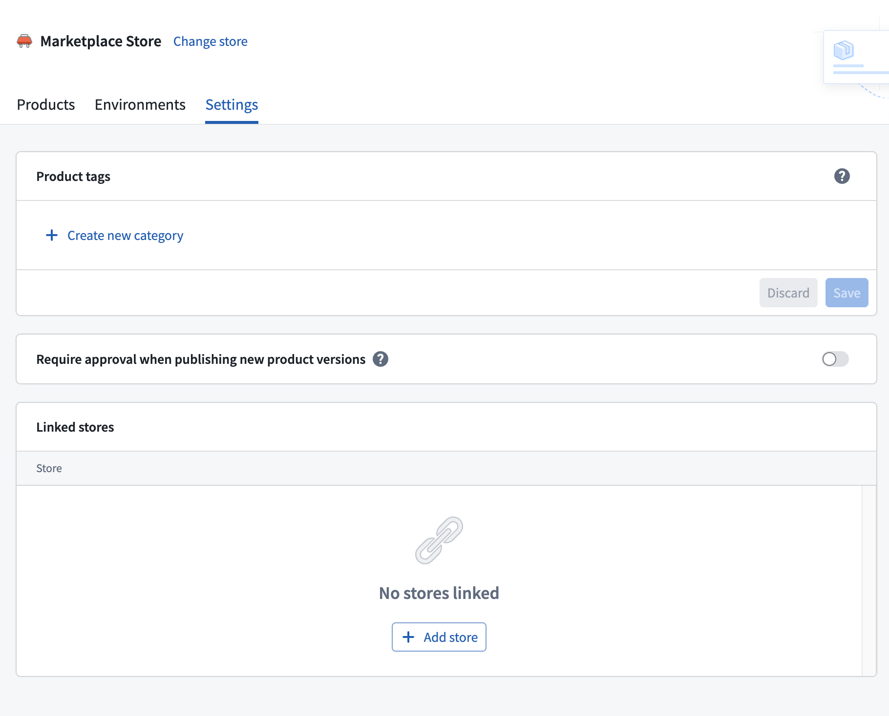
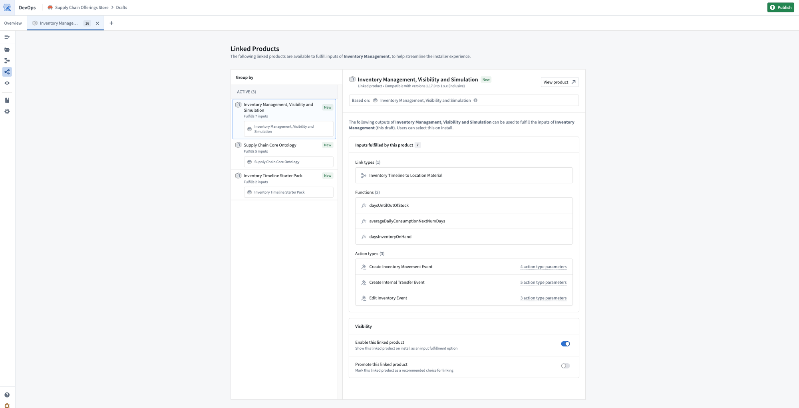

<!-- source: https://palantir.com/docs/foundry/marketplace/linked-products/ · mirrored 2026-08-11 from Palantir Foundry docs -->

# Linked products

You can modularize a complete workflow into a set of linked products in a Marketplace store. This allows smaller products to be iterated upon and upgraded in isolation.

Using linked products allows you to ensure:

* Automatic mapping between one product’s content and another product’s inputs
* Semantically-versioned dependencies between products
* Less duplicate content upon installation, as overlapping content in multiple products can be separated into one upstream product for consumption downstream

For example, if your workflow contains data-cleaning pipelines and object types backed by the clean data, then the pipelines and object types may be packaged into separate products. A connection between the pipeline and Ontology products enables their simultaneous installation, automatically mapping the clean datasets content from the pipeline product to the required inputs of the Ontology product.

## Linked products sources

There are several different sources from which DevOps generates linked products:

* **Same-store linked products:** DevOps automatically detects and links products within the same store based on shared source entities. See [Packaging linked products](#packaging-linked-products).
* **Cross-store linked products:** DevOps links products across multiple stores using configured store links, which are useful for shared upstream products consumed by other Marketplace stores. See [Cross-store linked products](#cross-store-linked-products).
* **Installation-based linked products:** DevOps automatically detects and links products based on existing installations on the enrollment that share the same source entities. See [Installation-based linked products](#installation-based-linked-products).

## Packaging linked products

DevOps inspects the source entities that are packaged to determine the links between products. By default, DevOps looks for linked products within the same store, but you can also configure [cross-store linked products](#cross-store-linked-products) to link products across multiple stores. In the following notional example, there is a data pipeline which outputs a dataset and an object type which is backed by the dataset.

The pipeline and object type can be packaged as individual products, and DevOps will ensure that the output dataset of the Pipeline product meets the dataset input requirements of the Ontology product. This link is derived from the source entities.

For example, if your product contains a Workshop application that has a dependency on the `Airplane` object type, then DevOps will only link products which contain the exact same `Airplane` object type as content.

DevOps creates the product links when the downstream product is packaged. This is demonstrated in the image above with the Ontology product. In other words, DevOps looks for products which have content fulfilling inputs of the product draft being published. By default, only products in the same store are considered, but [cross-store linked products](#cross-store-linked-products) can extend this to include products from linked stores. If the upstream product is repackaged to produce new outputs and these outputs can be consumed by the downstream product, then the downstream product must also be repackaged to regenerate the link to ensure an up-to-date workflow.

While packaging a product, you can see which other products can provide inputs to the packaging draft. You can open each linked product to see the mapping between the two products.

You can also use the **Group by linked products** option in the **Inputs** panel to preview the inputs provided by each of the upstream linked products.

### Breaking changes

A breaking change to a product is one which would cause dependent workflows of the product’s content to no longer function correctly. For example, a breaking change may be the removal of content or a type change of a dataset column. This means that any dependent workflows need to be adjusted to account for these new changes.

When breaking changes are present, *major version increments* (such as `2.0.0` to `3.0.0`) are recommended to inform installers that there are backwards-incompatible changes in a product’s content. To ensure that downstream products can continue to use the published product as a linked product, packagers will likely need to account for the breaking changes by updating the downstream products. For example, updates may be needed to ensure that a modified dataset column type is being correctly consumed, or to remove inputs that are no longer provided.

:::callout{theme="warning"}
Major version increments make the published version of a product incompatible with any existing downstream linked products. To reinstate linked product compatibility, **all downstream linked products** must be repackaged.
:::

If a minor version increment is selected when there are breaking changes, installers will be able to select the linked product, but will likely run into errors on install.

The safest procedure to follow is to repackage any downstream products of a recently-published product, so that all linked product mappings are regenerated.

## Installing linked products

When installing a product, linked products are surfaced on the **General** page of the installation job draft. You can add them as external references to fulfill inputs using already-installed content, or include them in the draft to install or upgrade alongside your primary product. See [Install a product](/docs/foundry/marketplace/install-product/#linked-products) for details.

## Splitting up a product

Often, large products contain distinct stages of a workflow (e.g. data-cleaning and application). Such a product can be split into smaller products, to allow more rapid iteration and releases of each part.

By separating some of the large product's content into another product, you can install both products together using the automatic mapping between them. However, this can lead to duplicate resources in existing installations.

Installing the newly-created product will create new resources, instead of reusing the installed resources of the original, larger product.

## Best practices for product linkage

The following are some tips to consider when linking products, to ensure that your product remain serviceable:

* Package products from upstream to downstream. This ensures the generated product links are most up-to-date.
* Indicate breaking product changes with a major version increment.
  * Repackage downstream product consumers to regenerate the product link.

## Cross-store linked products

By default, linked products are only generated between products within the same store. However, you can configure store links to enable linked products across multiple stores. This is useful when you have shared upstream products (such as common data pipelines or ontology definitions) that are consumed by products in other stores.

### How store links work

Store links are **one-way** connections that allow downstream products in your store to link to upstream products in another store. When you link to another store, DevOps will consider products from that store as potential upstream dependencies when packaging products in your store.

### Configuring store links

To configure store links, navigate to the **Store settings** for the store that should receive linked products from another store. This requires the `marketplace:link-to-local-marketplace` operation on the target store, which is granted to store viewers by default.

## Installation-based linked products

By default, linked products are generated when the source entities of one product's outputs directly reference the same resource as another product's inputs. Installation-based linked products extend this behavior by detecting cases where an existing upstream installation on the enrollment has output resources that reference the same input resources of a downstream product.

This is useful when builders create products based on resources that were installed from an upstream product, rather than building directly against the original source entities. In these cases, the downstream product's inputs reference installed resources rather than the upstream product's packaged content. DevOps detects that the installed resources originate from an upstream product and generates the linked product relationship automatically.

