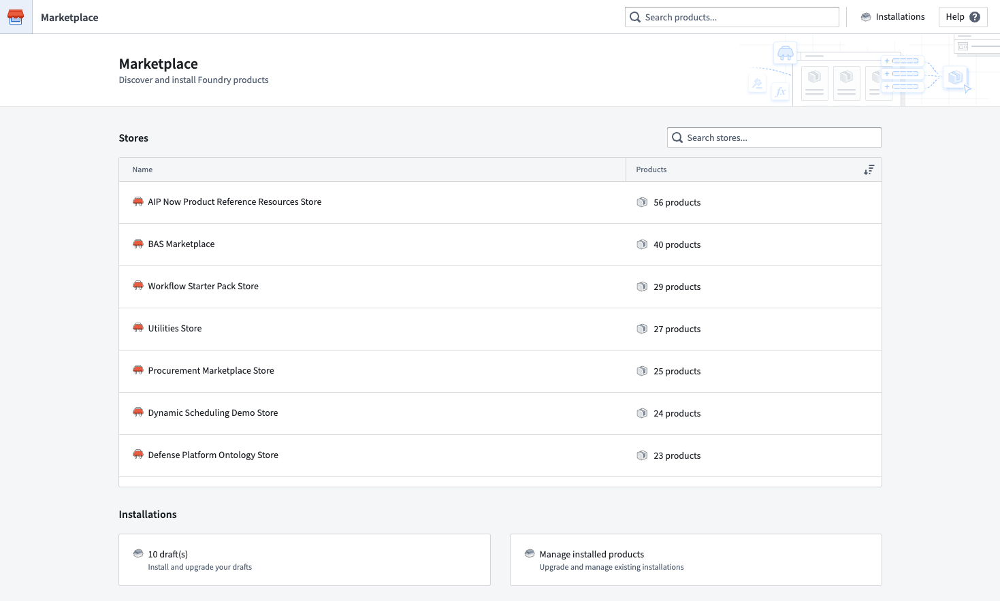

<!-- source: https://palantir.com/docs/foundry/marketplace/overview/ · mirrored 2026-08-11 from Palantir Foundry docs -->

# Marketplace

The **Marketplace** storefront provides discoverability and facilitates installation of published data products.
You can access Marketplace via the [Applications Portal](/docs/foundry/app-building/curating-apps/)

Key features of Marketplace include:

* **Guided product installation**.
* Ability to enable **automatic upgrades** for installations to accept new product versions with no user intervention, including **maintenance windows** and **release channels**.

Learn how to [browse](/docs/foundry/marketplace/browse-products/) and [install](/docs/foundry/marketplace/install-product/) Marketplace products.
