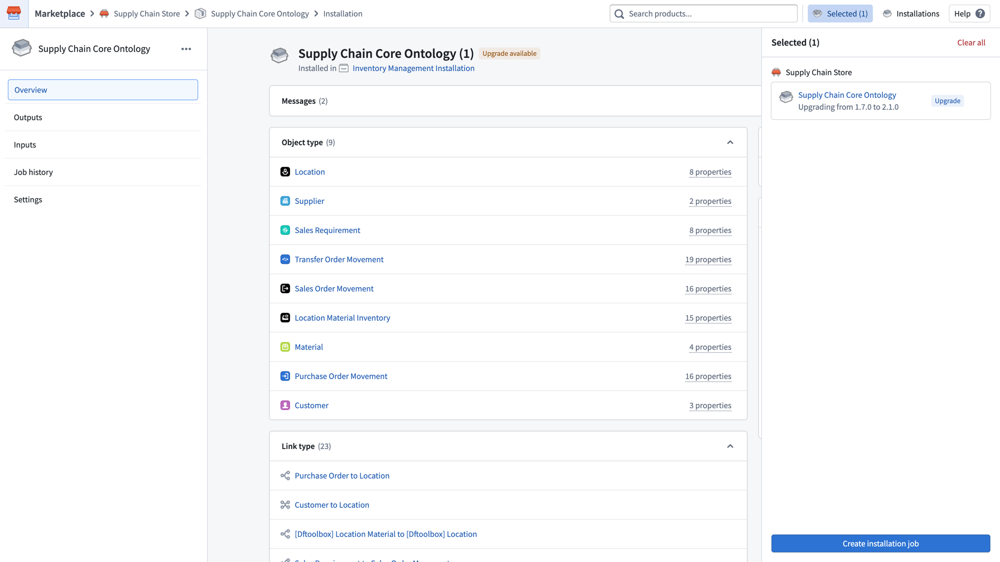
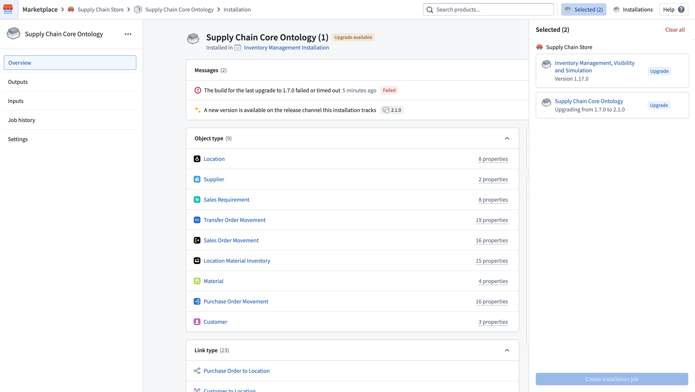
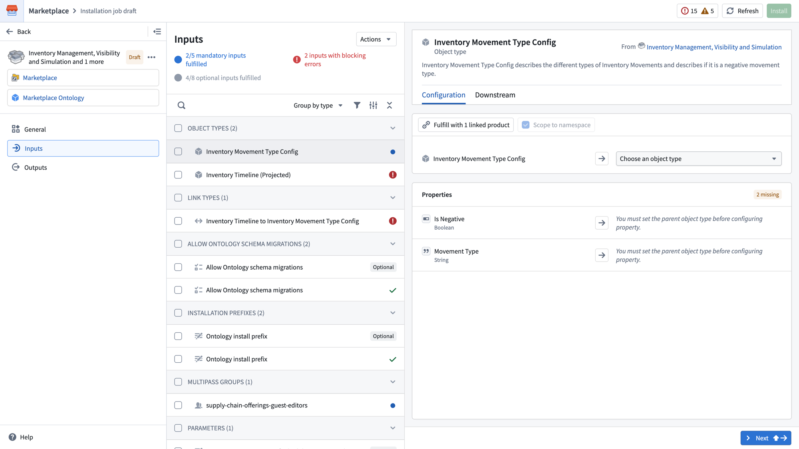
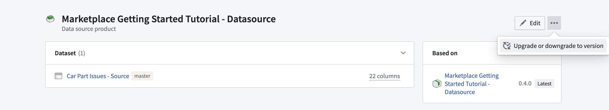
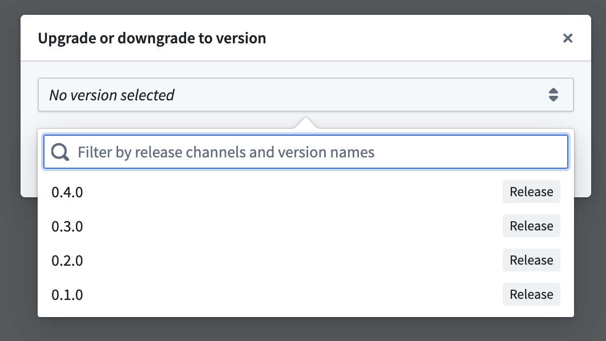

<!-- source: https://palantir.com/docs/foundry/marketplace/upgrades/ · mirrored 2026-08-11 from Palantir Foundry docs -->

# Upgrades

## Manual upgrades

When a new version is available for an installation, you can stage it for upgrade from the installation page. The installation will show an **Upgrade** badge and appear in the **Selected** panel on the right.

You can stage multiple installations together for an upgrade in the same job by navigating to each installation page and adding them to the selected list. Once all desired installations are selected, select **Create installation job** to begin the upgrade.

If you do not want to upgrade to the latest version, or instead want to downgrade to an earlier version, you can select the ellipsis (**...**) and choose **Upgrade or downgrade to version**. See [Downgrades](#downgrades) for more information. It is also possible to **Edit** an installation, which will create another installation job at the existing version. This can be used to edit inputs or force re-run an installation job without changing the product version.

When entering the upgrade draft, you may need to fill in new inputs or resolve any new errors that arise from the upgrade. The **Inputs** page will indicate any mandatory inputs that are not yet fulfilled and any inputs with blocking errors.

## Automatic upgrades \[Beta]

:::callout{theme="neutral" title="Beta"}
Automatic upgrades in Marketplace are in the [beta](/docs/foundry/platform-overview/development-life-cycle/) phase of development and may not be available on your enrollment. Functionality may change during active development.
:::

Automatic upgrades are disabled by default for both **[Production mode](/docs/foundry/foundry-devops/create-products/#installation-mode)** and **Bootstrap mode** products. You can configure automatic upgrade settings in the [installation settings](/docs/foundry/marketplace/installations/#installation-settings). Automatic upgrade settings include the following:

* The **maintenance windows** during which you would like to receive automatic upgrades. Select **Always open** to take upgrades as soon as they are available. Upgrades will cause downtime for installed resources; we recommend adding a maintenance window to avoid downtime.
* The **release channel** your installation should track. During any maintenance windows you have configured, your installation will automatically upgrade to versions tagged to that release channel as long as the upgrade does not require manual action.

Release channels are hierarchical rather than mutually exclusive. Depending on the track:

* **Release:** The installation receives the versions tagged as **Release**, **Test**, or **Stable**.
* **Test:** The installation receives the versions tagged as **Test** and **Stable**.
* **Stable:** The installation receives the versions tagged as **Stable**.

Upgrades will still require manual action if the new product version includes new inputs that must be mapped, or if any validation errors arise. If this is the case, you will be guided through the same manual configuration workflow as [manual upgrades](#manual-upgrades).

## Downgrades

To downgrade to a previous version or upgrade to a specific version of a product, start by selecting the ellipsis in the top right corner of the installation page. Then, choose **Upgrade or downgrade to version**.

A dialog will appear where you can choose the version. After making your selection, initiate the upgrading or downgrading process by selecting **Create a draft**.

