<!-- source: https://palantir.com/docs/foundry/media-sets-advanced-formats/add-audio-transcription/ · mirrored 2026-08-18 from Palantir Foundry docs -->

# Create an interactive audio transcription application

This guide will teach you how to build a workflow to transcribe audio and create an interactive application for viewing the transcription using [media sets](/docs/foundry/data-integration/media-sets/).

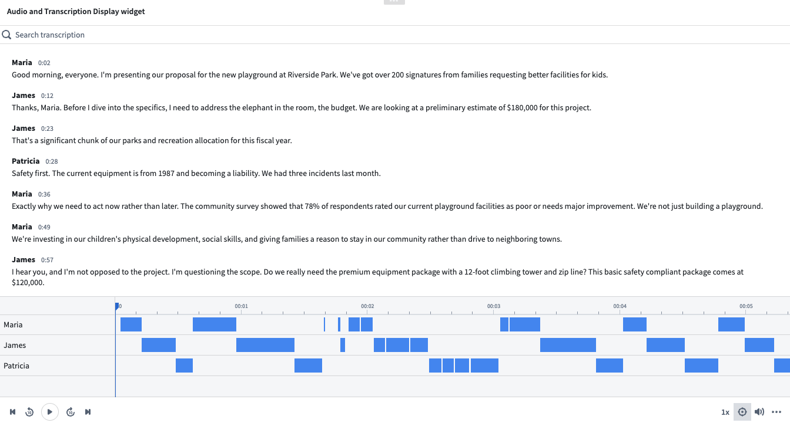

## Part 1: Import audio files in Foundry as a media set

First, you should import your audio files as [media sets](/docs/foundry/data-integration/media-sets/). There are two ways to do this:

* [Direct upload](/docs/foundry/media-sets-advanced-formats/importing-media/#direct-upload)
* [Data Connection](/docs/foundry/data-connection/media-set-sync/)

Once imported, you will be able to view your audio media set.

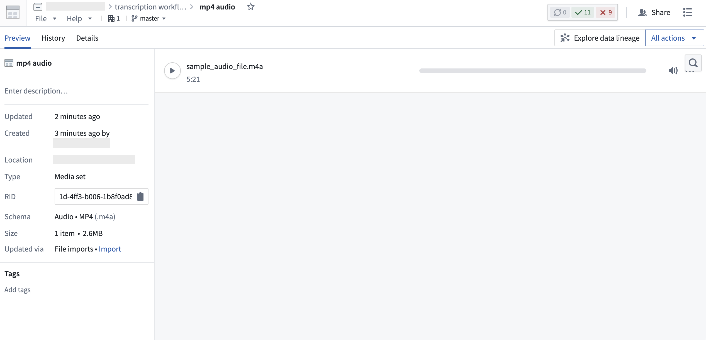

## Part 2: Transcribe audio media set via Pipeline Builder

1. Create a new pipeline in Pipeline Builder and add your audio media set to the pipeline. Detailed steps can be found in the [initial set up section](/docs/foundry/building-pipelines/create-batch-pipeline-pb-media-set/#part-1-initial-setup) of the Pipeline Builder documentation.

   Your imported audio media set should look like this:   
   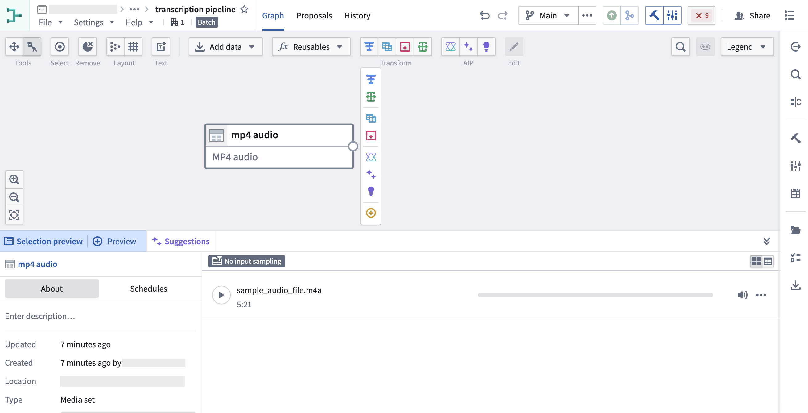   

2. Next, select the **Transcribe audio** transformation using **Transforms**.   
   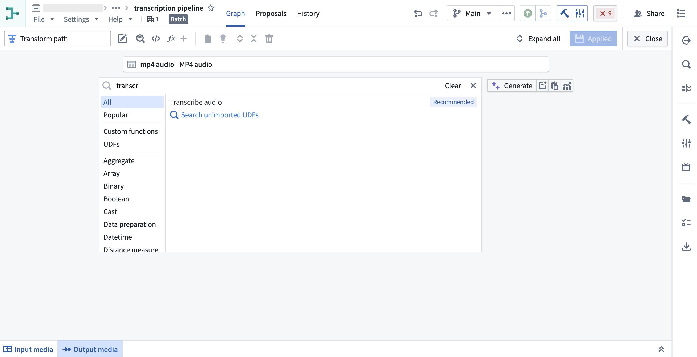   

3. Specify the inputs for the **Transcribe audio** transformation and select **Apply**.   
   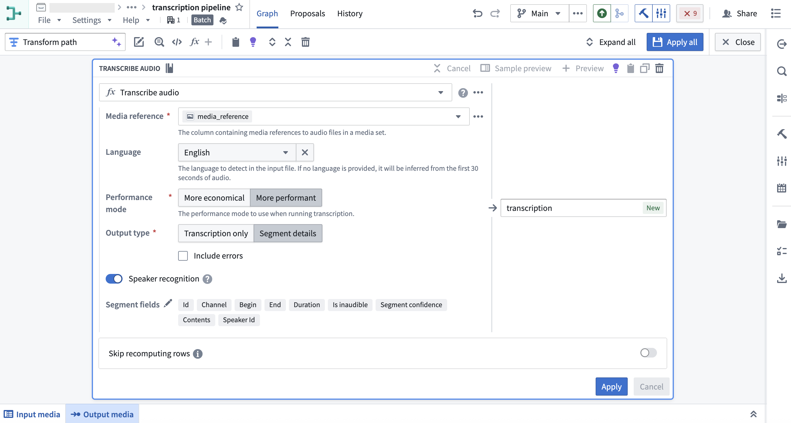   

   Use the `media_reference` column from the media set input, and select the desired language. If no language is provided, it will be inferred from the first 30 seconds of audio. There are several configuration options available. In this example, we want to include speaker diarization details in the output, so we will select the **More performant** mode, the **Segment details** output type, and toggle on **Speaker recognition**.

4. You can preview the outputs from the transcription in the table.   
   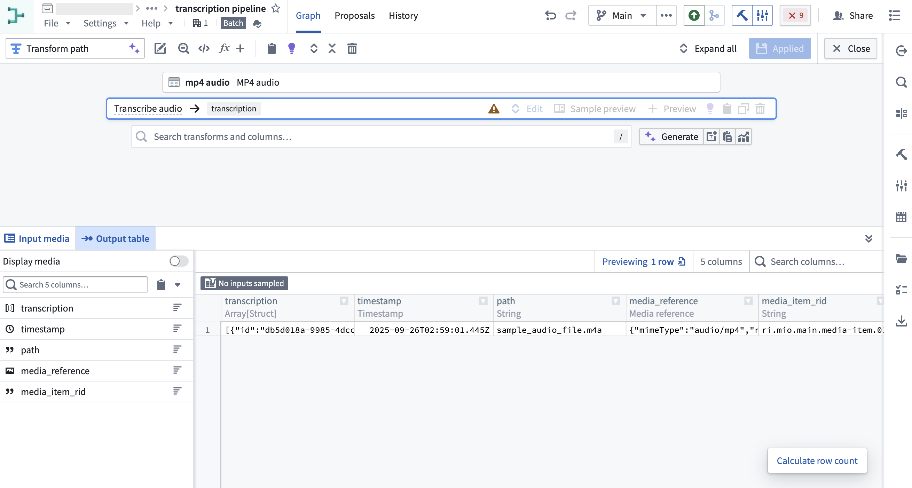   

   If you do not wish to use the transcription widget, you may decide to continue transforming your audio transcription string output as necessary.

   Once you have finished transforming the transcription as desired, you can output it as a **Dataset** or choose to ontologize the output by selecting an **Object type** output. At this point, you can stop following the guide here.

   If you wish to use the transcription widget, continue reading part 3 below to create transcription segments for the widget.

## Part 3: Ontologize transcription segments to be used in Workshop widget

In this section, we will create segment objects from the transcription output that contain the necessary properties to display in the transcription widget.

1. Use the **Explode array** transformation to convert the array of segment structs into individual rows.

2. Then, apply **Extract many struct fields** to extract the fields required for the widget. We will select the following fields: `id`, `begin`, `end`, `contents`, and `speaker_id`. Since we already know the names of the speakers, we will use **Map values** to convert the speaker ID to a speaker name.   
   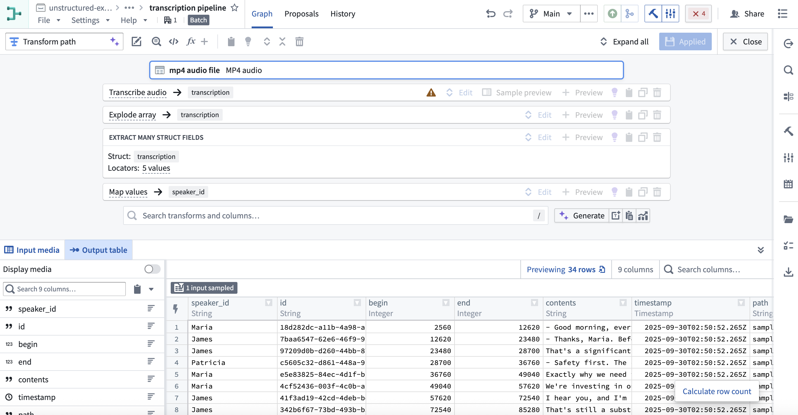   

3. Ontologize the output by selecting an **Object type** output. [Learn more about how to save your pipeline output](/docs/foundry/building-pipelines/create-batch-pipeline-pb-media-set/#part-4-add-an-output). Make sure to set the **Id** property as the primary key so each segment object has a unique key.   
   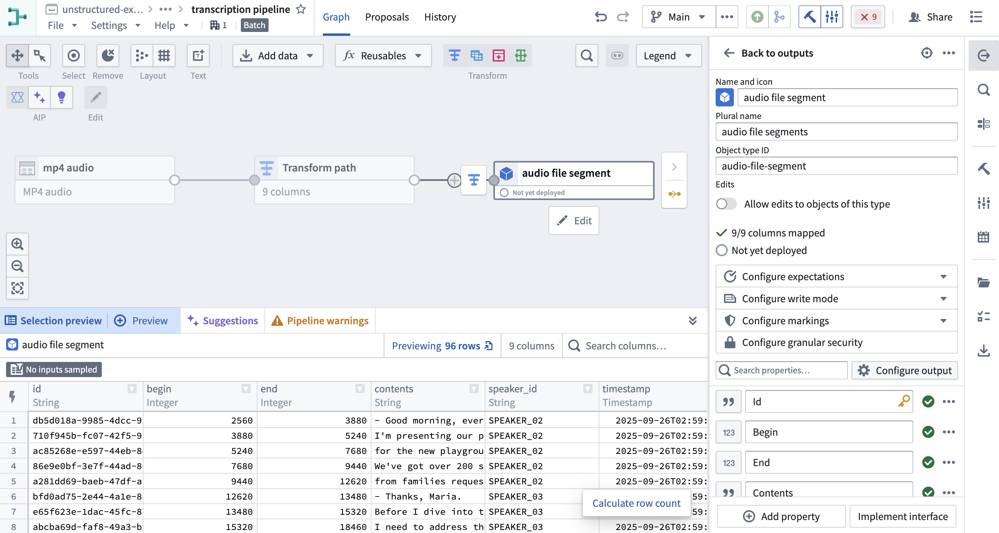   

## Part 4: Display the transcription in Workshop

1. In [**Workshop**](/docs/foundry/workshop/overview/), add the **Audio and Transcription Display** widget.   
   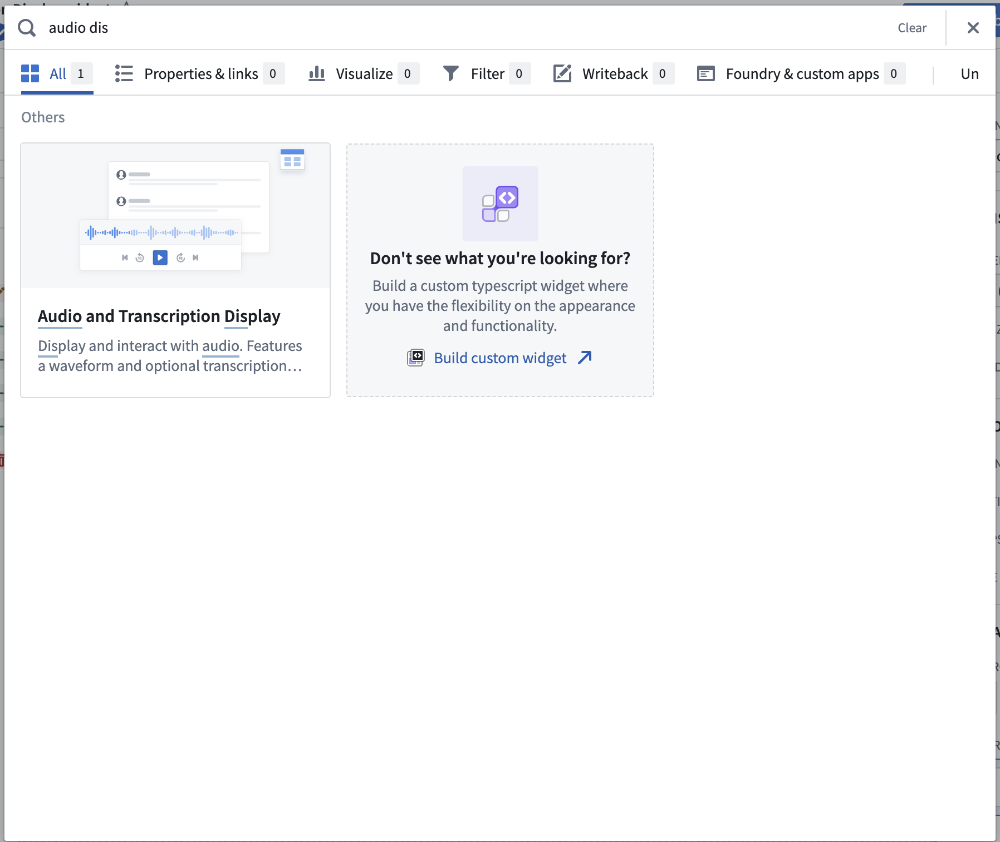   

2. Configure the widget using the object type created in [part 3](#part-3-ontologize-transcription-segments-to-be-used-in-workshop-widget) as the segments object set. See [Audio and Transcription Display widget](/docs/foundry/workshop/widgets-audio-preview/) documentation for a full enumeration of the configuration options.

3. Configure an action to be used in the widget.

   You can create [action types](/docs/foundry/action-types/overview/) on your segment objects set and surface them in the widget. For example, you may want to allow users to edit the segment contents, or correct the timestamps.

   In this example, we will configure a simple action that allows users to edit the speaker property of a segment.

4. Once the action type is defined, configure the action in Workshop. Select **Enable actions** and select the action you created on your object type. You can configure the icon and name. These will be shown in a segment toolbar when hovered over a segment.

   You can also configure [**Parameter defaults**](/docs/foundry/action-types/parameters-default-value/) to populate default values from the hovered segment. We will use the **Selected segment** parameter default for the action's object to edit.   
   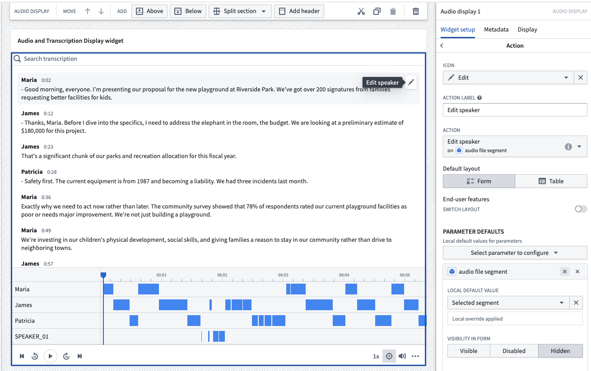   

   In this example workflow, we can now correct the speaker property of a segment upon inspection in the widget.   
   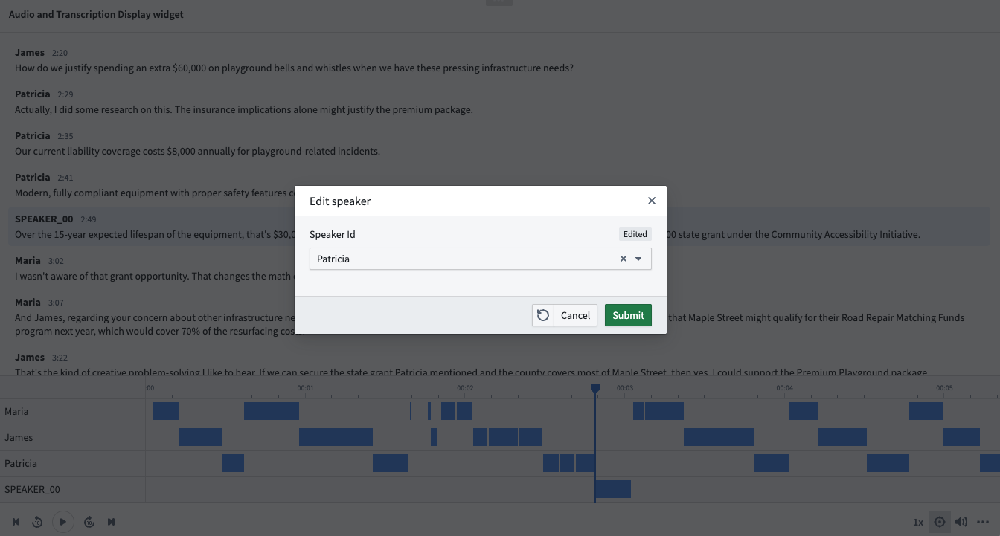   
