<!-- source: https://palantir.com/docs/foundry/media-sets-advanced-formats/add-dicom-media-set/ · mirrored 2026-08-18 from Palantir Foundry docs -->

# Add a DICOM media set

This guide will walk through how to import DICOM (`.dcm`) files to Foundry as a [media set](/docs/foundry/data-integration/media-sets/).

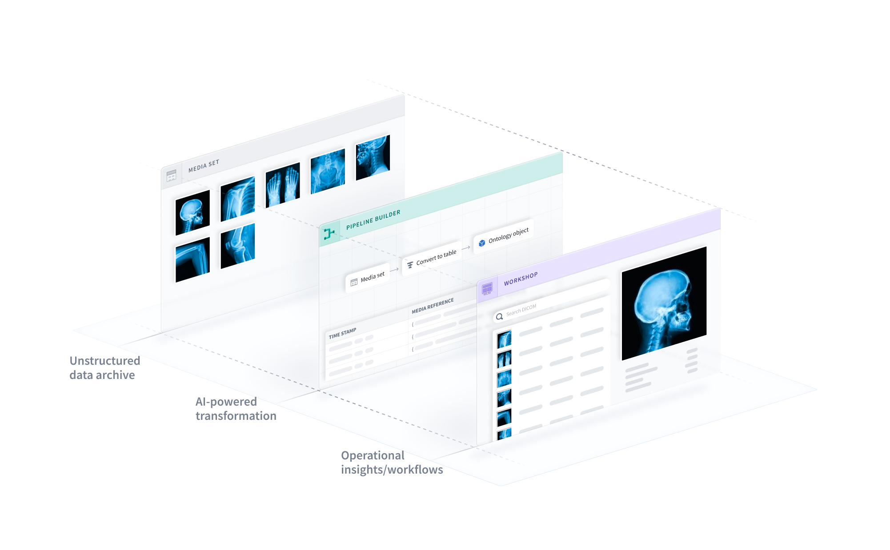

## Part 1: Import DICOM files

First, you will need to create a new media set and add the DICOM files to the media set.

1. Navigate to the folder in which the media set will be created. Select **New > Media set**.   
   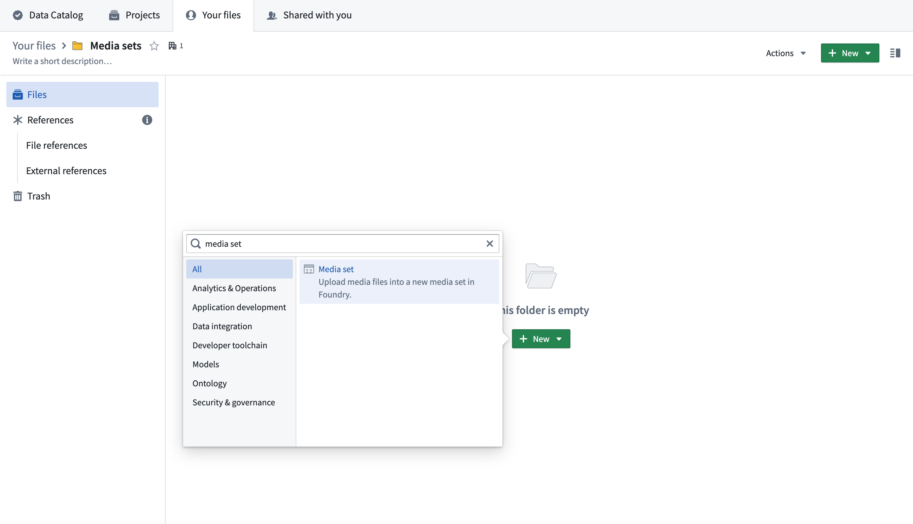   

2. Enter a name for your media set. Select **DICOM** as the media type and select **Batch** as the latency. Select **Create media set** to create the DICOM media set.   
   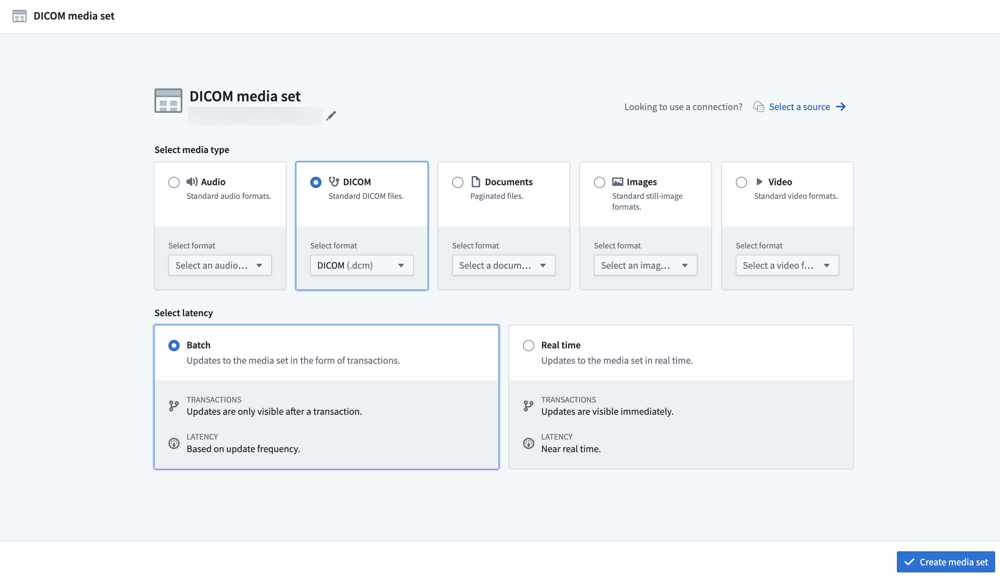   

3. Next, add one or more `.dcm` files to the media set.   
   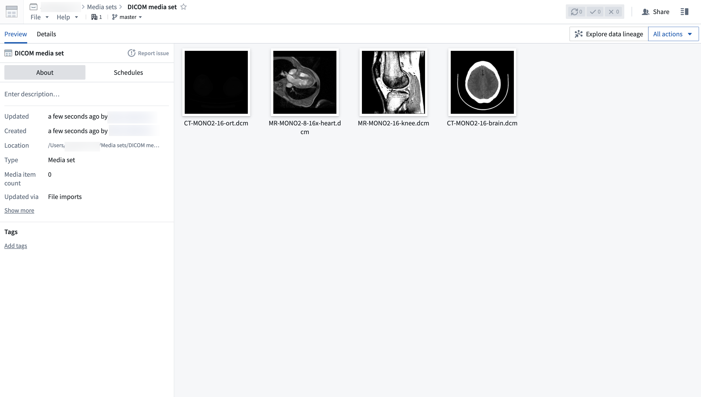   

The **DICOM** media set type includes metadata such as `Patient ID` and `Study ID`.

You can select a DICOM file and drag left and right and up and down to change the contrast and exposure.

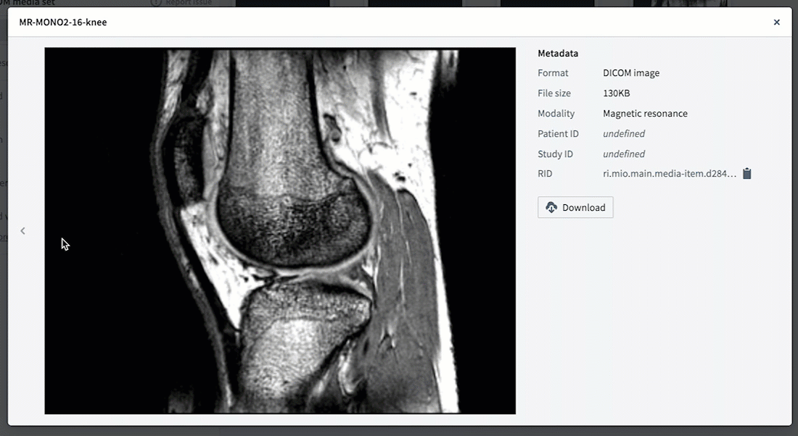

## Part 2: Create object type

Next, you will need to create a new pipeline to transform the media set to an object type that you can use in Foundry.

[Learn more about creating pipelines for media sets](/docs/foundry/building-pipelines/create-batch-pipeline-pb-media-set/).

1. Create a pipeline by selecting **Create new pipeline** from the **All actions** dropdown.   
   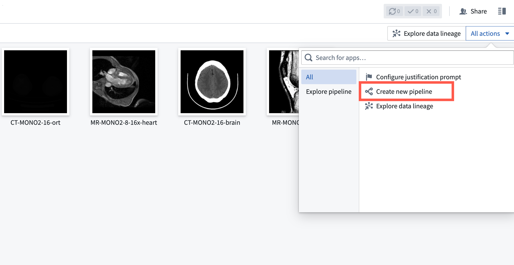   

2. The media set will automatically be added to the pipeline. Select **Transform** to convert the media set to a table.   
   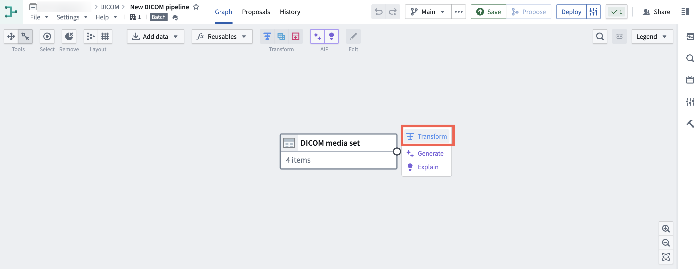   

3. Select **Convert media set to table rows**, then select **Apply**.   
   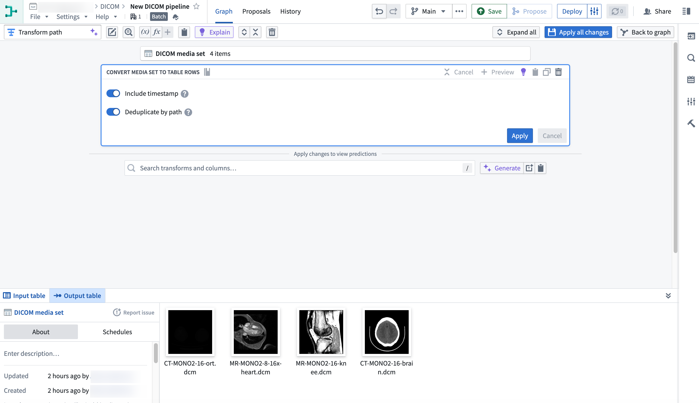   

   In the resulting table, each row represents a DICOM file in the media set.   
   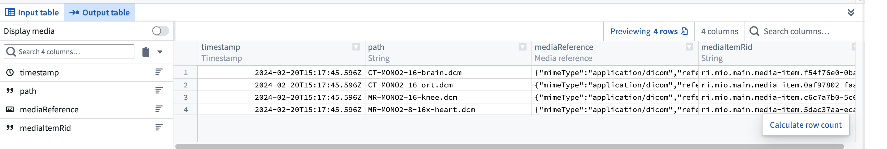   

4. Create an object type by selecting **Add pipeline output** from the **Pipeline outputs** menu in the right panel.   
   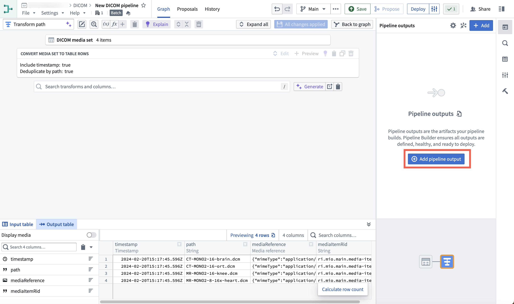   

   Select the **Object type** option.    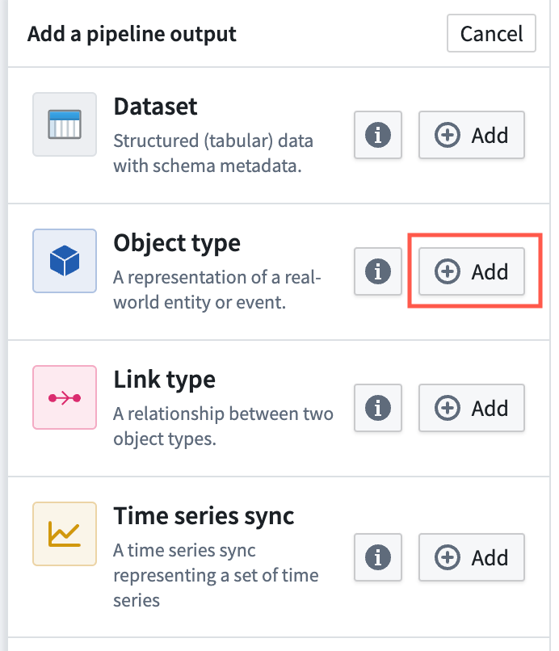   

5. Enter a name for the object type, for example `DICOM media set`. You can set the `Media Item Rid` property as the primary key by selecting the three dots to the right of the property and then selecting **Set as primary key**.    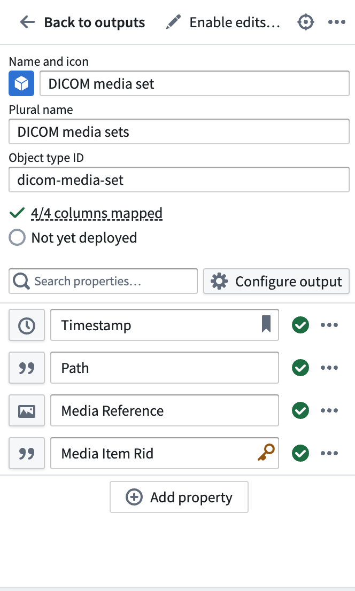   

When you are finished, you can [save and deploy the pipeline](/docs/foundry/pipeline-builder/outputs-deliver-pipeline/).

After the pipeline is deployed, you can view the object type in Object Explorer or Ontology Manager.

## (Optional) Part 3: Create Workshop module

You can open Workshop by selecting **Create Workshop module**.

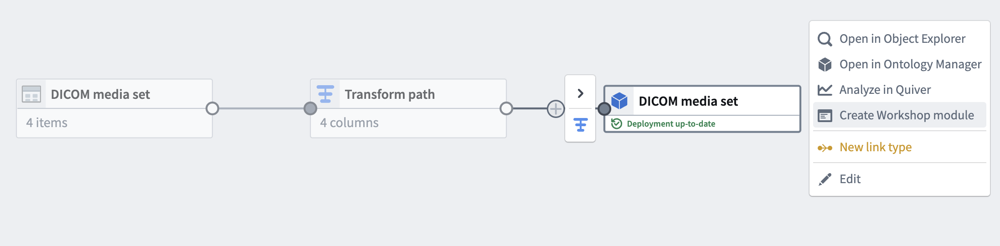

Workshop will automatically generate helpful widgets like an object table and preview.

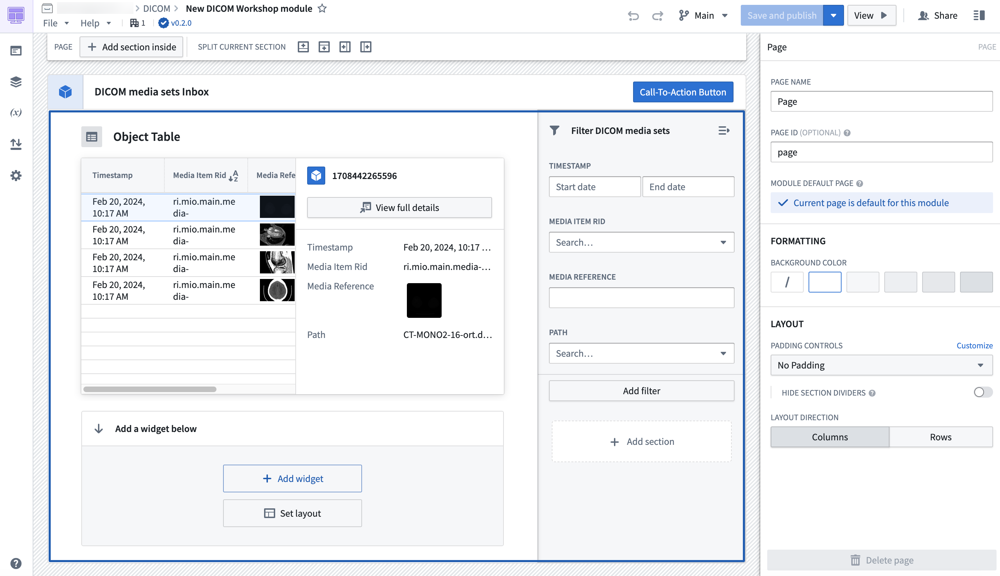

[Learn more about creating widgets in Workshop](/docs/foundry/workshop/concepts-widgets/).
