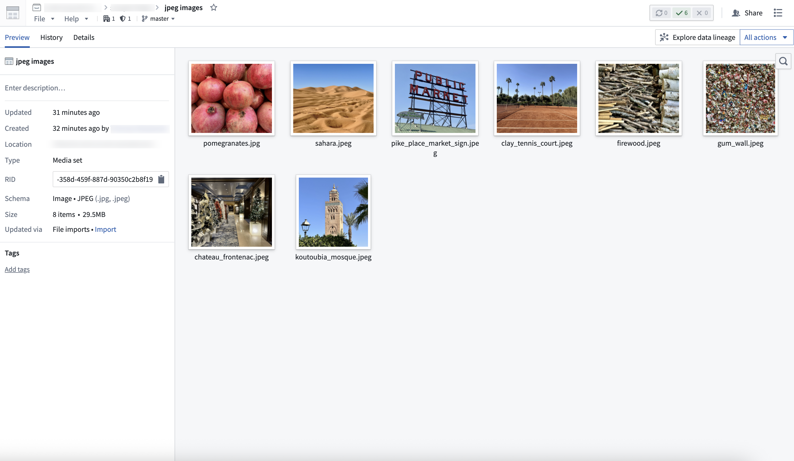
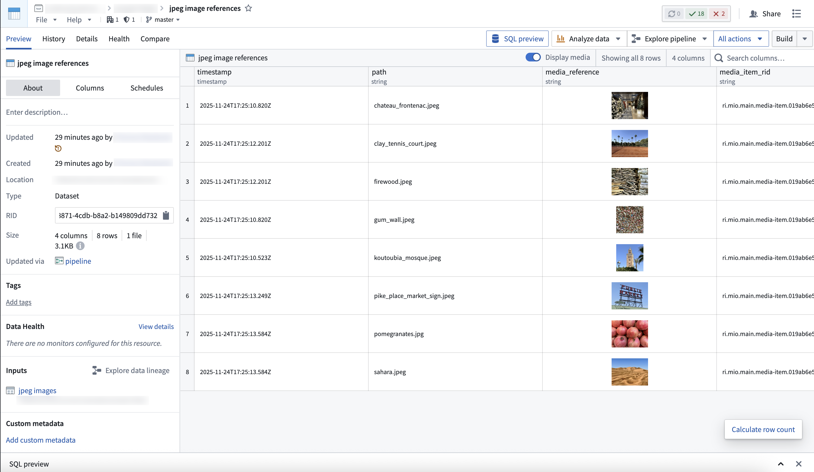
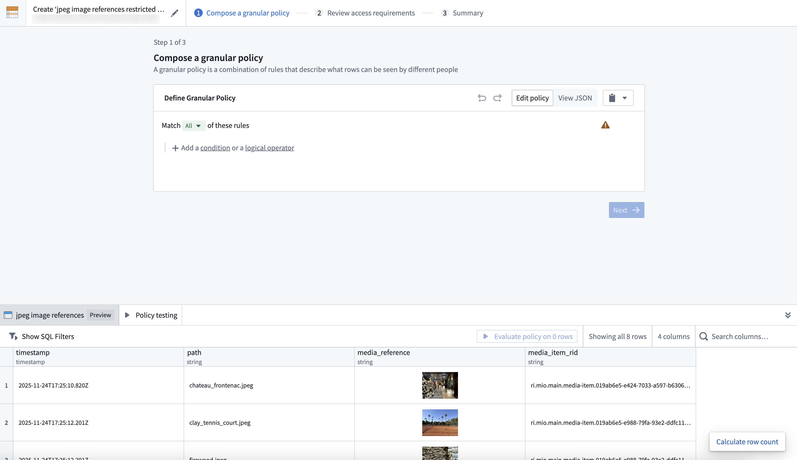
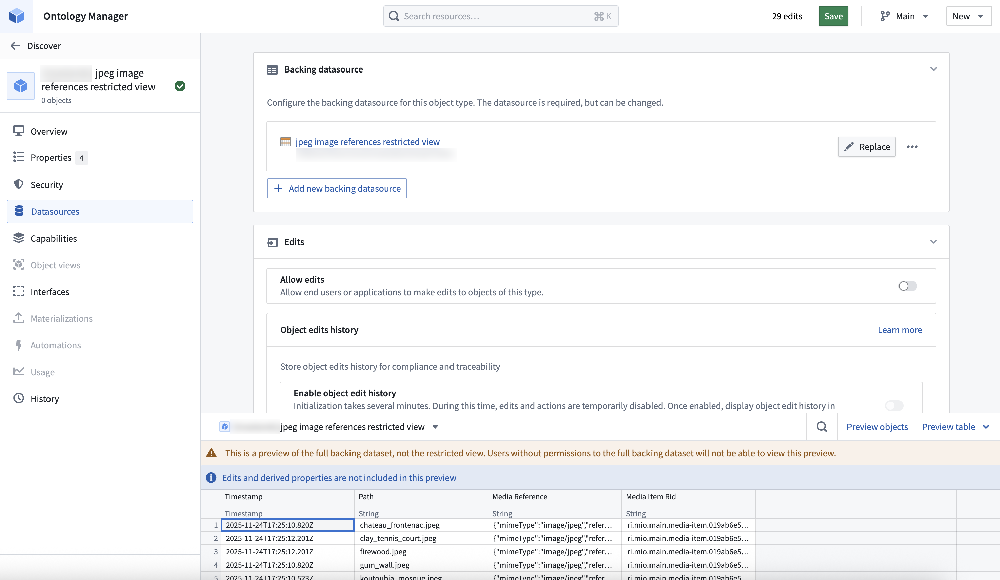
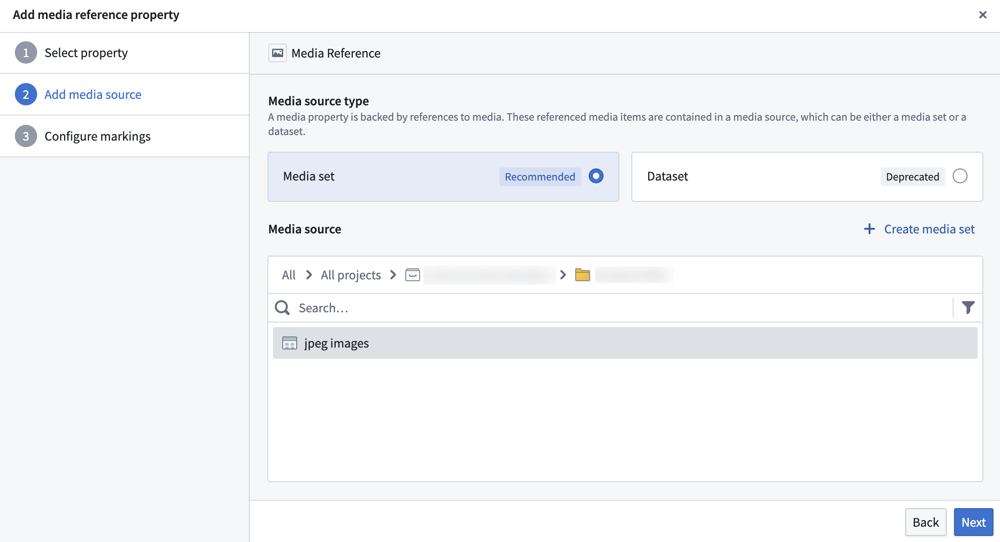
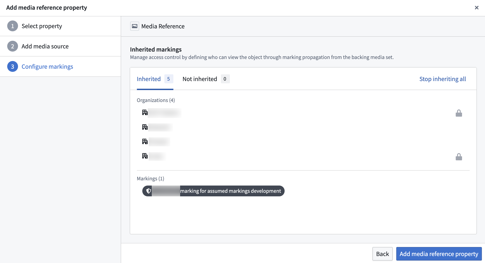
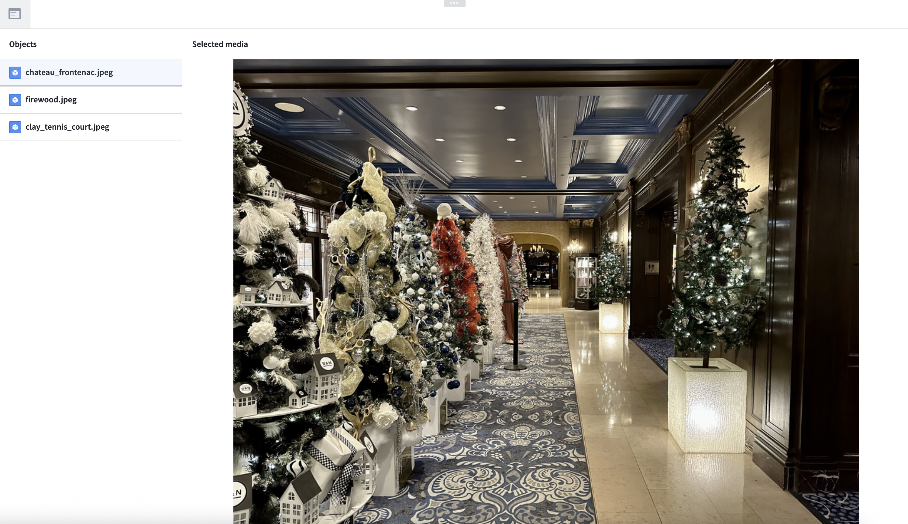

<!-- source: https://palantir.com/docs/foundry/media-sets-advanced-formats/configure-granular-policies-media/ · mirrored 2026-08-22 from Palantir Foundry docs -->

# Configure granular policies for media items

This guide explains how to build a workflow that provides different levels of access to media items within the same [media set](/docs/foundry/data-integration/media-sets/).

## 1. Create a media set

First, create a media set to store the media. There are two ways to do this:

* [Direct upload](/docs/foundry/media-sets-advanced-formats/importing-media/#direct-upload)
* [Data Connection](/docs/foundry/data-connection/media-set-sync/)

Once created, you will be able to view your media set.

## 2. Create a dataset and restricted view with media references

1. Create a dataset that references the media in the media set, along with any additional data to be stored in the ontology. You can do this through [Pipeline Builder](/docs/foundry/media-sets-advanced-formats/transforming-media/#pipeline-builder), or through code using the [media set transforms API](/docs/foundry/transforms-python/media-set-transforms-api/).

2. Create a [restricted view](https://www.palantir.com/docs/foundry/security/restricted-views/#restricted-views) off of the dataset, and define a granular policy to determine the rows a user can view.

## 3. Ontologize the media via the restricted view

1. Create an object type backed by the [restricted view](/docs/foundry/object-permissioning/configuring-rv-access-controls/).

2. Configure the property backed by the media reference column as a [media reference property](/docs/foundry/object-link-types/base-types/#configure-media-reference-properties).

3. Select which markings to stop inheriting from the backing media set. By default, users must have access to all markings on the backing media set to view any media reference properties on this object. You can stop inheriting specific markings to remove this restriction, but users will still need to satisfy the granular policy on the restricted view data source to see the object. Note that stopping inheritance *only* affects this object and *does not* remove the marking from the backing media set itself.

## 4. Interact with the media through the ontology

The newly defined object type is now available in all ontology applications, such as [Workshop](/docs/foundry/workshop/overview/), [Object Explorer](/docs/foundry/object-explorer/overview/), and [Vertex](/docs/foundry/vertex/overview/). Media reference property access is controlled by the granular policy on the restricted view data source, with inherited markings from the backing media set still applying.

