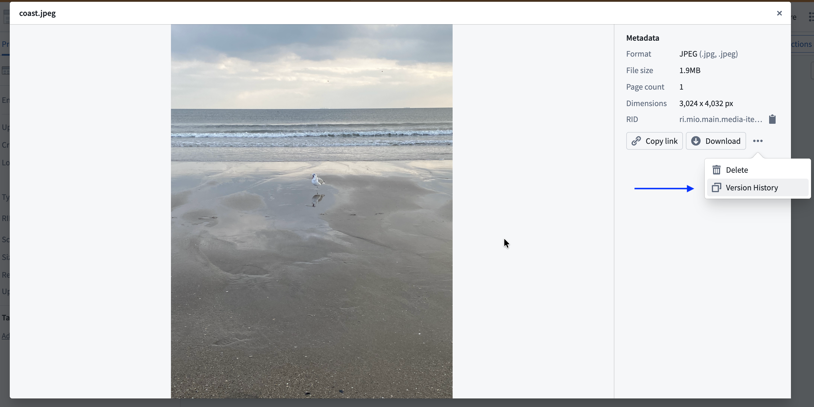
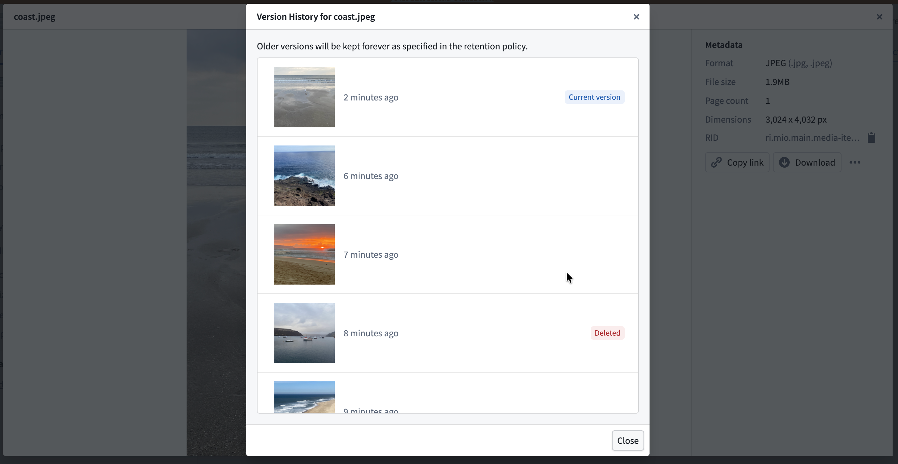
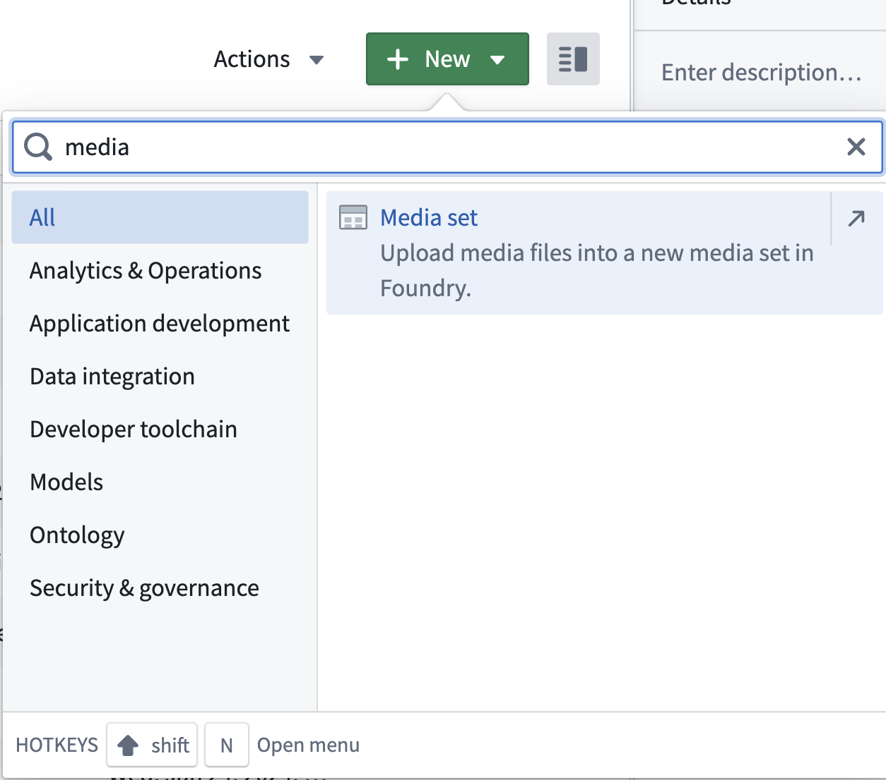
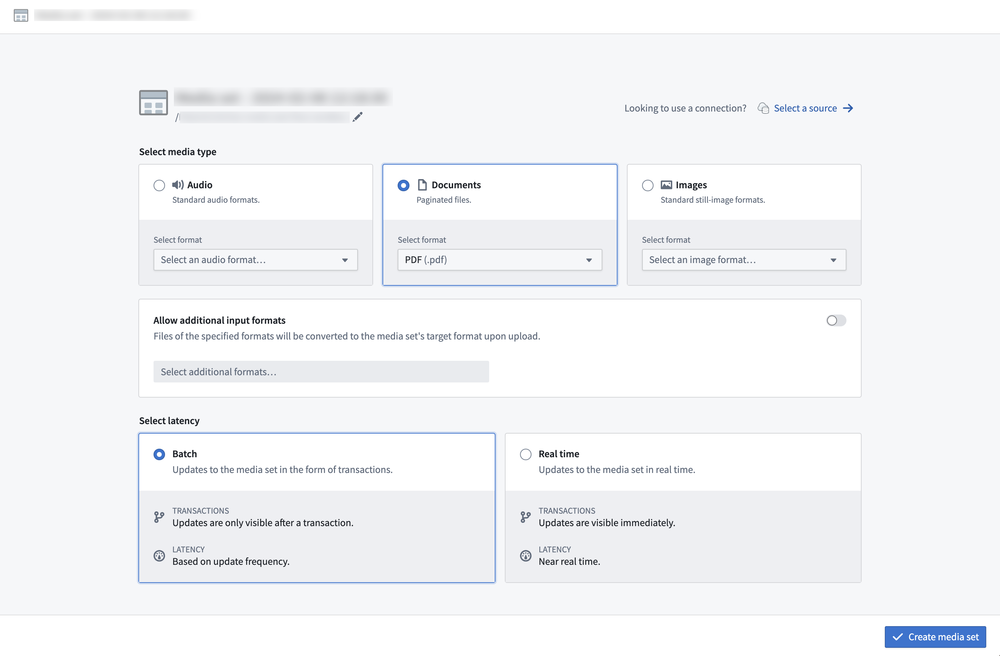
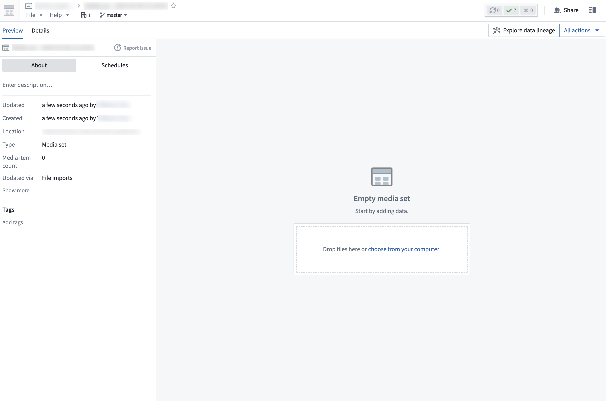
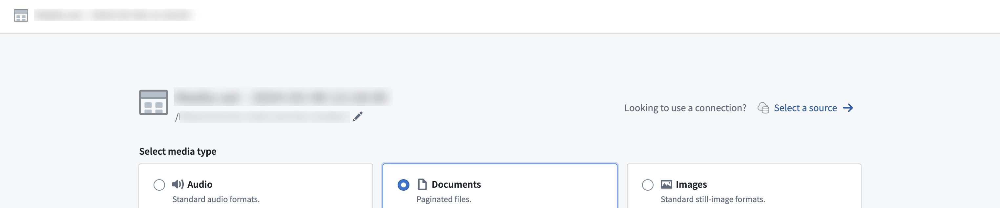

<!-- source: https://palantir.com/docs/foundry/media-sets-advanced-formats/importing-media/ · mirrored 2026-08-22 from Palantir Foundry docs -->

# Importing media

There are multiple ways that you can import media into a media set, including:

* Direct upload
* Connecting to an external source system
* Transforms
* [Using actions](/docs/foundry/action-types/upload-media/)
* OSDK

## Path deduplication

If a file is uploaded to a media set and has the same path (usually the filename, such as `example.png`) as an existing item in the media set, the new item will overwrite the existing one.

:::callout{theme="warning" title="Deduplication behavior"}
You must ensure path uniqueness to avoid overwrites. No warning or confirmation will appear before an upload overwrites an existing media item.
:::

An overwritten media item will still be available when using a direct [media reference](/docs/foundry/media-sets-advanced-formats/media-overview/#media-references) to that media item. Overwritten media items can also be viewed in the [media item version history](/docs/foundry/media-sets-advanced-formats/importing-media/#media-item-version-history) or listed in transforms by setting `deduplicate_by_path=False`.

For example:

```python
dataset = input_media.dataframe(deduplicate_by_path=False)
```

## Media item version history

When multiple media items are uploaded with the same path, only the most recent item is displayed in the media set. However, you can view the complete version history of uploads at a specific path to see all overwritten media items.

To view the version history of a media item path:

1. Select a media item in the media set.
2. In the **Metadata** panel, select **Version History**.



The version history displays all media items that have been uploaded to that path in chronological order, with the most recent upload listed first. Each entry shows when the media item was uploaded and allows you to preview the content.



:::callout{theme="neutral"}
Overwritten media items are not permanently deleted from the media set and may still be processed in builds. To manage storage and ensure only the latest items are processed, consider configuring a [retention policy for overwritten items](/docs/foundry/media-sets-advanced-formats/media-set-settings/#permanently-delete-any-media-items-that-have-been-overwritten-or-deleted-after).
:::

## Direct upload

To import media files to a media set through a direct upload, drag and drop the files into your new media set. Files must match the expected file type specified upon creation of the media set to be uploaded to the media set.

1. First, create a new media set by selecting **New** within a Project and selecting `media set` from the search bar as shown below.



2. Next, choose the desired media file type for the new media set and select **Create media set**.



3. Once you have created a media set, you can upload media via drag-and-drop onto the empty media set or by selecting the **choose from your computer** prompt.



## Connecting to an external source system

### Data Connection

Media sets can be imported using a sync to an external source through Data Connection. A detailed walk-through can be found in the [media set sync documentation](/docs/foundry/data-connection/media-set-sync/).

To create a new media set [sync](/docs/foundry/data-connection/set-up-sync/), navigate to the **Overview** tab of the desired [source](/docs/foundry/data-connection/set-up-source/).

After you create the sync, trigger a build in the media set view for the media to appear in your media set.

You can also connect an existing source to a new media set via the **Select a source** option.



#### Virtual media sets

For supported source types, media sets can optionally be configured to read directly from the external source system so no data is copied into Foundry's backing store. These are called [virtual media sets](/docs/foundry/media-sets-advanced-formats/virtual-media-sets/).

### External transforms

For sources with REST APIs, you can import media to a media set through [external transforms](/docs/foundry/data-connection/external-transforms/).

## Transforms

### Pipeline Builder

Media sets can also be directly imported into Pipeline Builder. [Learn more about available upload methods in Pipeline Builder.](/docs/foundry/pipeline-builder/datasets-add/)
