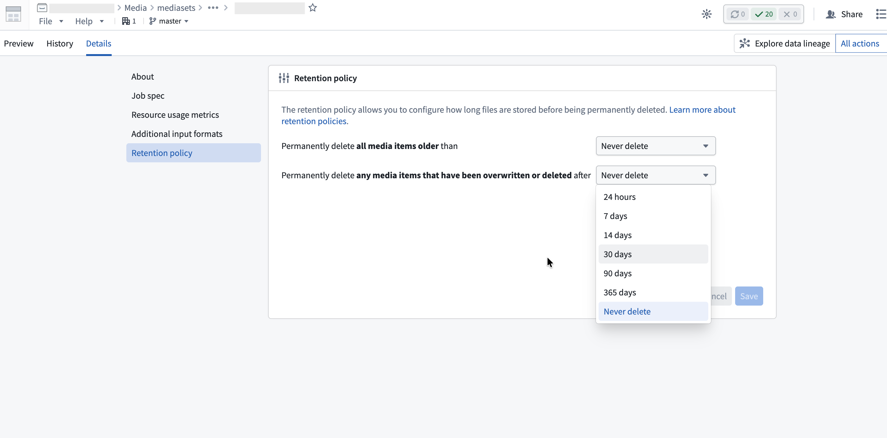

<!-- source: https://palantir.com/docs/foundry/media-sets-advanced-formats/media-set-settings/ · mirrored 2026-08-04 from Palantir Foundry docs -->

# Advanced media set settings

Beyond configuring the [permitted file formats](/docs/foundry/media-sets-advanced-formats/media-overview/#additional-input-formats) for a media set, you can also configure advanced settings, such as how to write media to the media set, and how long to keep media items.

## Transaction policies

The transaction policy of a media set determines how media items are added to a media set. A media set can have one of two transaction policies; **transactionless** or **transactional**.

The following details are true for a media set with transactionless policies:

* Items uploaded to the media set are immediately readable and cannot be rolled back.
* If a build writing to a transactionless media set fails, then all items that were successfully written during the build before failure will remain in the media set.
* Multiple clients can simultaneously write to a transactionless media set.
* Transactionless media set branches cannot be reset to an empty view.

The following details are true for a media set with transactional policies:

* All media items must be added to the media set from within a transaction.
* Only one transaction can be open on the branch of a media set.
* Upon committing a transaction, all items written in the transaction become readable.
* Upon aborting a transaction, all items in the transaction will be deleted.
* If a build writing to a transactional media set fails at any point, then no updates will be made to the media set.
* A maximum of 10,000 items can be written in a single transaction.

The semantics of transactional media sets are most similar to Foundry datasets. When writing incremental transforms, transactional media sets support the `replace` and `modify` [write modes](/docs/foundry/transforms-python/media-sets/#media-set-write-modes). Transactionless media sets only support the `modify` [write mode](/docs/foundry/transforms-python/media-sets/#media-set-write-modes).

## Retention policies

You can configure retention policies to permanently delete media items. This is a helpful option to minimize storage costs. To configure retention policies, open the media set and select the **Details** tab, then configure the options in the **Retention policy** section.

### Permanently delete all media items older than

This policy permanently deletes media items after a fixed period from when they were uploaded. For example, if you configure a 14-day retention period, each media item will be permanently deleted 14 days after it was uploaded.

### Permanently delete any media items that have been overwritten or deleted after

This policy permanently deletes overwritten media items after a fixed period from when they were overwritten. An overwritten item is a media item that has been replaced by a newer upload at the same path or has been [soft deleted](/docs/foundry/media-sets-advanced-formats/media-overview/#delete-media-items-from-media-sets). You can view overwritten items in the [media item version history](/docs/foundry/media-sets-advanced-formats/importing-media/#media-item-version-history).

For example, if you configure a 7-day retention period for this policy and upload five images to the path `example.png` over time, the four older versions will be deleted 7 days after they were each overwritten. The most recent upload remains accessible indefinitely until it is overwritten.

### Retention policy behavior

You can configure both retention policies on the same media set. A media item will be permanently deleted when either policy's conditions are met, whichever comes first.

Once a media item's retention window expires, it will be permanently deleted and no longer accessible. For example:

* When a retention window is reduced, such as from 30 days to 7 days, all media items that are older than the new window (7 days) will immediately become inaccessible.
* When a retention window is expanded, such as from 7 days to 30 days, media items that previously expired (7 days and 1 second) *will not* be accessible. The same is true if retention is changed to "Never delete".
