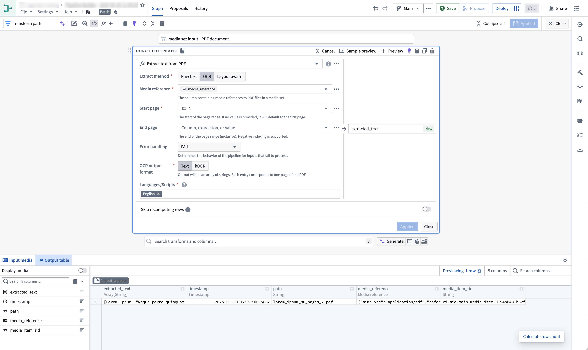

<!-- source: https://palantir.com/docs/foundry/media-sets-advanced-formats/transforming-media/ · mirrored 2026-08-04 from Palantir Foundry docs -->

# Transforming media

Media can be transformed using [Pipeline Builder](/docs/foundry/pipeline-builder/overview/) and [Code Repositories](/docs/foundry/code-repositories/overview/).

Pipeline Builder is useful for common media transformation workflows, such as extracting text from documents and images, transcribing audio, using media with LLMs, and more.

In contrast, Code Repositories can be used for workflows that demand more complexity or require more granular control, such as incremental pipelines, reading from non-media set inputs, using external libraries, and more.

:::callout{theme="neutral"}
Both tools can be used to transform input media sets, write to output media sets, and write to output datasets. However, certain features, such as reading and writing media sets incrementally and using tabular data within media transformations, are supported in Code Repositories only, not in Pipeline Builder.
:::

## Pipeline Builder

[Learn how to build a pipeline with media sets in Pipeline Builder](/docs/foundry/pipeline-builder/transforms-transform-media/).

Here is an example of the Text Extraction (OCR option) board used on a PDF media set:



Contact Palantir Support if you are interested in a transformation that is not currently available.

Media sets can also be configured as [outputs of your pipeline](/docs/foundry/pipeline-builder/outputs-add-media-set-output/).

## Code Repositories

[Learn how to use media sets with Python transforms](/docs/foundry/transforms-python/media-sets/).

Here is an example on how you can get started with media sets in Code Repositories:

```python
from transforms.api import transform
from transforms.mediasets import MediaSetInput, MediaSetOutput
@transform(
    images=MediaSetInput('/examples/images'),
    output_images=MediaSetOutput('/examples/output_images')
)
def translate_images(images, output_images):
    ...
```

Media sets can be read from and written to incrementally within python transforms. To find out how to do this, [follow the documentation](/docs/foundry/transforms-python-spark/incremental-media-sets/).

## Access patterns

Advanced users and developers can take advantage of media set **access patterns**, which are pre-configured transformations that can be performed on-demand on the media items in a media set. Access patterns have persistence policies for storage and optimization tuning, enabling the option to recompute at each request, persist outputs after first request indefinitely, or cache for a time.

Access patterns are leveraged in the Palantir platform to optimally process or render media set items. For example:

* Thumbnails and previews for PDFs in Workshop
* Buffered audio waveforms in the Preview application
* Tiled satellite imagery in Map

The default available set of access patterns is determined based on the configured media set schema. Additional transformations are registered as access patterns to a media set via API call only.
