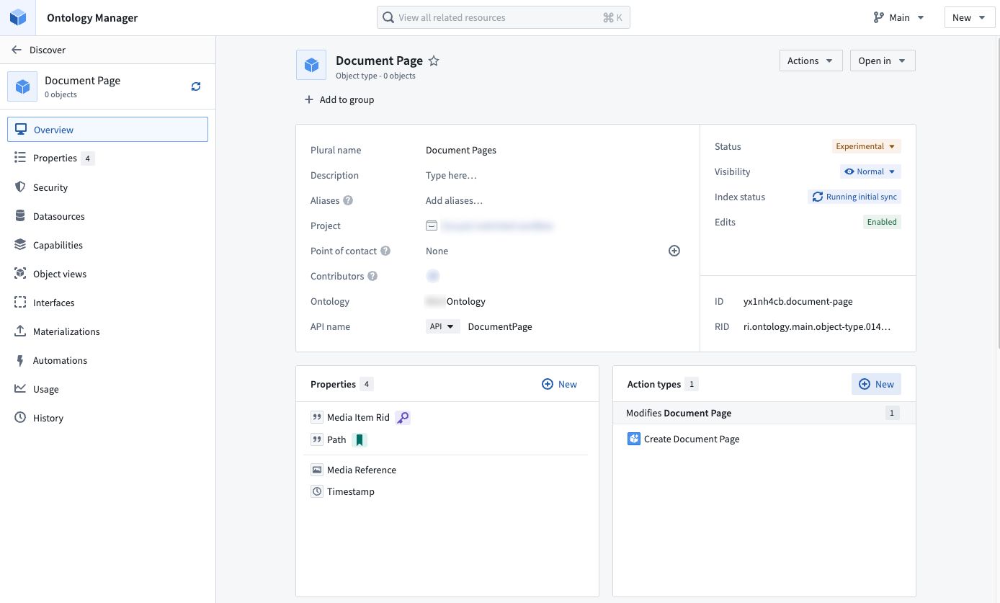
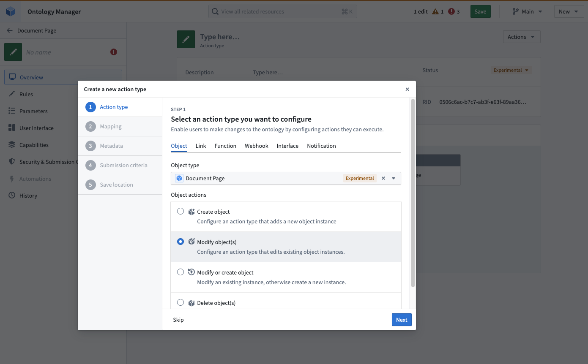
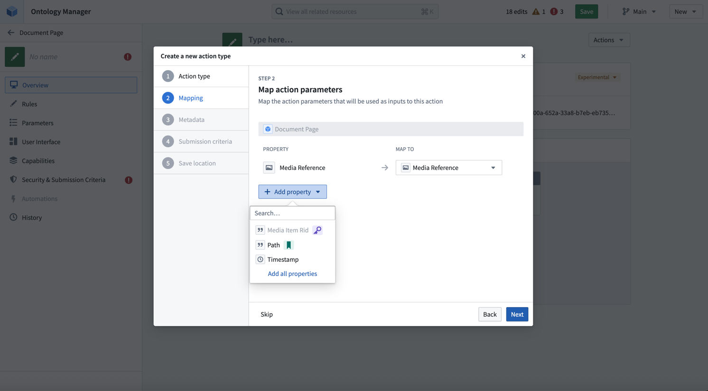
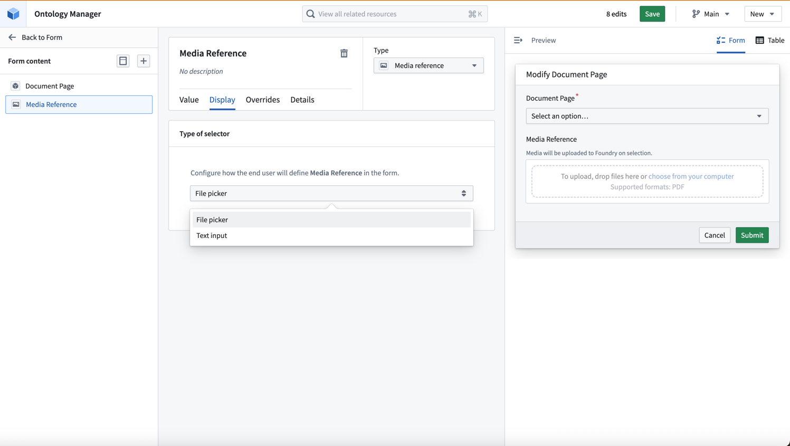
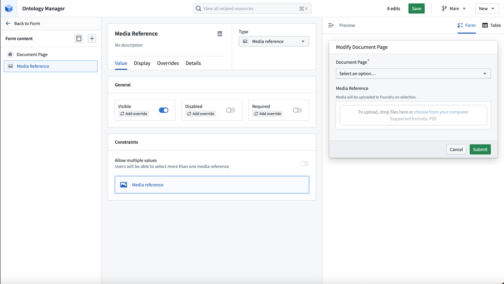
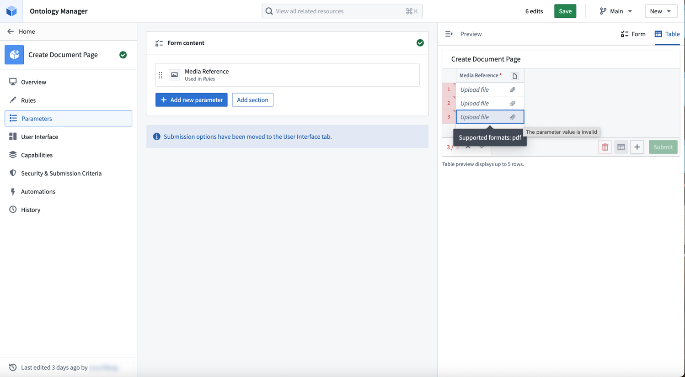
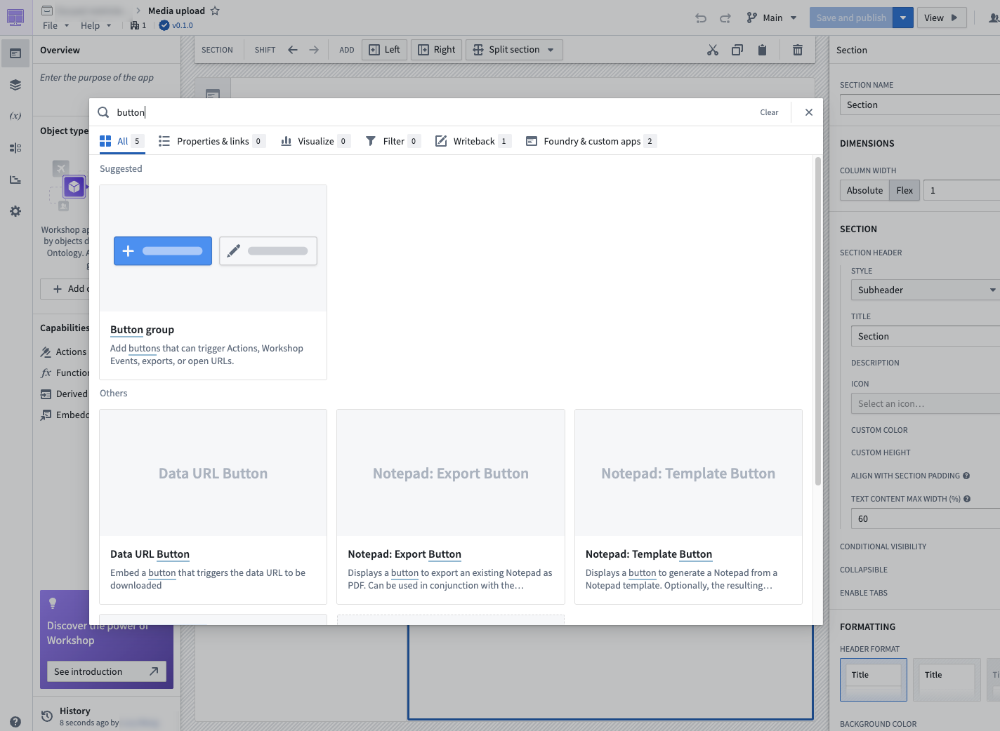
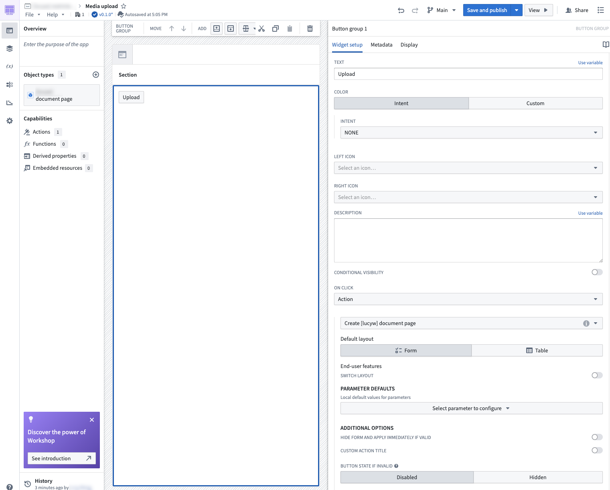

<!-- source: https://palantir.com/docs/foundry/media-sets-advanced-formats/upload-media/ · mirrored 2026-08-22 from Palantir Foundry docs -->

# Upload media

This guide explains how to create a workflow for uploading media. The recommended approach is to set up an action to upload media and call this action in Workshop using a Button group widget. See [upload media](/docs/foundry/action-types/upload-media/) for more information.

## Prerequisites

Before you begin, ensure you have:

* An object type with a [media reference property](/docs/foundry/media-sets-advanced-formats/media-in-ontology/).
* Permissions to create action types in your ontology. See [ontology permissions](/docs/foundry/object-permissioning/ontology-permissions/) for more information.

## Part 1: Create an action type with a media reference parameter

First, you will create an action that allows users to upload media to your object type.

1. Navigate to your object type with a media reference property in Ontology Manager. Select **New** from the action types section.   
      

2. Step through the dialog to configure rules and parameters on the action type.   
      
      

## Part 2: Configure the media reference parameter

Navigate to the **Media Reference** parameter section in your action form. The supported render options are **File picker** and **Text input**.

1. Under **Display**, select **File picker** to enable drag-and-drop uploads.   
      

   You can also choose to make the media reference parameter optional or required using the toggle.   
      

2. Choose the **Form** layout to perform single uploads. To upload multiple media files at once, you can use the **Table** layout option.   
      

## Part 3: Add the action to Workshop

Once your action type is saved, you can add it to a Workshop application inline, or by using the **Button group** widget.

1. In your Workshop application, add a [Button group widget](/docs/foundry/workshop/widgets-button-group/).   
      

2. Select **Action** under **ON CLICK**, and choose the action you created.   
      

3. Select the button in your Workshop, and drag and drop files into your action form or table.

For more information about using media in Workshop applications, see [Using media in Workshop](/docs/foundry/media-sets-advanced-formats/media-in-workshop/).
