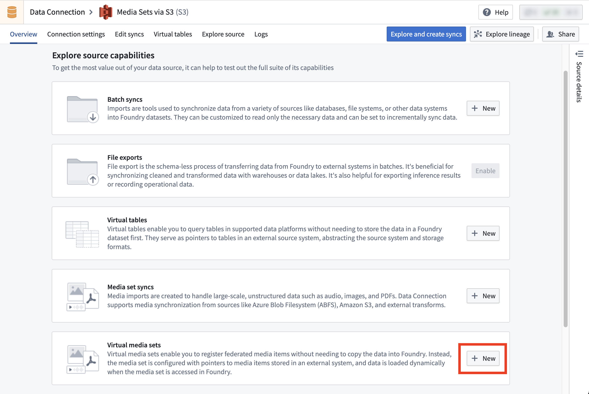

<!-- source: https://palantir.com/docs/foundry/media-sets-advanced-formats/virtual-media-sets/ · mirrored 2026-08-04 from Palantir Foundry docs -->

# Virtual media sets

A virtual media set is a special type of media set that reads directly from an external source system without copying files into Foundry's backing store. This allows you to work with media files stored in external systems while maintaining the media set interface and functionality in Foundry.

## Supported source types

Virtual media sets are currently supported for specific source types:

* [Amazon S3](/docs/foundry/available-connectors/amazon-s3/)
  * Only the "Access key and secret" credential type is supported.
  * Connections with STS roles are not supported.
* [OneLake and Azure Blob Filesystem (ABFS)](/docs/foundry/available-connectors/onelake-and-azure-blob-filesystem/)

Virtual media set syncs cannot be created using agent connections.

## Limitations

While virtual media sets enable you to work with media files stored outside of Foundry without needing to incur storage costs from copying them to Foundry, virtual media sets have some limitations as described below:

* Virtual media sets are not aware of updates and deletions in the source system. For example, if some media files in the source system are registered into a virtual media set and later deleted from the source system, the virtual media set will still contain items corresponding to the deleted files, but the items will no longer be accessible.
* When applying transformations to media items in virtual media sets, the transformed media items are persisted in Foundry's backing store and will incur storage costs.
* Virtual media sets cannot be configured with additional input formats.

## Creating a virtual media set

To set up a virtual media set sync, follow the instructions in the [media set sync documentation](/docs/foundry/data-connection/media-set-sync/) but select **Virtual media set sync** instead of **Media set sync**.



## Using transforms to register media items into virtual media sets

After creating a virtual media set in Data Connection, you can also register media items using Python transforms instead of using the virtual media set sync. This offers more control on the sync process:

* You have more control over the resource usage and parallelism, which allows you to optimize performance based on your specific requirements.
* You can implement more sophisticated logic to determine which files to sync, which is useful when the default filtering options offered by virtual media set sync are not sufficient for your use case.

### Example: Using a Python transform to register media items into a virtual media set

```python
# from the transforms-external-systems library
from transforms.external.systems import external_systems, Source, ResolvedSource
# from the transforms-media library
from transforms.mediasets import MediaSetOutput
from transforms.api import transform


@external_systems(
    # the rid of the source created in Data Connection
    source=Source("ri.magritte..source.abc123")
)
@transform(
    # the rid of the virtual media set
    mediaSetOutput=MediaSetOutput("ri.mio.main.media-set.abc123")
)
def compute(output, source: ResolvedSource):
    # Specify the physical path from the source and the media item path (name) of the media item to register.
    # The physical path is relative to the "subfolder" configured in the source.
    output.register_media_item("physical path", "media item path")
```
