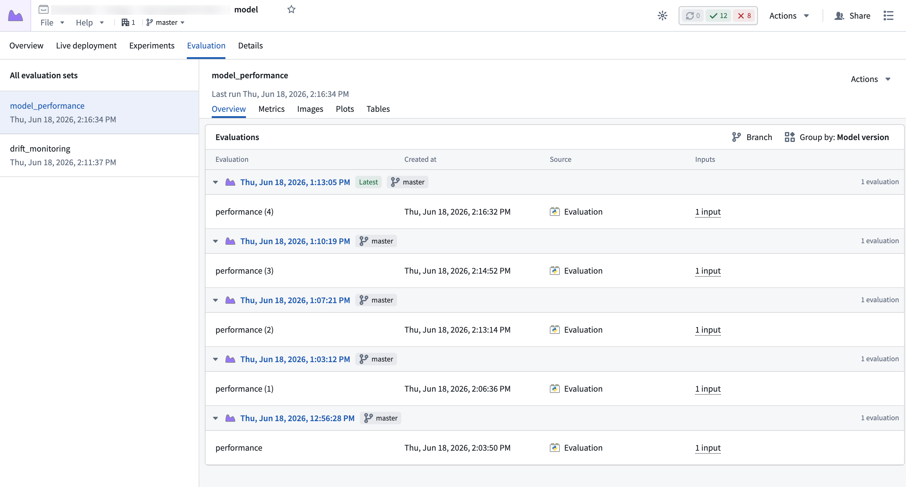

<!-- source: https://palantir.com/docs/foundry/model-integration/evaluations/ · mirrored 2026-08-26 from Palantir Foundry docs -->

# Evaluations

An [evaluation](/docs/foundry/integrate-models/evaluations-overview/) is a collection of metrics, images, plots, and tables that captures how a specific model version performs against a given set of test data. Evaluations are written to an [evaluation set](/docs/foundry/integrate-models/evaluations-overview/#evaluation-sets) associated with the model, where they can be visualized and compared on the model page.



## Integrate evaluations into model training code

Evaluations are created in [Code Repositories](/docs/foundry/integrate-models/model-asset-code-repositories/). The `@pm.transforms.evaluation` decorator wires up an evaluation set for each `ModelInput` in the transform, and the `ModelInput` then provides a hook for creating and writing to an evaluation. When the build succeeds, the evaluation is automatically committed to the evaluation set; if the build fails, it is aborted.

The below code snippet demonstrates evaluation usage in Code Repositories:

```python
from transforms.api import transform, Input
import palantir_models as pm
from palantir_models.transforms import ModelInput

# The decorator indicates the evaluation set that will be written to on the model input(s).
@pm.transforms.evaluation("error_analysis")
@transform.using(
    input_data=Input("..."),
    model_input=ModelInput("..."),
)
def compute(input_data, model_input):
    evaluation = model_input.create_evaluation(name="my-evaluation")

    # log metrics
    evaluation.log_metric("mae", 14250.0)
    evaluation.log_metrics({"mae": 14250.0, "r2": 0.91})

    # log an image, plot, or table
    evaluation.log_image("residual_distribution", pillow_image)
    evaluation.log_plot("residuals_by_tier", fig)
    evaluation.log_table("error_by_price_tier", error_by_tier)
```

[Learn more about creating and visualizing evaluations.](/docs/foundry/integrate-models/evaluations-overview/)
