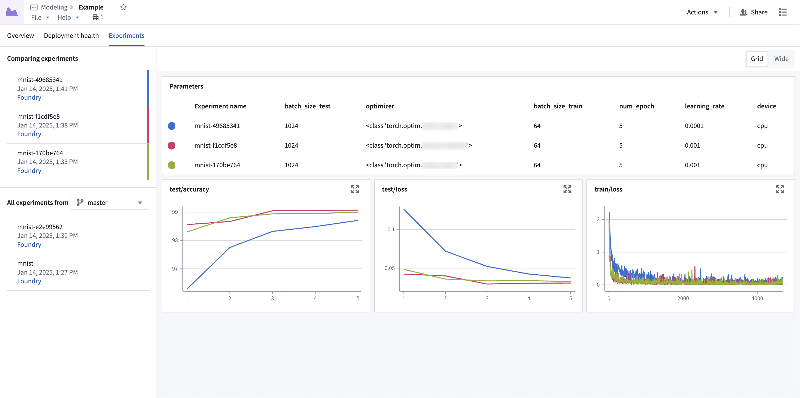

<!-- source: https://palantir.com/docs/foundry/model-integration/experiments/ · mirrored 2026-08-26 from Palantir Foundry docs -->

# Experiments

An [experiment](/docs/foundry/integrate-models/experiments-overview/) is an artifact representing a collection of metrics produced during a model training job.



## Integrate experiments into model training code

Experiments can be created from any environment used to create models in Foundry. The `ModelOutput` class in [Jupyter® Code Workspaces](/docs/foundry/integrate-models/model-asset-code-workspaces/) and [Code Repositories](/docs/foundry/integrate-models/model-asset-code-repositories/) provides hooks for creating and writing to experiments. These experiments can then be published alongside the model and are instantly viewable in the model page.

Users can also take advantage of [MLflow](/docs/foundry/integrate-models/experiments-overview/#mlflow) to streamline the integration of experiments into their existing code.

The snippets below publish the model with `MyModelAdapter`, a stand-in for your own [model adapter](/docs/foundry/integrate-models/model-adapter-overview/) class. `ModelAdapter` is an abstract base class that cannot be instantiated directly; you must define a subclass that implements the required methods, as shown in the following example:

```python
import palantir_models as pm

class MyModelAdapter(pm.ModelAdapter):

    def __init__(self, model):
        self.model = model

    @classmethod
    def load(cls, state_reader, container_context=None, external_model_context=None):
        ...

    def save(self, state_writer):
        ...

    @classmethod
    def api(cls):
        ...

    def predict(self, df_in):
        ...
```

Review the [`ModelAdapter` reference](/docs/foundry/integrate-models/model-adapter-reference/) for the full signatures and behavior of each method.

### Code Workspaces

The below code snippet demonstrates experiment usage in Jupyter® Code Workspaces:

```python
from palantir_models.code_workspaces import ModelOutput
# `my-alias` is an alias to a model in the current workspace
model_output = ModelOutput("my-alias")

experiment = model_output.create_experiment(name="my-experiment")

# log parameters
experiment.log_param("learning_rate", 1e-4)

# log metrics
experiment.log_metric("train/loss", loss)
experiment.log_metric("train/loss", loss, step=step)

# publish alongside model to persist in the models page
model_output.publish(MyModelAdapter(model), experiment=experiment)
```

### Code Repositories

The below code snippet demonstrates experiment usage in Code Repositories:

```python
from transforms.api import configure, transform, Input
from palantir_models.transforms import ModelOutput

@transform(
    input_data=Input("..."),
    model_output=ModelOutput("..."),
)
def compute(input_data, model_output):
    experiment = model_output.create_experiment(name="my-experiment")

    # log parameters
    experiment.log_param("learning_rate", 1e-4)

    # log metrics
    experiment.log_metric("train/loss", loss)
    # can also provide optional step value
    experiment.log_metric("train/loss", loss, step=step)

    # publish alongside model to persist in the models page
    model_output.publish(MyModelAdapter(model), experiment=experiment)
```

[Learn more about creating and visualizing experiments.](/docs/foundry/integrate-models/experiments-overview/)
