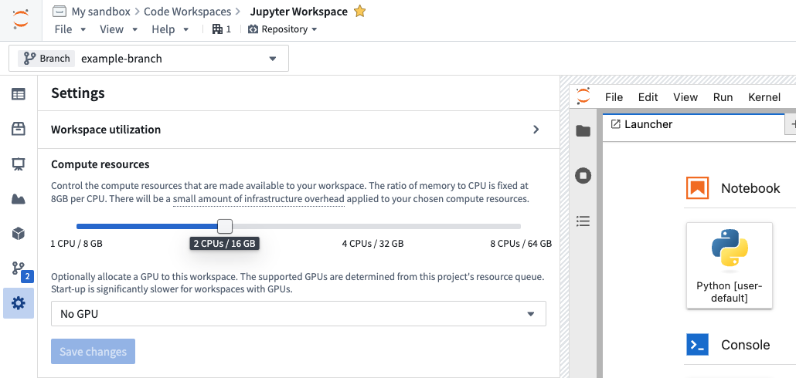
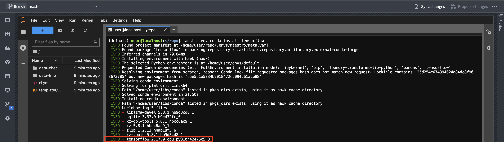
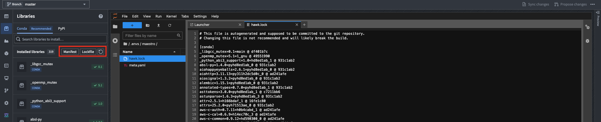
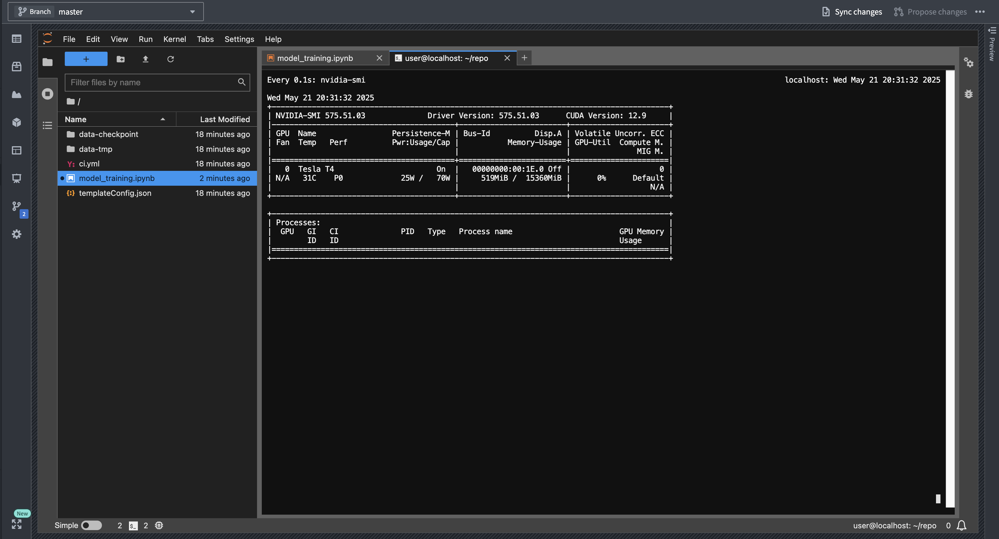

<!-- source: https://palantir.com/docs/foundry/model-integration/gpu-training/ · mirrored 2026-08-26 from Palantir Foundry docs -->

# Train models with GPUs

This page outlines the process of leveraging GPU resources when training machine learning models in Foundry. GPU acceleration can significantly reduce training time for deep learning models and other compute-intensive algorithms. The recommended method for training models with GPUs in Foundry is to use a Jupyter® [code workspace](/docs/foundry/code-workspaces/overview/) with one or more GPUs configured.

## Prerequisites

Only jobs originating in projects with an assigned GPU [resource queue](/docs/foundry/resource-management/resource-queues/) can use GPUs. You can check whether your project has a configured resource queue by selecting the flag icon in the right sidebar of the project file tree view, as shown below.


[Resource management administrators](/docs/foundry/resource-management/configure-access/) have the required permissions to assign resource queues to projects. This group of users can be configured in Control Panel. Resource queues can be assigned in the Resource Management application, accessible from the **Applications** section in the left sidebar, or by selecting the link shown in the example above. If you are not part of this group, contact your Palantir administrator or Palantir representative to enable GPUs for your project by submitting a [Foundry Issue](/docs/foundry/getting-help/issues/).

For details on supported GPU types and how GPUs affect compute usage, refer to the [Code Workspaces](/docs/foundry/code-workspaces/compute-usage/) or [Code Repositories](/docs/foundry/code-repositories/compute-usage/) compute usage documentation. Note that not all GPU types listed in the documentation may be available for your enrollment depending on your hosting configuration. Your enrollment may not have any available GPU types. Contact Palantir Support to enable any GPU types not currently available on your enrollment.

## Use a GPU in Jupyter® and VS Code Workspaces

GPUs can be requested from the **Settings** menu in the Code Workspaces sidebar in either [VS Code](/docs/foundry/vs-code/overview/) or [Jupyter®](/docs/foundry/code-workspaces/jupyterlab/) workspaces:



To obtain an environment with a GPU-enabled version of TensorFlow, PyTorch, or similar packages, you can install the package in a code workspace containing a GPU.

The following steps outline how to successfully set up GPUs in Code Workspaces:

1. Start a code workspace and enable a GPU in the **Settings** menu.
2. Install your desired machine learning library, for example, TensorFlow or PyTorch, using Maestro or the **Libraries** sidebar *after* a GPU has been added to the workspace.
3. Verify that the GPU-enabled version of the package is installed. Review the [verification steps](#cpu-only-packages-are-installed-instead-of-gpu-packages) below for more details on how to verify.
4. If necessary, reset or update your environment to ensure that a GPU-enabled build is installed. Review the [troubleshooting section](#adding-a-gpu-to-the-workspace-does-not-trigger-a-new-environment-solve) below for more information.

### Troubleshooting

This section provides a quick reference for issues that are commonly encountered with GPU-enabled packages in Python. Review the [Python library considerations](#python-library-considerations) below for more information.

#### CPU-only packages are installed instead of GPU packages

Installing packages like TensorFlow before a GPU is configured is a common mistake. If this happens, the CPU-only version of the library will be installed. You can check the build string in your lockfile or installation logs to see if this is the case for your workspace. GPU-enabled builds contain `cuda` in the name, while CPU-only builds contain `cpu`.

**Solution:** Install the package *after* the GPU has been added to the workspace, or reset the environment once a GPU has been added.

**Details:** When installing TensorFlow or similar libraries in a workspace without a GPU, Conda resolves to a CPU-only build variant. The build string will contain `cpu` like so: `cpu_py310heba74a3_3`. In contrast, a GPU-enabled version will have `cuda` in the build string, for example: `tensorflow-2.17.0-cuda120py310heb3ae67_203`. Below is an example of logs as the packages are installed:



You can also check which build was installed by viewing the **Lockfile** from the **Libraries** sidebar in Jupyter. In VS Code, the lockfile is located under `.maestro/hawk.lock`. Editing `meta.yaml` or `hawk.lock` files directly is not supported and can cause issues; always use the **Libraries** sidebar or Maestro commands.



#### Unsolvable environment error: CUDA cannot be installed because there are no viable options

Attempting to force the installation of a GPU-enabled package, for example, `tensorflow=2.17.0=*cuda*` without a GPU present will fail with an unsolvable environment error referencing `__cuda`.

**Solution:** Add a GPU to the workspace and then install the package.

**Details:** If you try to force-install a GPU-enabled version of a package by specifying the build string in a workspace without a GPU, conda will fail to resolve dependencies due to the absence of the `__cuda` virtual package. Below is an example of a command attempting to force-install a GPU-enabled version of a package:

```
maestro env conda install tensorflow=2.17.0=*cuda*
```

You will see the following error message:

```
ERROR ❌  Unsolvable environment error: ["tensorflow ==2.17.0 *cuda* cannot be installed because there are no viable options:
└─ tensorflow 2.17.0 | (...) | 2.17.0 would require
└─ __cuda *, for which no candidates were found."]
```

#### Adding a GPU to the workspace does not trigger a new environment solve

If you add a GPU after installing a CPU-only package, the environment will not automatically update to the GPU-enabled version of installed packages.

**Solution:** Reinstall the package *after* a GPU has been added, or reset the environment using the following command:

```bash
maestro env reset --hard
```

Alternatively, add or remove a dependency to trigger a new environment solve.

**Details:** When a GPU is added to a workspace where a CPU-only version of a package is already installed, the environment restore process uses the existing lock file, which still satisfies the original cpu-only constraints. As a result, the GPU-enabled version of installed packages will not be installed automatically. To get the GPU-enabled version, you must reinstall the package *after* a GPU is added, reset the environment to force a new solve, or change the dependencies to invalidate the lock file. Deleting the lock file manually is not recommended; always use supported commands to manage the environment.

## Use a GPU in Code Repositories

The recommended method for using GPUs in Python transforms is to use the [lightweight decorator](/docs/foundry/transforms-python/compute-engines/). You can specify the type of GPU as described in [the lightweight API documentation](/docs/foundry/transforms-python/configure-resources/):

```python
import torch  # Remember to add pytorch and pytorch-gpu to your meta.yaml file
import logging
from transforms.api import transform, Output, lightweight, LightweightOutput

@lightweight(gpu_type='NVIDIA_T4')
@transform(out=Output('/Project/folder/output'))
def compute(out: LightweightOutput):
    logging.info(torch.cuda.get_device_name(0))
```

To use a GPU in a [Python transform](/docs/foundry/transforms-python/transforms/) that uses Spark, import the `DRIVER_GPU_ENABLED` and/or `EXECUTOR_GPU_ENABLED` profiles into your project and use them in your code repository. This does not require specifying a GPU type and will simply use the GPU type available in the project's resource queue. Learn more about [importing Spark profiles](/docs/foundry/code-repositories/spark-profiles/#importing-spark-profiles).

Unless your code or the library you are using supports distributing inference or training over Spark, you need to make sure that your code can handle tasks such as distributing model training and inference work to the executors.

:::callout{theme="neutral" title="Prefer lightweight to driver-only Spark jobs"}
Using lightweight transforms is the more performant option compared to using Spark with a driver-only profile. Spark introduces overhead for distributing work and converting Spark DataFrames into Python objects, such as the Pandas DataFrames that your model likely expects. We recommend avoiding Spark transforms by using the lightweight decorator, unless you want to distribute work to executors, or your model can natively use Spark DataFrames. An exception to this is running a model as a container, as described in the section [below](#run-inference-with-sidecar-when-using-gpus). Note that running a model as a container is only supported in Spark transforms, and not in lightweight transforms.
:::

### Install GPU-enabled packages in Code Repositories

:::callout{theme="warning"}
The instructions below only apply to repositories managed within the Palantir platform's Code Repositories user interface. To use GPU-enabled packages within browser-based VS Code, refer to the [code workspaces instructions above](#use-a-gpu-in-jupyter-and-vs-code-workspaces).
:::

In Code Repositories, the conda environment solve process that produces the environment specifications and the actual build run on different servers. The servers that perform the conda solve do not have a GPU and cannot be configured to use one. Instead, Foundry allows users to specify which CUDA version they would like to run by using the `CONDA_OVERRIDE_CUDA` environment variable as recommended in the [conda documentation on virtual packages ↗](https://docs.conda.io/projects/conda/en/stable/user-guide/tasks/manage-virtual.html). To set this up, select the cog icon in your repository, toggle **Show hidden files and folders**, locate the most nested `build.gradle` file, and add the lines below. You will also need to specify that you want a GPU-enabled package by installing `pytorch-gpu`, `tensorflow-gpu` or using a build string constraint as mentioned above.

:::callout{theme="neutral" title="Check your maximum supported CUDA version"}
To determine the maximum CUDA version supported by your GPU, run the `nvidia-smi` command in a code workspace terminal with a GPU enabled. The CUDA version will be displayed in the top-right corner of the output, indicating the maximum supported CUDA version; you can use any CUDA version up to and including this version. Choose a CUDA version that is compatible with both your GPU and your machine learning framework. For more information, review the framework documentation links in the Gradle code snippet below.
:::

```gradle
// CUDA setup
tasks.runVersions {
// 11.8 is just an example, use the latest supported
// CUDA version for your model training framework version
// and GPU/driver.
// See https://www.tensorflow.org/install/source#gpu for tensorflow
// and https://pytorch.org/get-started/locally/ under linux for pytorch.
    environment("CONDA_OVERRIDE_CUDA", "11.8")
}
tasks.condaPackRun {
    environment("CONDA_OVERRIDE_CUDA", "11.8")
}
```

:::callout{theme="warning"}
Do not add this snippet in the top-level `build.gradle` file. Add it in one of the folders outlined below based on the template used to create the repository: <br>

* **The `transforms-python` folder:** When using a repository created from the transforms template.
* **The `transformers-model-training` folder:** When using a repository created from the model template.
:::

To see the installed packages in a code repository, review the `conda-versions.run.linux-64.lock` hidden file or navigate to the checks logs, which list the package versions used.

:::callout{theme="neutral"}
Note that GPUs are not available when previewing your transform, which could result in different behavior than what you would expect when running a build.
:::

## Python library considerations

### GPU-enabled packages in conda

:::callout{theme="neutral" title="Conda in Foundry"}
We recommend managing Python environments using conda rather than PyPI and Pip, since conda does not allow packages with incompatible dependencies to be installed. In the case of a conflict, conda will throw an error and refuse to install conflicting packages. This ensures that the Python libraries leveraged by Foundry for core functionalities such as `transforms-python` or `palantir_models` keep working no matter what packages the user tries to install.
:::

Machine learning libraries such as `tensorflow` or `pytorch` typically publish CPU-only versions of their packages to avoid unnecessary downloads of the heavy binaries required for GPU training, such as CUDA. It is important to make sure that you have installed the CUDA-enabled version of a library. Otherwise, the library will fail to detect and use the GPU, and model training will run exclusively on the CPU.

Conda checks the GPU(s) installed on the source system to determine what version of the package to install. If there are no GPUs on the system, conda will select a CPU-only build of the package for installation. Trying to force the installation of a GPU-enabled package by specifying a particular build version will make conda's dependency resolution fail due to the lack of GPU on the system through the `__cuda` virtual package, as explained in the [conda-forge documentation ↗](https://conda-forge.org/docs/user/tipsandtricks/#installing-cuda-enabled-packages-like-tensorflow-and-pytorch). The sections above go over Code Workspaces and Code Repositories examples to better understand the implications of this, and how to work with GPUs in Foundry.

### Pip

If needed, you can also install packages using pip in Code Repositories and Code Workspaces. Note that this will install pip packages and their dependencies on top of the existing conda environment, ignoring any dependency requirements from your conda packages.

## Verify GPU usage

### GPU usage in PyTorch

To verify that PyTorch is using the GPU and confirm that it speeds up operations, run the following code in a Jupyter® code workspace or code repository. Note that the speedup displayed may not be representative of the results you might get for model training in practice.

```python
import torch
import time
import logging

logger = logging.getLogger(__name__)

A_cpu = torch.randn(5000, 5000)
B_cpu = torch.randn(5000, 5000)
start_time = time.time()
C_cpu = torch.matmul(A_cpu, B_cpu)
cpu_time = time.time() - start_time
logger.warning(f"CPU execution time: {cpu_time:.4f} seconds")

if torch.cuda.is_available():
    A_gpu = torch.randn(5000, 5000, device='cuda')
    B_gpu = torch.randn(5000, 5000, device='cuda')

    # Warm-up run to initialize the GPU
    _ = torch.matmul(A_gpu, B_gpu)
    torch.cuda.synchronize()

    # Actual benchmark
    start_time = time.time()
    C_gpu = torch.matmul(A_gpu, B_gpu)
    torch.cuda.synchronize()  # Waiting for GPU computation to finish
    gpu_time = time.time() - start_time

    logger.warning(f"GPU execution time: {gpu_time:.4f} seconds")
    logger.warning(f"GPU speedup: {cpu_time/gpu_time:.2f}x faster")
```

### Inspect GPU usage

You can monitor GPU usage in real-time using the `nvidia-smi` command in the console. This command provides detailed information about GPU utilization, memory usage, and running processes.

1. Open a terminal in JupyterLab® by selecting the **+** icon in the file browser and selecting **Terminal**.
2. Run the `watch -n0.2 nvidia-smi` command to get a continuously updating picture of current GPU utilization:



## Run inference with sidecar when using GPUs

When a model is not produced by the repository that it is imported to, and this repository is running inference, the model's Python dependencies need to be imported and resolved against the repositories' dependencies. This can cause issues such as the model's libraries being resolved to different versions, or errors arising due to dependency conflicts. This is particularly tricky when complex GPU-enabled dependencies are involved.

In this case, we recommend setting `use_sidecar=True` in the `ModelInput` class. This runs a container along with each executor and driver that loads the model with the required Python environment. A GPU can be requested on the sidecar container(s) using the `sidecar_resources` argument as shown in the example below:

```python
from transforms.api import transform, Input, Output, configure, LightweightInput, LightweightOutput
from palantir_models.transforms import ModelInput
from palantir_models import ModelAdapter

# Using use_sidecar=True with @transform.using requires palantir_models version 0.2010.0 or higher.
@transform.using(
    inference_output=Output("path_to_output"),
    inference_input=Input("path_to_input"),
    model=ModelInput(
        "path_to_model",
        use_sidecar=True,
        sidecar_resources={"gpus": 1, "cpus": 3.4, "memory_gb": 16}
    ),
)
def compute(
        inference_output: LightweightOutput,
        inference_input: LightweightInput,
        model: ModelAdapter
    ):
    inference_results = model.transform(inference_input)
    inference = inference_results.df_out
    inference_output.write_pandas(inference)
```
