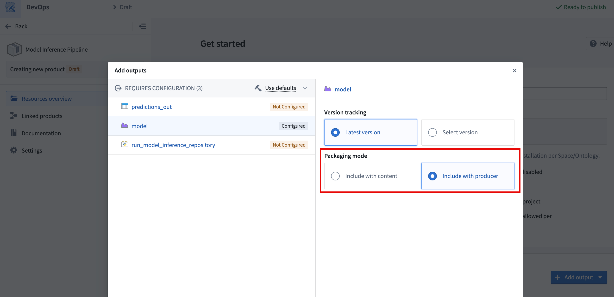

<!-- source: https://palantir.com/docs/foundry/model-integration/marketplace-models/ · mirrored 2026-08-26 from Palantir Foundry docs -->

# Add modeling resources to a Marketplace product

You can use [Foundry DevOps](/docs/foundry/devops/overview/) to include your modeling resources in [Marketplace products](/docs/foundry/devops/core-concepts/#product) for other users to install and reuse. [Learn how to create your first product.](/docs/foundry/foundry-devops/create-products/)

## Supported features

Models can be packaged as part of products in DevOps and deployed via Marketplace for release management purposes. Models are also supported as product inputs, allowing users to select models during installation.

### Package a model

Models can be packaged into a Marketplace product as **outputs** (content that will be deployed) or included as [**inputs**](#use-a-model-as-a-product-input) that users select during installation.

There are two ways to include a model in a product's outputs, **Include with content**, and **Include with producer**.

#### Include with content

The **Include with content** option installs the model as a static asset that cannot be rebuilt after it is deployed. The following are copied into the model resource when using this option:

* Saved model files and weights.
* The Python library containing the model adapter class.
* The container image that is used to back live deployments in [the model application](/docs/foundry/manage-models/create-a-model-deployment/) and in [Modeling Objectives](/docs/foundry/manage-models/set-up-live/).
* The [sidecar model inference in transforms](/docs/foundry/integrate-models/transform-model-input/#running-models-as-sidecar-containers).

Models can only be deployed as **Include with content** if the total model size, including files and underlying container images, is under eight gibibytes. The DevOps application will validate this condition and display an error if it is not met.

#### Include with producer

The **Include with producer** option installs the logic used to build the model so it can be built after it is deployed. This enables users to deploy models that can be trained continuously by a schedule. This is available for models built in Code Repositories, in [Jupyter® notebooks published as transforms](/docs/foundry/code-workspaces/training-models/#transforms), and in [Model Studio](/docs/foundry/model-studio/overview/), but not for models published interactively from a Jupyter® notebook. This is because models published interactively are considered static assets and do not have logic associated with them. When using this option, it is recommended that you package the latest version of the model to avoid confusion.

:::callout{theme="warning"}
Models deployed with a code repository producer **do not** have a defined container image by default, since this is produced when checks are run in the repository and used for subsequent builds that produce the model. Checks do not run when installing a product, so installed model builds are unable to produce a container image for the model. The lack of a container image on a model version will prevent the use of sidecar model inference in transforms and live deployments for the deployed version.   
To solve this issue, manually trigger checks on the installed repository that produces the model to build the container image and make it available for subsequent model training builds. Manually triggering checks is required to ensure that the Python adapter logic and the environment in the container are the same as in the source model. This must be done whenever a new version of the model is deployed.
:::

### Use a model as a product input

In addition to packaging models as outputs, product builders can include models as **inputs** to a product. During installation, users select the model to use via a model selector, which allows them to resolve specific model versions required by dependent components. This avoids the need to package the model itself, reducing package size and giving installers the flexibility to choose a model already available on their enrollment.

When a model is used as a `ModelInput` in packaged transforms, the transform must set `use_sidecar=True`. The sidecar runs the model adapter in its own container, removing the need to import the adapter library into the repository environment. Using `use_sidecar=True` is recommended in all cases. Learn more about [running models as sidecar containers](/docs/foundry/integrate-models/transform-model-input/#running-models-as-sidecar-containers).

### Live deployments

Models deployed via Marketplace can be used to serve as live deployments, subject to the caveat on model container images above. Live deployment needs to be configured manually only once after deployment, and cannot be automatically configured by Marketplace. If the model is rebuilt with a regular build or through an upgrade of the Marketplace product, the live deployment will automatically update to point to the latest version that was just created as described in the [model deployment](/docs/foundry/manage-models/create-a-model-deployment/#automatic-upgrades) documentation.

### Model functions

#### Set up a function on the deployed model

Like direct deployments, model functions need to be configured once on the model after deployment and will upgrade automatically upon new model version creation.

#### Use the model function in another function

Since model functions are not explicitly recognized by Marketplace, care needs to be taken if the model function is called from a Workshop application or from [another function](/docs/foundry/functions/functions-on-models/) deployed via Marketplace. Model functions that are used in Workshop or imported into repositories will be recognized as inputs to be provided during installation. On the contrary, model functions that are not imported to a repository and instead queried directly via the [Platform SDK](/docs/foundry/functions/platform-sdk/) are ignored.

Below is the recommended setup to package a model, its model function, and an outer function that calls the model function.

1. Create a product containing the model. After it is deployed for the first time, configure a live deployment and publish a function that is [registered to an ontology](/docs/foundry/functions/functions-on-models/#ontology-or-space-bound-functions).
2. Create a second product containing the outer function (TypeScript v1, TypeScript v2, or Python with an import of the model function) and any dependent applications, with the model function as an input. Use the function created in the previous step when installing this second product.
   * The model function used as input needs to be updated to the latest version every time the model's API changes, since model functions will only accept typed objects fitting the [model API definition](/docs/foundry/model-integration/model-functions-guide/#model-api-change).

:::callout{theme="note"}
For Python and TypeScript v2 functions, the model function must be registered to an ontology to be importable into the repository. If your model function is still space-bound, [migrate it to be ontology-bound](/docs/foundry/functions/functions-on-models/#migrating-model-functions-to-ontology-bound-functions) to take advantage of structured dependency tracking and Marketplace input mapping.
:::

## Unsupported modeling features and limitations

* **Modeling Objectives:** Use [direct model deployments](/docs/foundry/manage-models/create-a-model-deployment/) for live objective deployments and [model transforms](/docs/foundry/integrate-models/model-asset-code-repositories/#2-write-a-python-transform-to-train-a-model) for batch deployments.
* Models packaged with content can only be packaged if their total size, including weights, Python environment and underlying container image, is under eight gibibytes.
* [External models](/docs/foundry/integrate-models/external-model-connection/) are not supported in DevOps or in Marketplace.
