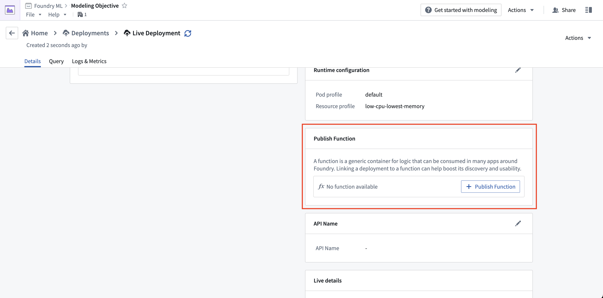
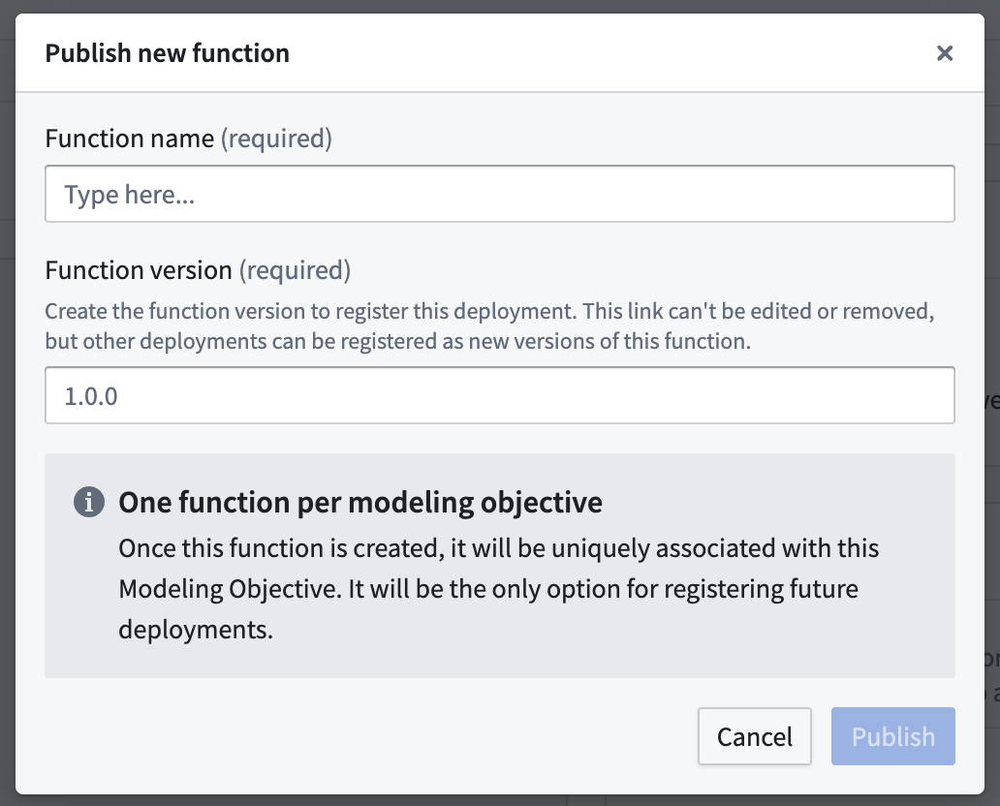
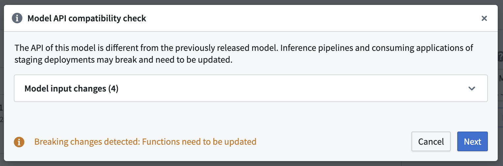
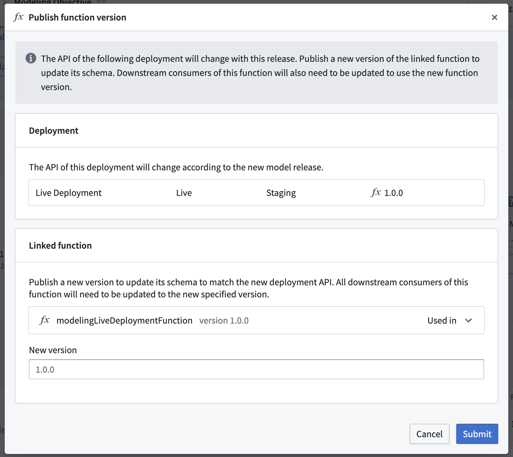

<!-- source: https://palantir.com/docs/foundry/model-integration/model-functions-guide/ · mirrored 2026-08-26 from Palantir Foundry docs -->

# Model functions developer guide

Model functions are automatically generated functions that wrap live model deployments, enabling models to be used for live inference in [Workshop](/docs/foundry/workshop/functions-use/), [Vertex](/docs/foundry/vertex/overview/), and other end-user applications. Model functions have the same input and output API as the underlying model and can be called from TypeScript, Python, or used directly in applications.

This developer guide covers the behavior of model functions including version updates, API changes, and configuration options. This applies to functions published from both [direct model deployments](/docs/foundry/manage-models/create-a-model-deployment/) and [Modeling Objective live deployments](/docs/foundry/manage-models/set-up-live/).

For instructions on how to import and call model functions in your code, see [Functions on models](/docs/foundry/functions/functions-on-models/).

:::callout{title="Prerequisites" theme="neutral"}
Before publishing a model function, ensure your model satisfies the [requirements for function publishing](/docs/foundry/integrate-models/model-adapter-api/#requirements-for-direct-function-publishing-and-model-use-in-functions).
:::

## Publish a model function

Model functions can be published from two types of deployments:

* **Direct model deployments:** From the model page, select the **+** icon in the sidebar after [creating a direct deployment](/docs/foundry/manage-models/create-a-model-deployment/#3-publish-a-function-for-the-deployment).
  * You can only have one function per branch wrapping the corresponding deployment.
* **Modeling Objective live deployments:** From the deployment details page, use the **Publish Function** card after [creating a live deployment](/docs/foundry/manage-models/set-up-live/#publish-function) to wrap it in a function.



When publishing from a Modeling Objective, you will be guided through the process of setting parameters for the function.



Both methods produce functionally equivalent model functions. These are simple wrappers that defer all logic to the underlying live deployment, but with the model API translated to input and output types recognized by functions.

To learn how to import and call model functions in your code, see [Functions on models](/docs/foundry/functions/functions-on-models/).

## Function version upgrades

This section explains function upgrade behavior and how to manage consuming resources, especially in the case of Model API changes.

### Direct model deployments: Automatic function version publication for each version

When a new version of the model is published on a branch with a function published, a new version of the associated function is also automatically created. It is not necessary to update consuming resources to the new function version, unless the model API has changed, as [described below](#model-api-change).

While only one function version can typically be imported in a given repository or application, users who want to import several model versions into their project for change management purposes can publish several functions on different branches to do so, since there can be one deployment and one function per branch on a model.

### Modeling Objectives: Create new version after releasing if the API changed

Upon releasing a model version with an API change in Modeling Objectives, the following warning will appear in case a new function needs to be published:



You should not ignore this warning. Updating a live deployment to a new model with a different model API will require manual action to fix downstream usage. The dialog will guide you through the process of publishing new function versions for any deployment affected by the release.



Usages of the current function version will break if you choose not to publish a new function version. To resolve this issue, return to the **Details** page of the deployment and publish a new function version.

### Model API change

When a Model API changes between versions, consumers must be updated to continue working. This includes TypeScript v1 functions and Workshop applications. Model functions mirror your model's API using Function-supported types. After an API change:

* Previous model function versions will expose outdated APIs that no longer match the current model.
* Both functions and the underlying live deployment validate inputs/outputs against the current API.
* Previous model function versions will fail validation and stop working, as the live deployment only accepts inputs/outputs matching the new model API version.

You should update your model functions and applications after each model API change.

### Upgrading a model function dependency in Code Repositories

#### TypeScript v1

To upgrade a model function dependency, edit the [`resources.json` file](/docs/foundry/functions/resource-imports-sidebar/#file-based-repository-imports) to select the new version of the model function. This will automatically regenerate the necessary type bindings.

#### TypeScript v2 and Python

Simply remove and re-import the function using the **Resource import** sidebar, specifying the right version.

## Row-wise publishing

Row-wise publishing flattens the function API for models with a single tabular input and a single tabular output, allowing each function call to process a single row instead of an array.

Row-wise function publishing is enabled by default for models that are single tabular input to single tabular output. This means the model API declares exactly one input and exactly one output, and that both are tabular. A model API that declares any additional input or output, such as one tabular input alongside a [`Parameter`](/docs/foundry/integrate-models/model-adapter-api/#parameter-types) input, is not eligible for row-wise publishing, and the published function accepts and returns arrays instead.

Row-wise publishing allows the model API to be flattened for each inference call so that executing the function calls one tabular row as input and outputs one tabular row. Alternatively, consider [using an Object or ObjectSet directly in the Model API](/docs/foundry/integrate-models/model-adapter-reference/#for-object-inputs) to facilitate use of your model with objects in functions.

For a model API that looks like the following:

```python
    @classmethod
    def api(cls):
        inputs = {
            "input_df": pm.Pandas(columns=[("area_code", int),
                              ("num_bedrooms", int),
                              ("num_bathrooms", int)])
        }
        outputs = {
            "output_df": pm.Pandas(columns=[("area_code", int),
                              ("num_bedrooms", int),
                              ("num_bathrooms", int),
                              ("predicted_price", int)])
        }
        return inputs, outputs
```

The direct publishing function signature *with* row-wise processing would look like:

```javascript
export async function housingPriceModelingObjective(parameters: {
    "area_code": FunctionsApi.Integer;
    "num_bedrooms": FunctionsApi.Integer;
    "num_bathrooms": FunctionsApi.Integer;
}): Promise<{
    "predicted_price": FunctionsApi.Double;
    "num_bathrooms": FunctionsApi.Integer;
    "area_code": FunctionsApi.Integer;
    "num_bedrooms": FunctionsApi.Integer;
}>
```

The direct publishing function signature **without** row-wise processing would look like:

```javascript
export async function housingPriceModelingObjective(parameters: {
    "input_df": Array<{
        "num_bathrooms": FunctionsApi.Integer;
        "area_code": FunctionsApi.Integer;
        "num_bedrooms": FunctionsApi.Integer;
    }>;
}): Promise<{
    "output_df": Array<{
        "predicted_price": FunctionsApi.Double;
        "num_bathrooms": FunctionsApi.Integer;
        "area_code": FunctionsApi.Integer;
        "num_bedrooms": FunctionsApi.Integer;
    }>;
}>
```

To enable or disable row-wise processing for a given function, publish a new function version and toggle the **Enable row-wise processing** option.
