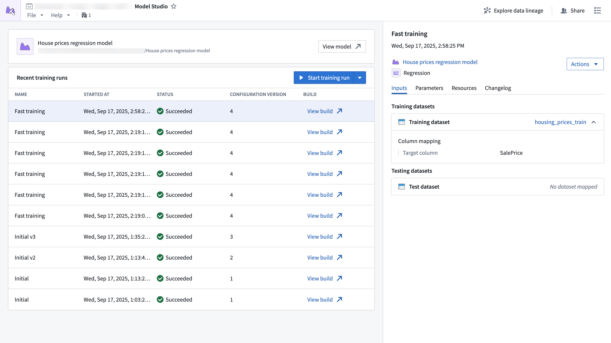

<!-- source: https://palantir.com/docs/foundry/model-integration/model-studio/ · mirrored 2026-08-26 from Palantir Foundry docs -->

# Model Studio

Model Studio is Foundry's no-code model development tool. With Model Studio, users can choose a training task, select input datasets, and optionally configure parameters to train and deploy production-grade machine learning models without writing code.

[Learn more about Model Studio](/docs/foundry/model-studio/overview/).
