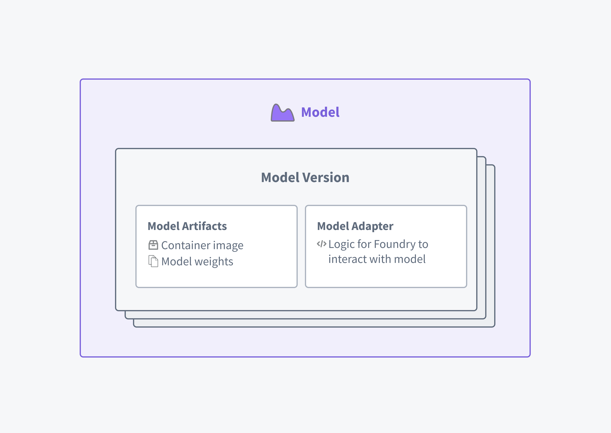

<!-- source: https://palantir.com/docs/foundry/model-integration/models/ · mirrored 2026-08-26 from Palantir Foundry docs -->

# Models

In Foundry, a **model** is an artifact for inference that contains machine learning, forecasting, optimization, physical models, or business rules. Within a use case, models encode knowledge about your data to create predictions and empower decisions.

Models developed inside or integrated into Palantir provide:

* Full version history, granular model permissioning, automatic dependency management, model lineage, and API management
* No-code hosting for live inference through [model deployments](/docs/foundry/manage-models/create-a-model-deployment/)
* No-code batch inference in data pipelines through the [Pipeline Builder trained model node](/docs/foundry/pipeline-builder/transforms-trained-model/)
* Model management, evaluation, and deployment via the [Modeling Objectives](/docs/foundry/model-integration/objectives/) application
* Binding to the Foundry Ontology, allowing for operationalization via [Foundry applications](/docs/foundry/app-building/overview/), [Functions on models](/docs/foundry/functions/functions-on-models/), and [Scenarios](/docs/foundry/workshop/scenarios-overview/) infrastructure.

### Architecture

A Model resource in Palantir comprises of two related but distinct components:

1. **Model artifacts:** The model weights *or* container where the trained model is saved.
2. **[Model adapter](/docs/foundry/integrate-models/model-adapter-overview/):** The logic that describes how the platform can interact with the **model artifacts** to load, initialize, and perform inference with the model.

An adapter is published as part of a Python library to enable communication with the stored model artifacts. It enables the platform to load, initialize, and run inference on any kind of model. Adapters are designed to be flexible and can be used to wrap the different model types that are supported in Foundry:

* Models trained in Foundry in [Code Repositories](/docs/foundry/integrate-models/model-asset-code-repositories/), [Jupyter code workspaces](/docs/foundry/integrate-models/model-asset-code-workspaces/), or [Model Studio](/docs/foundry/model-integration/models/)
* Manually uploaded [model files or checkpoints](/docs/foundry/integrate-models/integrate-overview/)
* Models [uploaded as containers](/docs/foundry/integrate-models/container-overview/)
