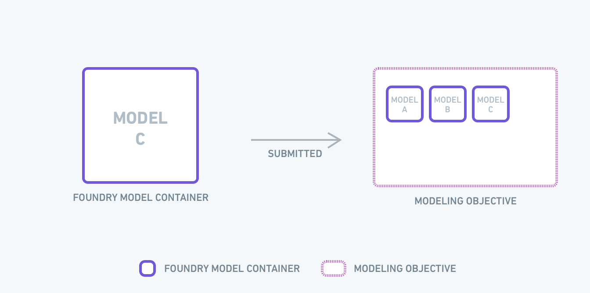
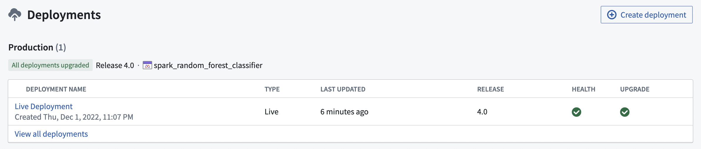
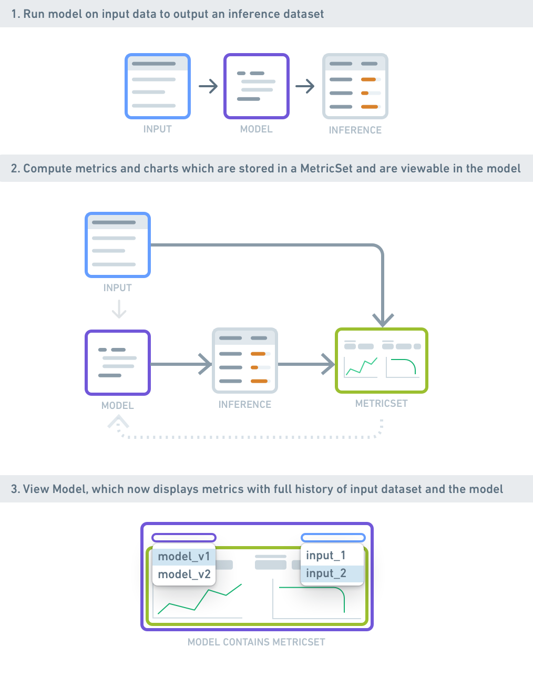

<!-- source: https://palantir.com/docs/foundry/model-integration/objectives/ · mirrored 2026-08-26 from Palantir Foundry docs -->

# Objectives

A **modeling objective** is a project for context, relevant data sources, metadata, and models all centralized around a specific operational problem. You can think of an objective as the definition for a modeling problem—the *interface* of the problem, for which the models submitted provide the *implementation*.

Modeling objectives serve as the communication hub for the modeling ecosystem and act as the system of record for evaluating, reviewing, and operationalizing successive model solutions over time.

Objectives are associated with [**metrics**](#metrics) which define how models submitted to the objective should be evaluated against each other.

## Submissions

When a model is **submitted** to a modeling objective to be managed and evaluated, a copy of that model version is created. This immutable submission is akin to a code Pull Request - when submitting a model, you are asking for a comprehensive review. A modeling objective is functionally a catalog of potential production-worthy model versions.

## Releases

After models are submitted, they can be **released**. Releases are versioned, packaged, and production-ready assets containing model submission code. Releases can be thought of as accepted solutions to the modeling problem defined in the objective.

A Release includes configurable environment tags (such as "Staging" or "Production"), a user-defined version number, and a short descriptive field—a release note.

Released models power [deployments](#deployments), which are production inference pipelines or interactive endpoints. Deployments can be configured to pick up the latest tagged release. For example, a deployment with a "Production" environment will take the latest tagged "Production" release.

The release system provides a way to protect production deployments by requiring intentional upgrades via tagged and versioned releases, as well as an auditable model version history for production pipelines.

## Deployments

**Deployments** enable delivery of selected and released models to consumers, including production pipelines, operational applications, and API subscribers.

Deployments provide a governed Continuous Integration & Continuous Delivery (CI/CD) layer for models in Foundry. As model submissions are reviewed and released, corresponding deployments pick up the new model versions automatically without downtime, while retaining lineage.

### Types of Deployments

#### Batch deployments

**Batch deployments** run models within a pipeline by executing the model on a designated input Foundry dataset and publishing results into an output dataset. They leverage distributed compute and are suitable for production pipelines (for example, predicting housing price for all addresses in a county), as well as large-scale non-realtime processing (such as bulk computer vision or document analysis). Consumers can read from a consistent output dataset, even as the deployed model is switched.

Batch deployments are typically managed via build schedules, leveraging Foundry's [internal build tools](/docs/foundry/data-integration/schedules/). Permissions propagate from the input dataset, model, Objective, and containing Project. [Read about how to set up a batch deployment.](/docs/foundry/manage-models/set-up-batch/)

#### Live deployments

For low-latency or interactive settings, models can be served via **Live deployments**, which provide a serverless REST API endpoint that can be interactively queried.

Live endpoints can be independently permissioned, and executed with configured replication and resources. They are also highly available, meaning models can be updated via CI/CD without incurring endpoint downtime.

You can integrate Live deployments into operational applications [by creating an interactive Live endpoint for your model](/docs/foundry/model-integration/tutorial-productionize/#43-how-to-create-an-interactive-live-endpoint-for-your-model) or with [Functions on models](/docs/foundry/functions/functions-on-models/).

## Metrics

One of the most critical steps in modeling is understanding how well a model performs and under what conditions. Foundry enables you to generate and track **metrics** for models atop evaluation datasets, as well as logical subsets within that data. Metrics and their associated input datasets power the evaluation workflows within [Modeling Objectives](/docs/foundry/model-integration/objectives/).

Metrics can be generated [ad hoc](/docs/foundry/evaluate-models/model-evaluation-code/) (for example, at development time), or systematically as part of a modeling objective's [automatic model evaluation](/docs/foundry/evaluate-models/model-evaluation-automatic/). They are then visible within the model preview, and comparable with other models in the [evaluation dashboard](/docs/foundry/evaluate-models/review-model-metrics/).

A `MetricSet` encapsulates the numerical metrics, images, and charts for a single model evaluation. `MetricSets` contain a reference to the corresponding model (and version), as well as the singular dataset and transaction (i.e. version) on which the metrics were computed. This dataset reference is called the "input dataset" of the `MetricSet`. [See the range of options available for metric sets.](/docs/foundry/evaluate-models/metric-sets-reference/)

## Metadata

An objective has associated, highly-configurable [**metadata**](/docs/foundry/manage-models/configure-objective-metadata/) that can be used to enable a broad range of management and collaboration workflows. Custom metadata fields can be collected with each model submission, which can aid with comparing models to one another.
